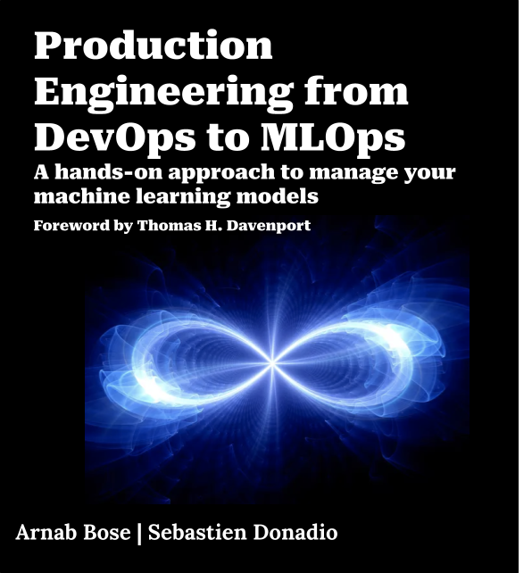

# Production Engineering from DevOps to MLOps

An open source book written by [Sebastien Donadio](https://www.linkedin.com/in/sebastien-donadio-01481920) and [Arnab Bose](https://www.linkedin.com/in/arnab-bose-phd-6369531). Published under a [Creative Commons](https://raw.githubusercontent.com/thejsway/thejsway/master/LICENSE) license and free to read online here. All code licensed under an [MIT](https://raw.githubusercontent.com/thejsway/thejsway/master/CODE_LICENSE) license. [Contributions](https://github.com/thejsway/thejsway/blob/master/CONTRIBUTING.md) are most welcome.

This book is also available on [Leanpub](https://leanpub.com/thejsway) (PDF, EPUB).

[]

## Overview

This book takes a DevOps approach to MLOps and uniquely positions how MLOps is an extension of well-established DevOps principles using real-world use cases. It leverages multiple DevOps concepts and methodologies such as CI/CD and software testing. It also demonstrates the additional concepts from MLOps such as continuous training that expands CI/CD/CT to build, operationalize and monitor ML models. 

* **Beginner-friendly yet comprehensive**. From the very basics of programming up to front-end and back-end web development, a lot of topics are covered in a simple and approachable way. No prior knowledge needed!
* **Easy to follow**. Code along directly in your browser or build an efficient JavaScript development environment on your local machine.

## Supporting this work

A lot of time and energy went into this content. If you find it useful and want to support this effort, here's what you can do:

* Buy it under one of the available formats (see above). Any financial contribution would be much appreciated.
* Spread the word about it.

Thanks in advance for your support!
