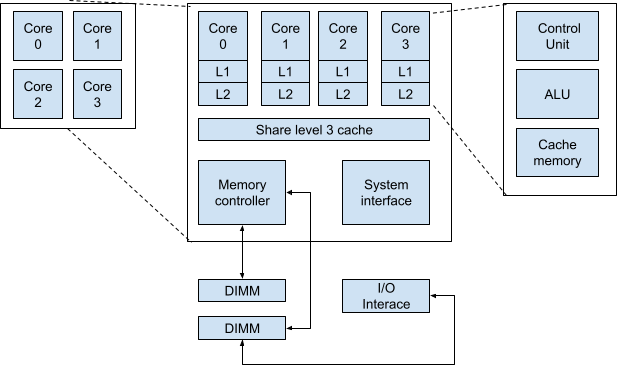

# 1 - Getting to know the DevOps universe

This first chapter starts the first part of this book by talking about DevOps.

In this first chapter, we will talk about the definition of DevOps, we will demonstrate that DevOps is widely used and is critical for any software development and deployment. Then we will talk about the importance of knowing operating systems, we will give a few examples then we will use Linux to create scripts to automate tasks.


By the end of this chapter, you will be able to:   -   know the DevOps process
-   select an operating system for your need
-   create a script to do automation


To start this chapter, we will define what DevOps is.
##  Defining DevOps


In this section, we will describe in depth what DevOps is. We will talk about where it started and what problems it solves. We will review how much impact it has on the company structure and its benefits.


###  The DevOps word


Patrick Debois, the French software engineer, who later rose to prominence as one of its gurus, first used the term "DevOps" in 2009. "DevOps" was created by   fusing the terms "development" and "operations". These two words help to figure out exactly what individuals mean when they use DevOps. Notably, DevOps isn't a method, a tool, or a rule. DevOps is sometimes referred to as a "culture". In addition, we refer to the "DevOps movement" when discussing issues like adoption rates and potential future trends, and the "DevOps environment" when describing an IT organization that has embraced a DevOps culture.


###  The DevOps origin


System engineers or IT experts made up a large portion of the original DevOps team. They developed best practices to manage software within a company, such as configuration management, system monitoring, automated provisioning, and the toolchain approach.

Another origin for DevOps was the Agile methodology. Agile software development recommends close cooperation of customers, product management, developers, and software quality/testing to fill in the gaps. By quickly iterating toward a better product, it helps get a product more tested with a reduced time to market and more in line with the client's needs. The way the app and systems interact is a fundamental part of the value proposition to the clients. This iterative approach allows product teams to include clients' feedback. Therefore DevOps can be considered an extension of Agile.


###  The DevOps solution


Developers and system administrators agree that their business-side clients frequently push them in various directions. Business customers expect change—new functions, new offerings, and fresh sources of income as soon as possible. They also desire a system that is reliable and unaffected by outages or disruptions. Companies are therefore faced with the dilemma of either maintaining a stable but stagnant environment or providing changes fast while managing an unstable production environment. Neither option is deemed suitable by business leaders. And, more importantly, neither enables a firm to give its customers the best solutions possible.


The developers’ goal is to produce software at an accelerated rate. On the other side, Operations is aware that making changes quickly and without enough safeguards risks causing the system to become unstable, which is against their mission statement.


The answer to this conundrum is DevOps, which unifies all parties involved in software development and deployment—business users, developers, test engineers, security engineers, and system administrators into a single, highly automated workflow to deliver high-quality software quickly while maintaining the integrity and stability of the entire system.


The DevOps solution is to:   -   determine the guiding principles, expectations, and priorities.
-   work together to solve problems inside and between teams.
-   make time for more complex work, and automate routine and repetitive tasks.
-   measure every item put into production and incorporate comments into your work.
-   promote a more successful culture of working effectively together across varied abilities and specialized knowledge, and share the facts with everyone concerned.


###  The DevOps efficiency


DevOps encompasses various variants of the concept:    -   collaboration: developers and IT work together
-   automation: large portions of the end-to-end software development and deployment process are automated by DevOps using toolchains
-   continuous integration: DevOps is Agile-based. Developers are required to frequently integrate their work with other developers. Integration problems and disagreements become apparent considerably sooner than in waterfall development.
-   continuous delivery: when a feature is ready, it is delivered to the production environment
-   continuous testing: software quality is intrinsically in the DevOps design. Developers create ways to validate their coding and the testing team will validate their features independently
-   continuous monitoring: tech teams evaluate software availability and performance continues to increase stability. Continuous monitoring makes it possible to immediately pinpoint the source of problems to proactively avoid outages and lessen user problems.
-   quick repair: bug fixes should be deployed into the production environment very quickly


###  The DevOps adoption


Most companies adopted the DevOps process. It is a win-win solution for all the participants:

-   Programmers benefit greatly from automated provisioning since it allows them to set up their development environments without the need for paperwork, protracted approval processes, or lost time while waiting for IT to supply a server. The way developers work is altered when they can quickly provision a working environment complete with all the necessary tools (computing power, storage, network, and apps). They possess far greater creativity and originality. It's much simpler to experiment with various choices, run various scenarios, and properly test their code.
-   Operations engage developers; which enhances system stability. More frequent deliveries inject less unpredictability into the system, reducing the probability of deadly failure. Even better, rather than being released at odd hours or on the weekends, these more restricted releases may be done throughout the day, when everyone is at work and ready to handle issues.
-   Test engineers   create a test environment with automated provisioning that is almost exactly like the production environment, which leads to more accurate testing and an improved ability to forecast the performance of future releases. Like other groups, test engineers benefit from teamwork and automation to boost productivity.
-   Product managers     get faster feedback. They can adapt software features faster to their clients’ needs.
-   Business owners and executives   see DevOps enables the company to produce high-quality goods considerably more quickly than rivals that rely on conventional software development techniques, actions that boost revenue and enhance the brand value. High-quality developers, system administrators, and test engineers want to work in the most advanced, productive environment available, which is another factor in the capacity to draw in and keep top personnel. Finally, senior executives spend less time intervening in inter-departmental disagreements when developers, operations, and QA collaborate, giving them more time to create the specific business goals that everyone is now working together to achieve.


##  The DevOps workflow


Figure 1.1 represents the DevOps workflow that we will follow in this book. We can start the initial state with the code itself. Any features or bug fixes will be made by a code change. This code is versioned by a Version Control Software such as git, svn, or mercurial. This version of the code will be compiled and unit tested to be sure that the most recent changes did not impact the other part of the software. The artifact control is the following step, this part is used by models. The goal of this part is to manage data and metadata. The Test box is the following step. We will have the software tested for performance, integration, and regression. The goal is to ensure that the software we release is better in terms of the number of features and the number of bugs. Once all the tests have been passed, we can now release the software in production. The software will be monitored, bugs will be reported and included in a backlog with the rest of the features to be implemented.

<center>


 Figure 1.1: The DevOps workflow

</center>


<!-- <p align="center">
  
  <br>
  <em>Figure 1.1: The DevOps workflow</em>
</p> -->


##  The DevOps state-of-the-art


We could write much longer to demonstrate that DevOps has been a key part of the process development of successful firms by increasing software quality, reducing the time to market, and improving system stability and security but a lot of books have been written on this purpose. All the major book publishers have at least one or many books on this topic. They all explain the advantages and the implementation of a DevOps system.


The evidence is unambiguous: DevOps is here to stay. It has been successful in uniting business users, developers, test engineers, security engineers, and system administrators into a unified workflow aimed at satisfying client needs.


The goal of this book is not to talk about DevOps but not to give you more in-depth knowledge on how to use DevOps. In the following section, we will start by describing how an operating system works and why it is very important to know the basics of the operating system for DevOps.


##  Using operating systems for DevOps


In the prior section, we talked about the DevOps principles. We know that DevOps is an efficient culture for software development. The first question is now where do we start? Because the software runs on operating systems, it is important to know what an opening system is and why it is so important in the DevOps process.


###  How operating system works?


As we know the DevOps process’s goal is to improve software quality and time to market. When we build a machine learning model software or any software, it will run on an operating system.


<!-- 
<p align="center">
  
  <br>
  <em>Figure 1.2: Software and operating system</em>
</p> -->

<center>


 Figure 1.2: Software and operating system

</center>

Figure 1.2 represents the link between software, operating system, and hardware. An operating system performs three primary tasks: managing the computer's resources, such as processor, memory, and storage; creating a user interface; and running and supporting application software.

Operating System (OS) has several main functionalities:   -   interface for sharing hardware resources


OS manages hardware resources by providing the software layer to control them. Displaying a character on the monitor after the user uses the keyboard, controlling the movement of a mouse, and storing a program in memory are examples of resource handling that an OS can perform.    -   process scheduling


When using a computer, we need to have many software running in parallel. Indeed, when we use our favorite browser, we may need to see the time or play music in the background. To do so, the OS will task these different processes to run on the underlying hardware.   -   memory management


Hardware has a different level of memory hierarchy. Processors perform calculations by using operands stored in registers. Registers are very limited and data will be stored in memory. Memory is divided into different levels. The level 1 (named L1) is the one that is the closest to the processor. Therefore the L1 latency is much lower than all the other levels.   -   data access/storage


When we create Machine Learning models, we need to have a large amount of data. Data are usually stored on a hard disk or disk. The OS is in charge of organizing data storage by using files, and directories and setting a set of rules on how to organize the storage unit.   -   communication


Lastly, the last function is to communicate with the outside world. If a computer wants to communicate with another one, the OS will organize the input/output of a given architecture.


The OS is critical when running any software. Figure 1.3 shows all the functions that software will be able to use when running on an OS. If we want to run software running a machine learning model. The data will be located on a hard disk (File Management and Device Management). Data will be loaded into memory (Memory Management) and will be processed (Processor Management). If the data comes from any data streaming in real-time such as financial data, the data comes through the network (Network, Communication Management).


<!-- <p align="center">
  
  <br>
  <em>Figure 1.3: function of the operating system</em>
</p> -->

<center>


 Figure 1.3: function of the operating system

</center>


It is expected that an operating system will run every process fairly. It means that the operating system will give enough processing time to all of them. To do so, it is important to understand how a computer is designed. We recommend reading the book Computer Architecture written by John Hennessy and David Patterson. Figure 1.4 shows a computer architecture.


<!-- <p align="center">
  
  <br>
  <em>Figure 1.4: Computer architecture</em>
</p> -->


<center>


Figure 1.4: Computer architecture

</center>

We can see a Central Process Unit (aka processor or CPU) divided into cores. These cores have registers and different memory hierarchies. They share the same L3 cache which allows these cores to share data. Every core can access memory and handle input/output with external devices such as network cards or storage units.


It is critical to understand how a system works since when we design software efficiency, reliability, and scalability will be a part of the requirement of our clients. When we know how an OS works, what is the next step? Choosing an operating system.

The next section will talk about the different types of operating systems available on the market.


###  What OS should we choose?


Choosing an OS is an important part of the process when we build the technology part of a company. Most of the time, when joining a firm, this choice may not be available but as we will talk about in Chapter 2, we will see that with the cloud, that be can a question we should answer even if the company has already chosen an OS for its employees.


The goal of this section is not to get into a debate on which OS is better. It will not be possible to answer. What is important to answer is for which needs, we will choose a system or another one.


We will first describe what we should look for when comparing OS:   -   Community and historical footprint


Knowing when a system has been created will help to know its reliability of a system. If the system is well used and still maintained, the maturity should be high enough to trust the system.   -   File structure and memory management


It is important to know how the data are stored and how scalable a system will be when handling a large quantity of data.   -   Configuration (registry, databases, files)


When choosing an operating system, because the needs can be different, it is critical to know if a system is configurable. For instance, a system requiring an ultra-low latency in terms of networking will have a different configuration than a system requiring a high-scale web server.   -   Interfaces and command line


As we know an operating system is made for users. The way that we will interact with the system to automate tasks, to create software is also a critical part of the choice of an OS


We will compare the following opening systems:   -   Microsoft Windows


It was first created as a graphical interface for the Microsoft OS DOS in 1985. In 1995, Windows replaced MS-DOS and became an OS. Windows was the most used OS in the world for many years.   -   macOS and iOS


They are the main competitors of Windows on personal devices. macOS was released in 2001 and iOS got released 6 years later. The main difference between the two is one is built for computers and the other for mobiles.   -   Linux (Unix-based system)


A family of open-source Unix-like operating systems known as Linux is based on the Linux kernel, which Linus Torvalds initially made available in 1991. There are many different Linux distributions (such as Red Hat, Ubuntu, Debian, Fedora,...). Linux is far from being as used as the two previous OSs. Linux is open source and easily configurable. It is the most used OS in the production environments.   -   Android


Android was created in 2003 and bought by Google in 2005. Google decided to make this OS open-source. Android is mainly used on mobile devices which are not Apple devices.


Figure 1.5: Market share of OS for production environment

<!-- <p align="center">
  
  <br>
  <em>Figure 1.5: Market share of OS for production environment</em>
</p> -->

<center>


Figure 1.5: Market share of OS for production environment

</center>


Figure 1.5 shows the market share of Linux as the most used OS for the production environment. The benefits of using Linux for servers are the following:   -   free and open-source: we can see and modify the code easily. It is easy to configure to specific business needs.
-   reliability: the uptime for a server is unbeatable. Linux does not crash and does not to be restarted for a configuration change.
-   security: Linux is the most secure system in the industry implementing security mechanism for data and processes
-   hardware support: there are drivers for many devices and pieces of hardware
-   low maintenance cost: unlike other OS, the maintenance cost is much lower


The Linux kernel is the most stable, and secure. Any software going to production will have to run on this OS. It is important to learn the basics of how to interact with the operating system. That’s why in this book, we chose to introduce you to this system.

In the next section, we will review the basic commands of a Linux operating system and we will talk learn how to automate tasks.


##  Scripting and automation


Without a doubt, since human intelligence is necessary at every stage of the system development life cycle, human interaction cannot be eliminated from computer-based systems. To minimize issues in the final result, automation is key in the DevOps process. Automation was not created by computer scientists and has been around in the industry for centuries. The goal of DevOps is to reduce the time to market, improve the quality, save time, increase consistency, reduce labor, and lower cost. By explaining the benefits of automation, we can already observe that they are similar to the benefits of DevOps. Without automation, DevOps will not be as efficient as it is. We can automate all the different phases of DevOps: software building, software configuration, software deployment, software testing, software monitoring, and alerting.


Why are we talking about scripting and automation in this same chapter? By using scripting code, we can systematically sequence several tasks. Scripting is the same as programming. What scripting language can we use?   -   Python   is a general-purpose language and it is open-source. It is the most used language in the world today. It is also platform agnostic.
-   Shell Scripting or Powershell   is one of the most popular and well-supported Unix shell scripts. Linux systems are supported by the Bash and Shell scripting languages. Additionally, it supports both Mac and Windows operating systems.
-   Ruby, Pearl, and JavaScript   can be also considered scripting language solutions.


For this section, we choose to work with Shell scripting. There are not any particular shell scripting languages to start. Shell scripting is done using sh, bash, csh, and tcsh. The most used shell scripting is bash shell scripting. For Unix-based computers, Bash is an interpreted scripting language.


###  Starting with the basic Linux command lines


The goal of this section is to present the most used Linux command lines. A Linux command is an application or utility that runs from the command line. An interface that receives lines of text and converts them into instructions for your computer. A graphical user interface (GUI) is just a command-line application abstraction. For instance, a command is carried out every time you click the "X" to close a window. We provide the command you execute options by using a flag. With the -h switch, we access the help pages for the majority of Linux commands. Flags are frequently optional. The input we provide to a command to enable appropriate operation is known as an argument or parameter. The argument can be anything you write in the terminal, although it is typically a file path. Flags can be called using hyphens (-) and double hyphens (--), and the function will execute arguments in the order you pass them to it.


Let’s start with the following commands:   -   ls   is the command to list the content of a directory.
-   `pwd`   returns the current directory path
-   `cd`   changes the current directory to another one. Many options will make you navigate through the Linux file systems
-   `rm`   deletes files and   mv   moves files
-   `man`   displays the help for a command line
-   `touch`   modifies the access and modification time of a file
-   `chmod`   changes the access rights for files
-   `sudo`   allows running a command as admin (or root)
-   `top`   or   htop   will list processes running on a machine
-   `echo`   prints a string on the screen (it is used to debug or monitor the steps of a script)
-   `cat` reads the content of a file
-   `ps` return the list of all the processes run by a shell
-   `kill` sends a message to a process. It is usually used to kill a process
-   `ping` is a network command to test network connectivity with another networking interface
-   `vi` or `vim` is a text editor
-   `history` list all the previous command lines
-   `which` returns the full path of a software
-   `less` helps you to inspect a file backward and forward
-   `head` or `tail` displays the first/last lines of a file
-   `grep` matches lines from a regular expression (or a string)
-   `whoami` displays the current user
-   `wc` displays the word counts of a file
-   `find` searchs files in directories
-   `wget` downloads a file from a URL


The list above is not exhaustive but it will help you to bootstrap your work for scripting and automating some tasks.


###  Writing your first script to automate a task


Let’s assume you want to start scripting a command line. We are going to use the simplest command line: echo.

```bash
echo     "This book is useful"
```

If you write this command in a command line, you will display the string in an argument.

```bash
This book is useful  .
```

If we want to have this command line in a script, we will need to create a file and add this command line to this file.

```bash
vim scrip1.sh   to create and edit a file
```

```bash
#!/bin/bash

echo     "This book is useful"
```

We can run this command in two ways by either running:

```bash
bash script1.sh
```

or by changing the access right to the file:

```bash
chmod   a+x script1.sh

./script1.sh
```

It will display the same string:  ```bash "This book is useful" ```


If you would like to add more commands to this file, it is possible. We just need to edit this file again and add more instructions to this file.

```bash
#!/bin/bash

echo     -n     "This book is useful to know how to count to 5"
for     ((     iterator  =  0  ; counter  <  5  ; counter++   ))
do
echo     -n     "$iterator "
done
```

If you run this script, you will have the following output:


This book is useful to know how to count to 5

```bash
0 1 2 3 4 5
```

By combining the command of the first part of this section, you will have so many ways of scripting any functionalities you think can be necessary for your DevOps operation.


##  Summary


In this chapter, we learned what DevOps is and we saw how operating system works and how they can help in the DevOps process. We also learned how to create scripts to automate tasks. In the next chapter, we will talk about the cloud and we will learn how to use the cloud in the context of DevOps.


