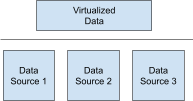
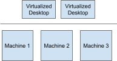
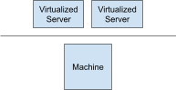
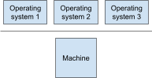
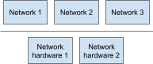
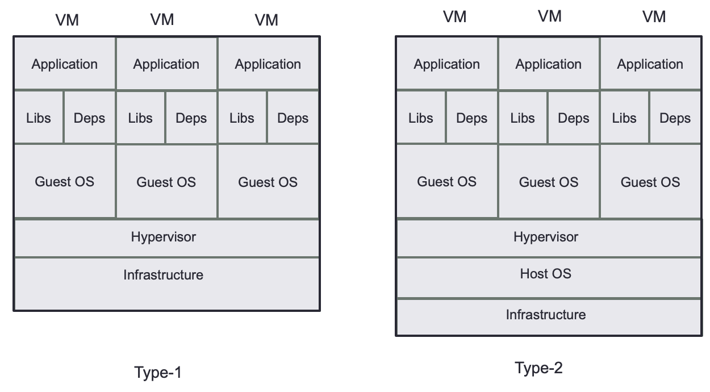
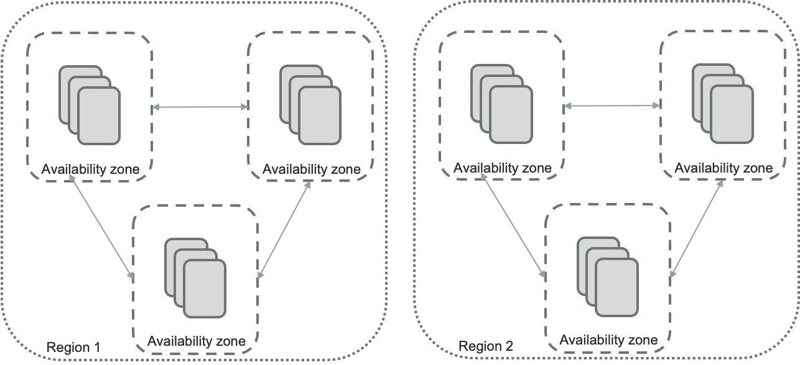

# 2 - Understanding clouding for DevOps

In this second chapter, we cover virtualization and the cloud. By the end of this chapter, you will be able to:   -   create a virtualized machine
-   create a computing instance
-   create a storage bucket
-   understand the cloud regions
-   configure a virtual cloud

In the first section, we will study virtualization and we will explain why DevOps can benefit from it.

##  Virtualizing hardware for DevOps

Virtualization allows using a full machine capacity by splitting these resources among many users and environments. Let’s consider two physical servers with distinct services: a web server and a mail server. Only a small portion of each server's operational capacity is being utilized. Since these services have been tested and run for many years, we do not want to interrupt them or attempt an upgrade of this machine; which could potentially prevent these services from running. Using virtualization will allow the gathering of the two services into one physical server. They will run on two different virtualized environments and leave the second server for other services.

The virtual environments—the things that use those resources—and the actual resources are divided by software known as hypervisors. The majority of businesses virtualize using hypervisors, which may either be loaded directly into hardware (like a server) or on top of an operating system, such as a laptop. Your physical resources are divided up by hypervisors so that virtual environments can utilize them.

Resources are divided between the various virtual worlds and the actual environment. Users engage with the virtual world and do calculations there (typically called a guest machine or virtual machine). A single data file serves as the virtual machine. And like any digital file, it may be transferred between computers, opened on either one, and expected to function as intended.

The hypervisor transfers the request to the actual system and caches the modifications when a user or program sends an instruction in the virtual environment that requires more resources from the physical environment; everything happens at practically native speed (particularly if the request is sent through an open source hypervisor based on KVM, the Kernel-based Virtual Machine).

There are different types of hypervisors as shown in Figure 2.1. The selection of the type will depend on the business needs.

| Type | Schema |
|------|--------|
|Data  |  |
|Desktop  |  |
|Server  |   |
|OS  |   |
|Network |   |

Figure 2.1: Hypervisor types

- Data: Different sources of data can be reduced into a single source of data
- Desktop: Desktop on many different machines
- Server: A server can handle multiple services
- Operating system: A machine can handle multiple instances of operating systems
- Network: Create virtual networks within a physical network

The use of virtualization is essential in DevOps. DevOps automates the delivery and testing phases of the software development process. The DevOps teams may test and develop using systems and devices that are comparable to those used by end users thanks to virtualization. In this manner, testing and development are expedited and take less time. The program may also be tested in virtual live situations before deployment. Real-time testing is made easier by the team's ability to monitor the results of any modification made to the program. The quantity of computer resources is decreased by doing these operations in virtualized settings. The quality of the product is raised thanks to this real-time testing. The time needed to retest and rebuild the program for production is less when working in a virtual environment. As a result, virtualization eliminates the DevOps team's additional work while assuring quicker and more dependable delivery.

Virtualization in DevOps has various benefits, some of which include:
-   The amount of effort is less

There is no need to locally upgrade the virtualization-related hardware and software because these changes are regularly made by the virtualization service providers. A company's IT team may concentrate on other crucial tasks, saving the business money and time.   

 -   Testing environment

We can create a local testing environment with virtualization. It is possible to test software in this environment in several different ways. No data will be lost even if a server fails. As a result, dependability is improved, and software may be evaluated in this virtual environment before being deployed in real time.   

 -   Energy-saving

Because virtual machines are used throughout the virtualization process rather than local servers or software, it reduces power or energy consumption. This energy is conserved, lowering the cost, and the money saved may be used for other beneficial activities.

-   Increasing hardware efficiency

The demand for physical systems is reduced by virtualization. As a result, power consumption and maintenance expenses are decreased. Memory and CPU use is better utilized.

Virtualization implementation difficulties

Virtualization in DevOps has many benefits, but it also has certain drawbacks or restrictions.

-   time commitment

Even if less time is spent on development and testing, it still takes a lot of time to set up and use because of this.

-   security hazard

The virtualization procedure increases the risk of a data breach since remote access and virtualizing desktops or programs are not particularly secure options.

-   understanding of infrastructure

The IT team has to have experience with virtualization to deal with it. Therefore, if a business wants to start using virtualization and DevOps, either the current staff may be trained or new employees are needed. It takes a lot of time and is expensive.

In this section, we saw the advantages of virtualization for DevOps. We are now going to talk about the cloud for DevOps.

###  Creating a virtualized machine on your computer

In this part, we will use an example of a type-2 hypervisor: VMware Workstation Player. You can get some information on this website:    [https://www.vmware.com/products/workstation-player.html](https://www.google.com/url?q=https://www.vmware.com/products/workstation-player.html&sa=D&source=editors&ust=1681619115795284&usg=AOvVaw24duDh7o0Z7oJqdgU-eW44)

Once you download the software, you will install it on your local machine.

We are using this hypervisor because you can find a free version to evaluate it:   -   Launch the installer when VMware Workstation Player has been downloaded, then continue the installation procedure. You will have the opportunity to install an enhanced keyboard driver, even though you won't initially require it.
-   Most likely, you already know which Linux OS you wish to try. Some Linux distributions, but not all, are well suited to running on a virtual machine. In a virtual computer, every 32-bit and 64-bit distribution functions. If you do not know, you can go on the Ubuntu website to download an iso file containing the Ubuntu distribution
-   Once you have downloaded the iso file you can now create a new virtual machine
-   Select the default option, Installer disc image then you will browse to the iso file
-   You will have to select a few options, then your virtual machine will be ready to run

Once all these steps are done, you have a Linux machine running on your macOS or windows environment. You will be able to do a lot of testing without having any fears to impact your machine.

We learned how to create a virtualized machine on your computer, we will now learn how to create a virtualized machine in the cloud. In the next section, we will talk about the cloud for DevOps.

##  Cloud   for DevOps

Getting hardware became very challenging. The supply chain crisis made the ships' delivery complex. However, the demand for storage and computation power kept raising and will keep on going. Companies have a large amount of data to store and process. Because processing data and transactions are critical for them, companies will need to find a third-party solution such as cloud computing/storage. Clouding is a cheaper solution than getting in-house hardware resources. Not only it is difficult to get hardware, but it is also complicated to find technologists to manage hardware and operating systems.

There are different ways of using a cloud:
-   private cloud:
-   community cloud:
-   public cloud
-   hybrid cloud

These different types of cloud go from the in-house hardware which could be considered like a private network to the public cloud where the computer resource is owned by corporations or institutions.

### Benefits of Cloud Computing

With cloud computing, you may use services as you need them and only pay for what you need. Without a lot of internal resources, we can manage IT operations as an outsourced unit. Additionally, hiring engineers is rather expensive, and putting together a technical team can take a lot of time.

The key benefits of cloud computing are:
-   Users spend less on computing and IT infrastructure, which improves performance.
-   There are fewer complications with uptime.
-   The program is instantly accessible for updates.
-   Operating system compatibility has been enhanced.
-   Backup and recovery
-   Scalability and effectiveness
-   improved data security as a result of more storage capacity

The three major Cloud Computing Offerings are

-   Software as a Service (SaaS)

A software distribution strategy known as SaaS involves vendors or service providers hosting software and making it accessible to customers online (internet). SaaS is becoming a more popular delivery paradigm as the core technology for Web Services or Service Oriented Architecture (SOA). The internet makes this service accessible to users all around the world. Traditionally, you had to pay for the program upfront and install it on your computer. On the other side, SaaS users pay a monthly subscription fee online rather than purchasing the product. Anyone who needs access to a particular piece of software, whether it be one or two people or tens of thousands of workers in an organization, can sign up to become a user. SaaS is compatible with any device that has access to the internet. Just a few of the crucial tasks that SaaS can assist you with include accounting, sales, invoicing, and budgeting.

-   Platform as a Service (PaaS)

Developers may construct apps and services on a platform and in an environment made available by PaaS. This service is accessible online since it is hosted in the cloud. PaaS services receive constant updates and feature additions. Businesses, web developers, and software developers may all benefit from PaaS. It functions as a platform for the creation of applications. It involves application deployment, testing, collaboration, hosting, and maintenance as well as software support and management.

-   Infrastructure as a Service (IaaS)

IaaS is a model for cloud computing services. It provides users with internet access to computer resources in the "cloud," a virtualized environment. It provides bandwidth, load balancers, IP addresses, network connections, virtual server space, and other computer infrastructure. The assortment of computers and networks that make up the pool of hardware resources are frequently scattered throughout several data centers. This increases the redundancy and dependability of IaaS. The computing solution known as IaaS (Infrastructure as a Service) is complete. One alternative for small businesses looking to cut expenditures on their IT infrastructure is IaaS. Every year, expensive expenses are incurred for upkeep and the acquisition of new parts such as hard drives, network connections, and external storage devices.

### Hypervisor

A piece of hardware, firmware, or software known as a "hypervisor" enables the setup and use of virtual machines on computers (VM). Each virtual system is known as a guest machine, and a host machine is a computer on which a hypervisor runs one or more virtual machines. The hypervisor treats resources like CPU, memory, and storage as a pool that may be easily shared between existing guests or new virtual machines. The independence of the guest VMs from the host hardware allows hypervisors to maximize the utilization of a system's resources and increase IT mobility. Since it makes it possible for them to be quickly moved between many computers, the hypervisor is sometimes referred to as a virtualization layer. Multiple virtual machines can run on a single physical server.

Figure 2.2 represents two types of hypervisors:   -   Native or bare-metal type-1 hypervisors

To manage guest operating systems and control hardware, these hypervisors work directly on the host's hardware. They are thus occasionally referred to as "bare-metal hypervisors." The most common server-based setups for this type of hypervisor are corporate data centers.

-   Hypervisors of type 2 or hosted

These hypervisors utilize a common operating system, much like other computer programs (OS). A guest operating system runs as a process on the host, while type-2 hypervisors insulate guest operating systems from the host operating system. A type 2 hypervisor should be used by individual users who want to run several operating systems on a personal computer.

<!-- 

  
   
  <em>Figure 2.2: Type of hypervisors</em>

 -->

Figure 2.2: Type of hypervisors

Different hypervisors will be offered in various geographies and availability zones by cloud service providers. Figure 2.3 shows how public clouds organized their regions.

<!-- 

  
   
  <em>Figure 2.3: Availability zone and regions</em>

 -->

Figure 2.3: Availability zone and regions

There are three major Cloud Service Providers: Amazon Web Services (AWS), Google Cloud Perform (GCP), and Microsoft Azure.

Depending on the price and the managed services you are familiar with, you may choose between different providers.

The emphasis in this part will be on AWS.

###  Creating a clouded solution

The region in which the program will operate must first be selected. If your instance doesn’t need to be close to another, you can choose any region you prefer. We would recommend that if you are using your instance in the US to build an instance in your US region.  We will build the following components of the system:    -   An Amazon EC2 instance is a virtual server on Amazon's Elastic Compute Cloud (EC2) that runs applications on the architecture of Amazon Web Services (AWS). While EC2 is a service that enables corporate subscribers to run application programs in a computing environment, AWS is a full and dynamic cloud computing platform. It may be used to build virtually endless amounts of virtual machines (VMs). A variety of instances with different CPU, memory, storage, and networking resource options will need to be selected.
-   Scalability, data accessibility, security, and speed are all features of Amazon S3. For a variety of use scenarios, including data lakes, websites, mobile apps, backup and restore, archives, business applications, IoT devices, and big data analytics, Amazon S3 enables the storage and protection of any quantity of data. To suit your unique commercial, organizational, and compliance demands, you may optimize, manage, and configure data access using Amazon S3's administrative tools.

Concretely the steps to create an instance will depend on when you will read this book. We are going to give you the high-level steps to create your clouded solution:   

1.   you need to create an AWS account. If you just want to try how AWS works, we recommend getting a trial version. Once your account is created, you need to log on to this account to start the next step.
2.   you select your region and then the type of AWS component you want to build. In this example, you need to select EC2.
3.   When you start setting up your new EC2 instance, you are required to choose the Amazon Machine Image (AMI). AWS provides many operating systems. We would recommend using the same operating system you use in the section Virtualizing hardware for DevOps.
4.   you need to select the type of instance. This one will   reserve   hardware for the instance you are creating. There are some   tiers   that are smaller and could be cheap to use
5.   you must choose which Virtual Private Cloud (VPC) and which subnets inside your VPC you wish to create your instance. Prior to starting the instance, it is preferable to decide and arrange this. A VPC is a sub-cloud within your cloud tenancy. For instance, if you need to create many independent applications, you can choose to split your tenancy into several VPCs (aka sub-clouds)
6.   you have to choose a couple of other options which are less important. Then you will be able to create an S3 bucket to have enough storage for your application. The S3 bucket is not required if you don’t need more space.
7.   Once the EC2 instance is created, you will be guided to create a key to use with an ssh terminal. We would recommend creating a new one and using this key to connect to this instance
8.   As the last step of the creation of these instances, it is advisable to set the inbound communication. For instance, if you want to create a python notebook running on this EC2 instance, you will need to open port 8888 to be reachable from outside.

In this section, we learned how to create a computing instance in the cloud. Because more and more DevOps/MLOps tools are clouded, getting familiar with the cloud functions is critical. We would recommend reading some online tutorials on cloud providers, they all have an exhaustive list of tutorials that can help you to create examples to learn how to use the cloud. We will now summarize what we learned in this chapter.

##  Summary

In this chapter, we learned how to create a machine in the cloud, we also learned how the cloud companies organize their regions and what a private cloud was. The next chapter will focus on how to build software and how to use libraries.

+\newpage
