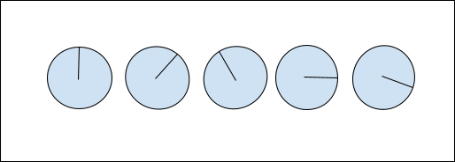

# 3 - Building software by understanding the whole toolchain

In this chapter, we will talk about all the steps to building software. By the end of this chapter, you will be capable of:   -   using a compiler to create an executable
-   making the difference between dynamic and static libraries
-   how to automate software building using continuous integration software
-   understanding file version control


In the first section, we will review how a computer works. Then we will explain how to talk to a computer by using a compiler. We will talk about libraries that help programmers to build software then we will talk about how to automate building to finish this part, and we will learn about managing code sources.


We will start by studying how a computer works.


##  How does a computer work?


It is best to start at the beginning if you want to grasp how a computer functions. Alan Turing, who created a device to decode the Enigma code, was represented by Benedict Cumberbatch in Morten Tyldum's 2014 film The Imitation Game. The Enigma machine could render all communications between the Axis nations incomprehensible to the Allies. In large part because of the machine created by Alan Turing, the Allies were able to interpret these signals and win the war. Figure 3.1 shows the visual of this device in the film. We can observe disks on this machine that represent the state of this machine (which is the decoding algorithm). This disk rotates to decode the Enigma messages.


<!-- <p align="center">
  
  <br>
  <em>Figure 3.1: Representation of the state machine of Alan Turing from the movie The Imitation Game</em>
</p> -->

<center>


Figure 3.1: Representation of the state machine of Alan Turing from the movie The Imitation Game

</center>


###  Turing Machine


English mathematician Alan Turing developed an abstract computing system that could compute real numbers with an unlimited amount of memory and a limited number of configurations or states in a 1937 publication. This computer system, which came to be known as the Turing machine, is regarded as one of the primary concepts in theoretical computer science. In turn, Alan Turning is frequently referred to as the inventor of the modern computer and the father of computer science.


###  State Machine


There were about 100 revolving drums in this electro-mechanical device. When a character from an encoded message was fed into the device, it set off a series of events in which the cylinders rotated and changed states, with the state of the next cylinder being dependent on the state of the preceding.


The processing units of all computer devices are powered by current solid-state systems, which are comparable to this process. A state machine essentially comprises states and transitions. Consider a straightforward binary system, where there are only two possible states: on and off. A state is essentially any situation of a system that depends on earlier inputs and responds to later inputs. The machine can compute or execute an algorithm thanks to these sequences, which are conditioned by a finite set of states; these sequences represent the machine's program.


###  From the Von Neumann Architecture to the Harvard Architecture


John von Neumann was a Hungarian-American mathematician who contributed to the creation of several significant ideas in foundational and applied mathematics. His 1945 paper served as the foundation for the architecture of the computers bearing his name. Von Neumann laid the groundwork for contemporary electronic stored-program computers by fusing a state machine with a memory unit.


<!-- <p align="center">
  
  <br>
  <em>Figure 3.2: Von-Neumann architecture</em>
</p> -->

<center>


Figure 3.2: Von-Neumann architecture

</center>


As shown in Figure 3.2, von Neumann's architecture consists of a stored-program computer, where instruction data and program data are stored in the same memory. The central processing unit (CPU) is made up of the control unit and the arithmetic/logic unit.


By supplying the timing and control signals that the other computer components need and instructing them on how to respond to the program instructions, the control unit enables the transition between states. The relevant data is processed by the arithmetic/logic unit (ALU), which enables the execution of arithmetic (addition, subtraction, multiplication, and division) and logic (and, or, not) operations.


The computer may then store both the data to be processed and the program instructions in the memory unit. A crucial component of Von Neumann's architecture is the memory unit, which allows us to transmit a variety of program instructions directly to a computer. Earlier computer architecture models had set programs with a specific function that were in striking contrast to this.


Harvard Architecture followed Von Neumann Architecture. It was founded on the idea that there should be distinct buses for data and instruction traffic. It was primarily created to get around Von Neumann Architecture's bottleneck. Unlike the Von Neuman Architecture, there is a distinct physical memory address for instructions and data and instructions can be executed in 1 cycle.


Today’s computing devices such as desktop computers, laptops, and smartphones are all modeled on the von Harvard architecture. We could continue the history of computers to reach the current architecture we are currently using but what we will summarize is that the architecture followed the same design but got more complex by adding cores, and levels of memory cache. The goal was to increase the parallelism to get a more performant machine. The point is that it became way too complicated to talk to the machine directly. The need for a translator between humans and machines was higher than ever: the compiler was born and that’s what we are going to introduce in the next section.


##  Bridging Hardware and Software


As we previously saw, the architecture of computers became more and more complex to speed up applications. We started getting architecture with many cores (many CPU units) and many memory locations. The non-unform memory access (NUMA) architecture became mainstream on all the computers and servers we are using today.


<!-- <p align="center">
  
  <br>
  <em>Figure 3.3: NUMA architecture</em>
</p> -->

<center>


Figure 3.3: NUMA architecture

</center>


Figure 3.3 represents the high-level concept of the NUMA architecture, we can see many cores (equivalent to the ALU unit of the CPU) and the interconnection between the memory cache of all these cores and the way they access the main memory. Of course, we could eventually use assembly code to talk to this machine like we did for many years but the use of compilers is much easier. We will now learn how to talk to an architect by using compilers.


###  Generating an executable with compilers


Software systems are collections of programs in different languages. A layering of languages, starting with assembly and increasingly moving away from the native language of computers to high-level languages that are more easily understood by humans, are spoken by computers in addition to their native instruction sets. Humans may structure complicated systems using languages better suited for such tasks, such as C, C++, Java, and Python. All abstractions require more labor and logic to function, and with this added logic, there is frequently a trade-off between performance, complexity, and implementation utilizing various software engineering methodologies.


What connects the hardware and software? All data within a CPU is expressed in binary, which is the only language a CPU can understand. In essence, it is the machine as seen by the programmer. The compiler enables us to overcome an impedance mismatch between how people think about creating software systems and how computers compute and store data. They are crucial for accelerating program runtime, as well. Computer code created in one programming language (the source language) is translated into another language by compilers (the target language). They convert computer code between higher-level and lower-level languages. They may produce machine code, assembly languages, object code, and intermediate code. John Mauchly developed Short Code in 1949. (aka. Brief Code). The ability to translate algebraic equations into boolean expressions was a feature unique to this compiler. Then came COBOL, Lisp, Fortran, and C. More compilers mean more languages. Compilers continued to advance in intelligence by becoming better at enhancing the abstraction of what developers wished to convey with effective hardware execution. To enhance software engineering, new programming paradigms were introduced. Python and Java opened up object-oriented programming to all users in the 1990s.


A compiler can be divided into three phases as represented in Figure 3.4:

-   the front-end phase deals with the pre-processing of the code source. It will validate syntax and grammar with the code source. This phase will create an abstract syntax tree.
-   the middle-end phase is in charge of receiving the abstract syntax tree resulting from the parsing of the previous phase. Many passes will perform code optimizations. The code optimizations can optimize different objective functions. The most important one is to optimize the runtime code. Another example of objective functions could be optimizing energy consumption.
-   the back-end phase deals with the selection of the target, it can be a target machine, a virtual machine, or just another code. This phase can do register allocations and the instruction scheduling.


<!-- <p align="center">
  
  <br>
  <em>Figure 3.4: Compiler phases</em>
</p> -->


<center>


Figure 3.4: Compiler phases

</center>


Dennis M. Ritchie, an American computer scientist, created the C programming language at Bell Laboratories in the early 1970s. Since its inception, hundreds of C compilers have been developed for various operating systems and types of architecture. Thirteen years later, the GNU Compiler debuted with the express purpose of being an open cooperation. The structure below demonstrates how this C compiler creates code that can be executed on an x86 Linux kernel.


<!-- <p align="center">
  
  <br>
  <em>Figure 3.5: GNU C compiler script</em>
</p> -->

<center>


Figure 3.5: GNU C compiler script

</center>


Figure 3.5 shows the GNU C compiler is a script that makes several tool calls. The first one, the c-preprocessor (also known as cpp), uses the source files and headers to perform simple changes such as macro expansion. The assembly code generation for the x86 architecture will thereafter be handled by the C Compiler (cc), as we previously described. The assembler (as), the following utility, creates a relocatable object file using assembly code.


To create a single executable file or library, the linker is responsible for assembling libraries and relocatable object files and assigning addresses.


The executable file format will be parsed by the operating system. This is an ELF (Executable and Linkable Format) file on Linux, as opposed to a PE (Portable Executable) file, on Windows. There is a loader for every operating system. Which software components from the disk go where in memory is decided by the loader. The executable's virtual address space is allotted at this point. then the execution will begin at the entrance point (in the example of the C language, the function main).


The linker part is critical in software engineering because that’s the part in charge of getting external code (libraries). Any language can import libraries from other developers for helping them code faster and have code that is more reliable by using code that was tested before. C and C++ will be able to use static libraries while Python will use dynamic libraries. We will now see the difference between these two types of libraries.


###  Static vs. Dynamic Linking


In software engineering, many executable applications rely on external code libraries, which are frequently given by outside sources like an operating system vendors. There are two ways that a program can integrate this code to deal with these external dependencies: by statically linking in all the code and creating a standalone binary, or by dynamically linking in the external code and requiring the operating system to inspect the executable file to determine which libraries are required to run the program and load them separately.

Static linking will be used by the linker to combine the application code and dependencies into a single binary object. There is no way for a program to benefit from the same library being used by numerous applications because this binary object has all the dependencies included, necessitating the loading of each piece of code separately at runtime. For instance, the Glibc library is used by several programs on Linux. These programs would waste a lot of memory storing the same dependent library again if they were statically linked. Static linking offers a key benefit: even when using objects retrieved from an external library, the compiler and linker may collaborate to optimize all function calls.

Instead of using a stub to replace the locations of the required libraries, dynamic linking enables the linker to produce a smaller binary file. When an application starts, the dynamic linker will load that library by loading the relevant shared object from the disk. The dependence won't be loaded into memory until it's required. When many active processes make use of the same library, memory allocated to the library's code may be distributed among them. But this effectiveness comes at a price: when used through the Procedure Linkage Table, library functions are indirectly accessed (PLT). This indirection may result in extra cost, particularly if a library's brief function is regularly utilized. To reduce this expense, typical HFT systems will employ static linking wherever possible.

Building software is a sequence of a few steps; which could be highly complex. It is important to know how to automate this sequence of building software. The build tools will help to perform this process. We will now talk about how to build software with build tools.


##  Building software with build tools


A build system is a group of software tools that are used to streamline the build process, which is roughly defined as the process of "translating" source code files into executable binary code files. Even though numerous build systems have been "developed" and put to use for more than three decades, most of them still use the same fundamental methods that Make first used to introduce the directed acyclic graph (DAG). The traditional GNU Make, CMake, QMake, Ninja, Waf, and many others are still in use today. We will show you how to create C projects using some of these well-liked build systems in this section.


Let’s review two build systems:   -   GNU Make: Using the instructions in the makefile file, GNU Make creates projects. A makefile must be created to instruct GNU Make on how to build a project.


This example creates an executable toto.exe by compiling the source   toto.c.

```makefile
# Makefile
CC = gcc
exe: toto.c
    $(CC) toto.c -o toto.exe
```

-   CMake: The adaptable, open-source CMake framework is used to handle the build process, which is independent of the operating system and compiler. Unlike many cross-platform solutions, CMake is designed to be used in conjunction with the native build environment. Simple configuration files called CMakeLists.txt files are used to produce common build files (such as Makefiles on Unix and projects/workspaces on Windows MSVC). CMake can produce a native build environment that can assemble executable binaries, compile source code, build libraries, produce wrappers, and more. Multiple builds from the same source tree are consequently supported by CMake because it allows both in-place and out-of-place builds. Both static and dynamic library builds are supported by CMake. CMake also creates a cache file that is intended for use with a graphical editor, which is a useful feature. For instance, CMake locates include files, libraries, and executables as it runs and may come across optional build directives. This data is captured and stored in the cache, which the user is free to edit before the native build files are generated. Source management is also made simpler by CMake scripts since they consolidate the build script into a single file with a better-organized, understandable structure.


This example creates an executable toto.exe by compiling the source   toto.c.

```cmake
cmake_minimum_required(VERSION 3.9.1)
project(CMakeToto)
add_executable(toto.exe toto.c)
```

We could give you more examples of different build tools but they will all have the same principle. Now that we know how to build software, we would like to know how to automate the build.

##  Building software using continuous integration


According to the development approach known as "continuous integration" (CI) every time a piece of code is changed in a software program, a build should be created, followed by testing. The purpose of this idea is to solve the issue of discovering bugs that crop up later in the build lifecycle. Continuous integration was implemented to make sure that code updates and builds were never carried out in isolation by the developers as opposed to the developers working in isolation and not integrating sufficiently. Any software development process includes continuous integration as a crucial step. The following questions are assisted by the continuous integration method for the software development team.


Systems can occasionally become so complicated that each component has many interfaces. Always make sure that all the software components function harmoniously with one another in such situations. The code may be simply too sophisticated if the continuous integration process continues to fail.


The majority of test cases will almost always verify that the code complies with acceptable coding standards. This is an excellent time to determine whether the code complies with all the necessary coding standards by doing an automated test following the automated build.


If the test cases don't cover the necessary functionality of the code, testing the code is useless. So it's always a good idea to make sure that the test cases that are prepared cover all of the application's important scenarios.


Figure 3.6 illustrates the steps of the continuous integration process. The code source is initially in a version control system (section Version control system of this chapter). Once a developer modifies the code in it, the continuous integration process triggers a build. If the build succeeds the software testing phase starts. Any errors in these phases will be reported to developers. If there are no errors, the software will be deployed to the right environment.


<!-- <p align="center">
  
  <br>
  <em>Figure 3.6: Continuous integration process</em>
</p> -->

<center>


Figure 3.6: Continuous integration process

</center>


We may pick from a variety of continuous integration technologies. There are so many that it is difficult to choose the finest one. What you should look for is the following criteria:   -   strong ecosystem  . A CI tool tries to expedite project release and eliminate additional development labor.
-   compatibility with clouds  . A good CI tool should make it simple to transport data to and from the cloud.
-   deploying choices  . A CI tool should make deployment straightforward.
-   alternatives for integration  . CI tool can connect to other project-related software and services.
-   security and safety  . Whether it is open-source or commercial, a good CI tool should not increase the risk of getting data compromised.


A CI tool must meet the goals of the project and company while also being technically competent.


We can give a list of a few software but this list will be far from being exhaustive:   -   Jenkins   is one of the most well-liked free open-source CI programs that is frequently used in software engineering. It is a Java-based server-based CI program that needs a web server to run, it makes automated builds and testing simple.
-   Atlassian's Bamboo   is a server-based CI and deployment platform with an easy-to-use drag-and-drop user interface. Developers who already utilize other Atlassian services (such as Jira) frequently use this tool. Bamboo enables the creation of new branches automatically and their merging following testing. Continuous deployment and delivery are simple to do using this technology.
-   GitLab CI   is a free continuous integration tool with open-source code. For projects hosted on GitLab, this highly scalable solution is simple to install and configure due to GitLab API. GitLab CI is capable of deploying builds in addition to testing and developing projects. This tool highlights the areas where the development process needs to be improved.
-   CicleCI   is a platform for continuous integration and delivery. It may be used in the cloud or locally and supports a variety of coding languages. Automated testing, building, and deployment are simple with this program. Numerous customization tools are included in its simple user interface. With CircleCI, developers can swiftly decrease the number of problems and raise the caliber of their apps.
-   TravisCI   has no requirement for a server because the service is hosted in the cloud. Additionally, TravisCI has an enterprise-focused on-premises version. The fact that this utility automatically backs up the most recent build each time you run a new one is one of its nicest features.


<!-- <p align="center">
  
  <br>
  <em>Figure 3.7: CI tools</em>
</p> -->


<center>


Figure 3.7: CI tools

</center>


Figure 3.7 shows the market share between the different CI solutions.


In the rest of this chapter, we are going to choose Jenkins to build our example.


###  Using Jenkins for continuous integration


Jenkins may be used as a server on many different operating systems, most notably Linux but also Windows, macOS, and several Unix variations. It may be executed on Oracle JRE or OpenJDK and requires a Java 8 VM or above. Jenkins typically operates as a Java servlet inside of a Jetty application server. Other Java application servers, including Apache Tomcat, can execute it. Jenkins has recently been modified to function within a Docker container. The Docker Hub online repository contains read-only Jenkins images3.

Jenkins can use a large variety of plugins. Plugins simplify the integration of other development tools into the Jenkins environment, enhance build and source code management, and broaden the capabilities of the Jenkins Web UI. One of the most common uses of plugins is the provision of integration points for CI/CD sources and destinations.

Let’s learn how to link our build software,   CMake   with Jenkins:   -   need to ensure that CMake will build the software by running CMake. For that, you will go to the directory where you have the source and the CMakeLists.txt (file with the directives describing the project's source files and targets). Then you will type   cmake  . If the software builds, you can proceed to the next step.
-   login to Jenkins. If you install Jenkins on your computer, you will be able to use a web browser to access the default port 8080   http://localhost:8080
-   create a   new item  . You can choose a   freestyle project  .
-   need to link to the version control system of your choice (for us, it will be the GitHub website)
-   add build step and specify where the CMake file is


Once all the steps are done, you can save the project and test the project to see if Jenkins starts the build by getting the file from the GitHub repo and building the software using CMake.


We will now talk about the missing part of this continuous integration process, the source version control system.


##  How does version control software contribute to DevOps?


The process of monitoring and controlling changes to software code is known as version control, commonly referred to as source control. Software technologies called version control systems assist software development teams in tracking changes to source code over time. They are especially helpful for DevOps teams since they enable them to speed up deployments and cut down on development time.


Every change to the code is recorded by version control software in a particular form of a database. If a mistake is made, programmers may go back in time and review prior iterations of the code to help repair it while causing the least amount of interruption to the entire team.


Software engineers constantly write new source code and modify current source code while working in teams. The code for a project, application, or piece of software is often arranged in a "file tree" or folder structure. Each developer may make modifications in various locations within the file tree, thus one developer may be working on a new feature while another edits the code to address an unrelated problem.


Version control helps teams deal with problems of this kind by tracking the particular modifications made by each contributor and avoiding conflicts across ongoing activities. A concurrent developer may make changes to the software that is incompatible with those made in another area of the program. This issue has to be identified and fixed systematically without preventing other engineers from doing their work.


Without dictating a certain method to work, good version control software supports a developer's workflow. Instead of imposing restrictions on what operating system or toolchain developers must use, it should also operate on any platform. Instead of the annoying and cumbersome process of file locking, which grants the go-ahead to one developer at the price of obstructing the development of others, excellent version control systems permit a seamless and continuous flow of changes to the code.


Without using any kind of version control, software development teams frequently encounter issues like not knowing which changes have been made and are accessible to users or the generation of incompatible modifications between two unconnected pieces of work that must then be carefully untangled and revised. Developers that have never used version control may have added versions to their files, sometimes with suffixes like "final" or "latest," and then dealt with a new final version afterward. You may have code blocks that are commented out because you wish to remove certain functionality but save the code in case you need it in the future. Version control offers a solution to these issues.


Version control software is a crucial component of the day-to-day professional activities of the contemporary software team. The enormous benefit version control provides them even on tiny solo projects is often recognized by individual software engineers who are used to working with a good version control system in their teams. Many developers wouldn't even think about working without version control systems for non-software tasks once they become acclimated to their potent advantages.


Version control systems have seen significant advancements, some of which are superior to others. SCM (Source Code Management) tools or RCS are other names for VCS (Version Control System). Git is one of the most widely used VCS tools available right now. Git belongs to the DVCS category of Distributed VCSs; more on that later. Git is a free and open-source VCS system, like many of the most well-known ones on the market right now. The following are the main advantages of version control, regardless of what they are labeled or the technology employed.   1.   The whole long-term modification history for each file. This refers to each change made throughout time by various individuals. Changes include things like adding and removing files as well as altering content. The handling of file renaming and transfer differs amongst different VCS applications. This history should also contain the modification's author, the date, and any documented justifications. Going back to older revisions makes it possible to analyze defects' fundamental causes, which is crucial for resolving problems with software that is more than a few years old. If the application is still being developed, almost anything may be considered an "earlier version."
2.   merging and branching that team members should work simultaneously, but even those working alone might gain from being able to focus on several streams of change. Developers may keep many streams of work distinct from one another while yet having the opportunity to merge them back together to guarantee that their changes do not conflict by defining a "branch" in VCS systems. For every feature, every release, or both, the branching technique is used by many software development teams. Teams may choose from a range of workflow choices when determining how to utilize a VCS's branching and merging capabilities.
3.   Traceability. Root cause analysis and other forensics can benefit from the ability to track every change made to the program, link it to project management and bug-tracking tools like Jira, and annotate each change with a note outlining its goal and aim. When reading the code and attempting to understand what it is doing and why it is created in a certain way, having the annotated history of the code at your fingertips may help developers make changes that are correct, aesthetically pleasing, and consistent with the system's planned long-term design. This is critical for developers to be able to anticipate future work with ancient code, and it can be especially significant for doing so.


The list of VCS is also pretty long from CVS to SVN to Mercurial and Git, we could write a lot of comparisons. We just would like to show what the landscape is nowadays.


<!-- <p align="center">
  
  <br>
  <em>Figure 3.8: The most used VCS</em>
</p> -->

<center>


Figure 3.8: The most used VCS

</center>


Figure 3.8 shows the dominance of Git in the market. Git has been created by the Linux creator, Linus Torvalds in 2005 and since then, it never ceased getting into companies and organizations. GitHub and Bitbucket are cloud-based hosting services that let you manage Git repositories.


When using git, we are not tied to using one given template. However, the most used workflow is called the git workflow.


<!-- <p align="center">
  
  <br>
  <em>Figure 3.9: Git workflow</em>
</p> -->

<center>


igure 3.9: Git workflow

</center>


Figure 3.9 shows how to use git in companies that develop software for their business. We have a main branch named Master which could be the default branch where the latest code can be found. The other branch will help develop new releases by having a branch Develop where their development of the new features is made. Once this development branch is stable and we are ready to create a release, we will merge the development branch with the Release branch. When a code is in production and we have a critical problem to solve, we cannot wait for the next release. We will use the Hotfix branch to change the code as soon as possible.


To ease your work in creating the whole DevOps toolchain, we are recommending using GitHub. This website will walk you through how to create an initial git repo and then how to make some changes to the code.


##  Change management


Change management is a method for transforming an organization's objectives, procedures, or technology. Change management implements techniques for implementing, controlling, and adapting to change. To make it an effective process,  change management must evaluate how adjustments or replacements will affect processes, systems, and workers. Plan, test, communicate schedule, implement, document, and evaluate change. Change management requires documentation to establish an audit trail and assure compliance with internal and external controls, including regulations.


Each change request must be reviewed for its impact on the project. Change management is crucial in this process. Senior executives in charge of change control must assess how a change in one part of the project might influence other areas and the overall project.

It is important to put in place a set of metrics helping to monitor the changes:    -   Scope. Change requests must be examined for scope impact.
-   Schedule. Change requests must be evaluated for impact on the project timeline.
-   Costs. Change proposals must be examined for financial impacts. Overages on project activities may rapidly modify project expenses since labor is the biggest expenditure.
-   Quality. Change requests must be considered for impact on project quality. Rushing may cause faults, therefore accelerating the project timetable can impair quality.
-   HR. Change requests must be reviewed for extra or specialized effort. The project manager may lose crucial resources when the timetable changes.
-   Communications. Appropriate stakeholders must be notified of approved modification requests.
-   Risk. Change requests must be risk-assessed. Even slight adjustments might cause logistical, budgetary, or security issues.


In the change management culture, there are three important steps:

1- Unfreeze: where all the actors (tech, business, or other stakeholders) decide why and how they need to change the current state

2- Change the system: the people in charge of making changes operate

3- Freeze: once the changes have been done, we evaluate if the state is better or if it needs to be rolled back.


After this section, we know how to make changes and we know the process to make changes. We will not apply it in the context of software releases.

##  Building releases

After a set of changes, once a scope of features has been implemented, we may decide to release our changes to production. We first need to ensure that the change we will deliver will not damage the system (and of course, the stakeholders of the system). For that, we will test if the system still performs correctly after the set of changes we want to build.


As we saw in chapter 3, the first step of building a release is to stage the changes going to production. For that, we can use a specific branch coming from the revision control software. We will then use a building system compiling and linking to obtain an executable.


Variety of Tests

Planning and output analysis is necessary for testing. To verify various activities and requirements, DevOps experts may conduct various tests. Tests are carried out to check the software's integration, performance, accessibility, and usefulness rather than only to identify flaws in the source code and gauge its accuracy. As a result, testing proceeds in the order shown in the figure below, with early unit testing of the application used to verify the smallest testable components of the program.


Remember that the execution, scope, length, and data of functional tests might change. DevOps workers need to have a strong knowledge of their testing methodology before diving into any of these categories. They must realize that high-level DevOps testing is done without consideration for code structure analysis, which is often done by code developers. By using tests that don't need knowledge of the program's secret core architecture, the DevOps approach to black-box testing avoids these restrictions.


## Summary


We will now conclude this chapter by summarizing what we discovered. We first learned how to talk to a machine by using a compiler. We learned how to build software by using a build system. Then we saw how to use CI software such as Jenkins to automate the process of the build by using a version control system.

This chapter closed the first part of this book about DevOps, we will now start a new adventure by learning what MLOps is. The next chapter will finally introduce this topic.
