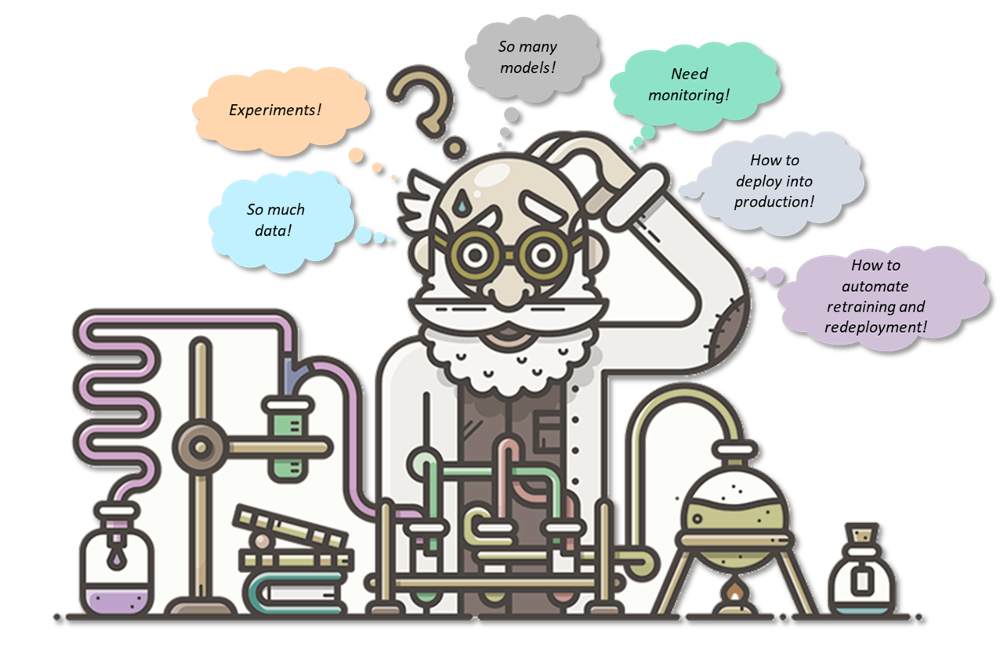
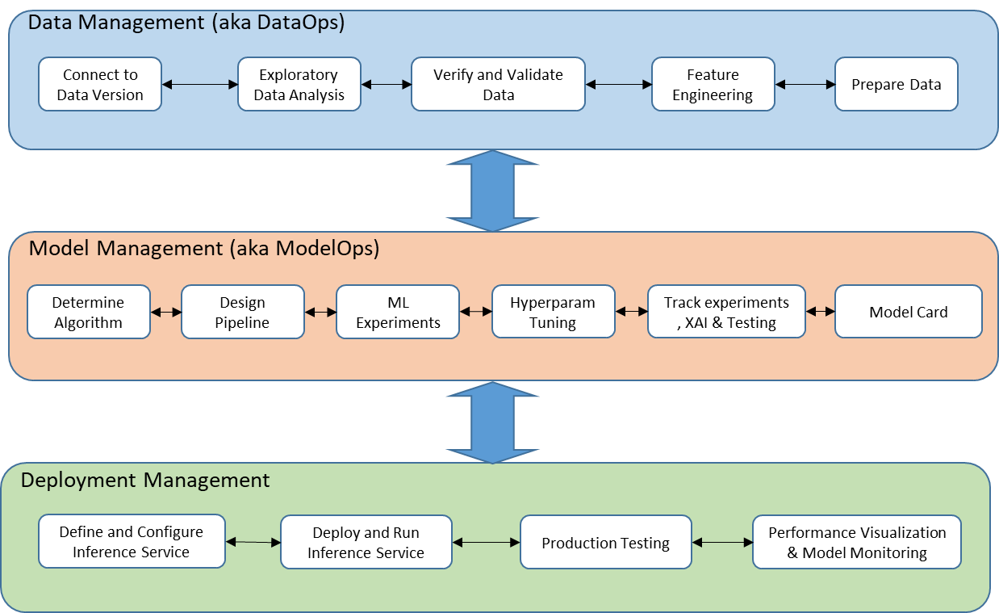
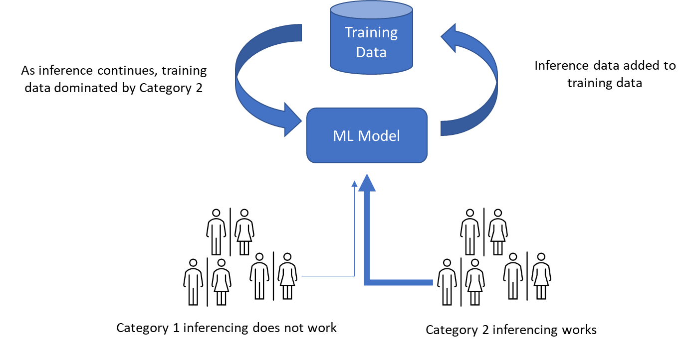
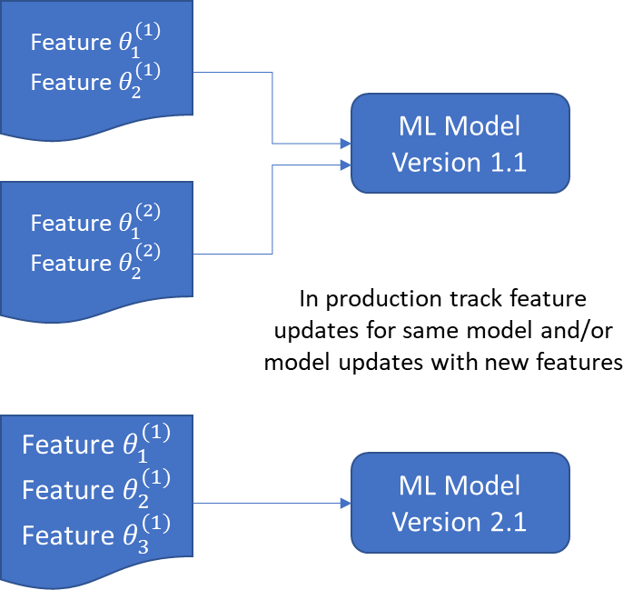
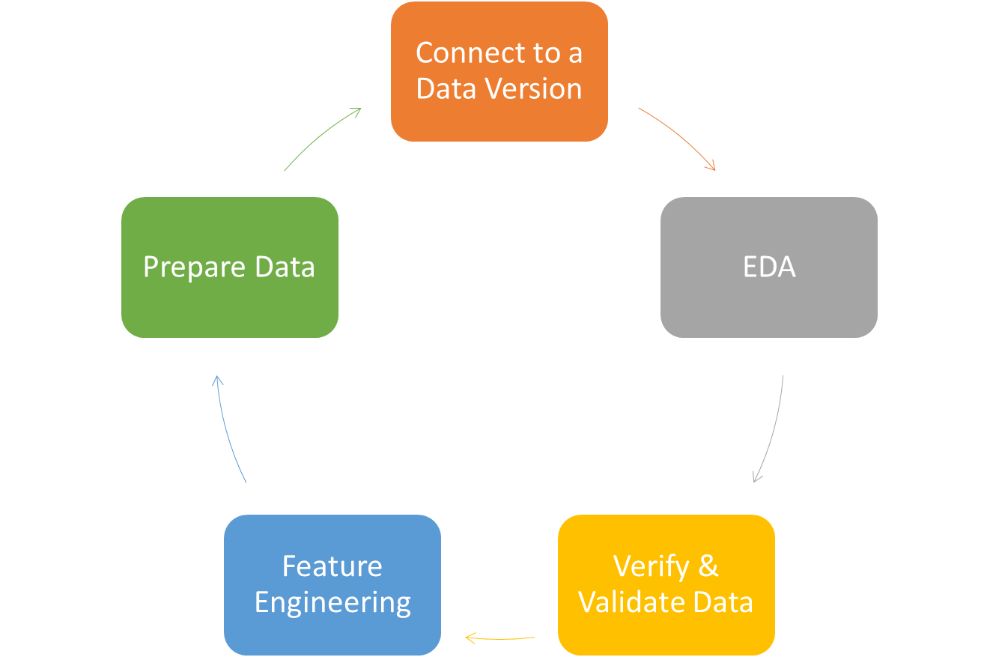

# 4 -   Introducing Machine Learning Operations (MLOps)

In this fourth chapter, we introduce the motivation and concepts of MLOps. By the end of this chapter, you will be able to:
  -   Appreciate the need for MLOps
  -   Get an insight into the challenges in operationalizing ML models
  -   Understand the concepts and principles of MLOps
  -   Manage ML workflow using agile project management

In the first section, we introduce the motivation of MLOps and its similarity to DevOps.

##  Motivation

The jury is out on how many data science projects do not make it to production, with numbers hovering in the high 80s   [[1]](Chapter4.html#ftnt1)    . In whatever way you look at it, this implies a low percentage of production operationalization of artificial intelligence (AI)/machine learning (ML) models. That is in contrast to predictions and societal hope that AI will improve our lives. So why this low percentage? Different reasons contribute to this such as inadequate data management, siloed enterprise organizations, not understanding ML technical debt, among others. Machine learning operations (MLOps) principles help manage these hurdles for ML model operationalization in production.

AI/ML model operationalization is similar but not the same as software deployment. Similar because you are writing and managing model code. This is where DevOps principles that have proven to manage hurdles in software production deployment are useful. Concepts such as scripting, task automation and CI/CD outlined in the previous chapters are cornerstones in MLOps.

Different because ML model is not just code but has an important data dimension that determines the parameter values. This added complexity has implications in terms of data tracking and how for the same (Python or R or C++) algorithm code you can have different model parameters. MLOps manages this data complexity and we will go into more details on this in the next chapter.

##  ML Operationalization Complexities

There are multiple complexities around ML model operationalization that need to be addressed by MLOps (Figure 4.1). ML models deal with a lot of data. They need to have multiple training runs and experiments with possibly different models. Once a model is decided upon it needs to be deployed into production with governance, security and compliance in place. Data assumptions during training may not hold in production so deployed models need to be continuously monitored for drift. Models that have “decayed” need to be retrained and redeployed in a systematic manner.

<!-- 

  
   
  <em>Figure 4.1: Complexities in machine learning (ML) model operationalization</em>

 -->

Figure 4.1: Complexities in machine learning (ML) model operationalization

##  ML Lifecycle

Using the above complexities as guides, the desiderata of a MLOps platform are:

1.   Integration with data infrastructure - enable easy data tracking and management via
1.   Versioning - enforce that any changes to the data (for example, outlier removal, imputation) should be a version change of the data.
2.   Location independence (cloud, on-premise, hybrid) - allow seamless access to data irrespective of whether it is on the cloud (for example, Amazon S3, Azure blob), on-premise storage or a hybrid combination of both.
3.   Governance - govern all data validation, transformations and preparation such that sensitive fields (for example, gender, race, ethnicity) are not used for predictive modeling, and track all ML model releases for audit and reproducibility.

1.   Collaboration and Team development - ML model building in enterprises is a team sport so support multi-user development via DevOps concepts such as CI/CD.
2.   Experimentation in a centralized place - track all ML experimentation so that model building is consistent with the data version, the algorithm version and the third-party library version that is enforced when the team is using the same ML pipeline.
3.   Reuse of pipelines - since ML model building is an iterative process, make it simple to change parameters and reuse ML pipelines for multiple experiments.

1.   Ease of adoption - enable established best practices via
1.   Popular ML libraries / packages - support popular ML libraries (for example scikit-learn, Tensorflow, Pytorch).
2.   Not-steep learning curve - leverage established ML model building principles such that there is no steep learning curve.

1.   Managed deployment - enable easy model deployment via containerization.
1.   Containerization - make it simple to build containers with a few clicks to deploy ML models.
2.   Model monitoring   - support model monitoring with notifications such as model drift and data drift.

The above wish list is encapsulated in the ML lifecycle workflow in Figure 4.2. It has 3 main pillars that we call phases - data management, model management and deployment management. Below we go through each component of the workflow. Later chapters go into the details for each component.

<!-- 

  
   
  <em>Figure 4.2: ML model building lifecycle</em>

 -->

Figure 4.2: ML model building lifecycle

###  Data Management/DataOps

This phase deals with data complexities such as versioning, consequence of feedback loop such as training data selection bias (Figure 4.3) where the model performs well in one segment of the data and not others.

<!-- 

  
   
  <em>Figure 4.3: Data complexity in ML model operation</em>

 -->

Figure 4.3: Data complexity in ML model operation

The components that comprise this phase are:

1.   Connect to Data Version - data plays an important role in ML model building, therefore using the right version of the data is important.

1.   EDA - perform exploratory data analysis to understand the data version.

1.   Verify and Validate Data - critical to verify that the data is as expected and then validate the data.

1.   Feature Engineering - once the data is verified and validated build features specific to the business problem.

1.   Prepare Data - the data is prepared in the correct format for model building consumption.

###  Model Management/ModelOps

This phase addresses experimentations with ML model pipelines to determine the correct model to deploy and complexities such as indirect system influence on models. For example, assume two models that work together with one giving user options and the second one showing information for a selected option. Then the behavior and updates to the first model influences the outcomes and selections from the second model, though both models are not related directly (Figure 4.4). There are also other direct system influence complexities through signal mixing such as ensembles, correction cascade where a model is dependent on another model/pipeline.

<!-- 

  
   
  <em>Figure 4.4: ML model indirect dependency via external user interaction</em>

 -->

Figure 4.4: ML model indirect dependency via external user interaction

The components that comprise this phase are:

1.   Determine Algorithm - depending on the business problem and data characteristics, you need to determine the algorithm to use.

1.   Design Pipeline - once an algorithm is determined, put together the pipeline that will use the data and the algorithm.

1.   ML Experiments - post design of the pipeline, run the pipeline for different experiments with different data versions and algorithms.

1.   Hyperparameter Tuning - part of the ML experiments include trying different hyperparameters.

1.   Track Experiments, XAI and Testing - track the outcome of each experiment, compare them side-by-side, run explainability and test the models.

1.   Model Card - once the models to be deployed to production are ready, document them using model card.

###  Deployment Management

This phase includes deployment of ML models, production testing, monitoring, and configuration challenges such as modifications that can be tracked and are reproducible (Figure 4.5).

<!-- 

  
   
  <em>Figure 4.5: ML model production configuration challenges</em>

 -->

Figure 4.5: ML model production configuration challenges

The components that comprise this phase are -      

1.   Define and Configure Inference Service - configure where the model is going to run in production as inference service.

1.   Deploy and Run Inference Service - once the production environment is ready, deploy and run the model.

1.   Production Testing - run any tests that are necessary for A/B testing or Multi-Armed Bandit Testing in production.

1.   Performance Visualization and Model Monitoring - insight into the performance of the deployed ML model with dashboard visualization and setup ML model monitoring to detect performance deterioration.

##  Agile ML Lifecycle

Agile project management is a good fit for the ML lifecycle due to its iterative nature. Given the multiple experiments with different data versions, data and feature engineering code, algorithm code, iterative processes work well. For example, in the agile ML lifecycle it is common practice to finance technical debt during experimentation with prototypes. Once a model (and its parameters) is declared ready-for-production, then the technical debt is cleared and code is eventually good quality.

Let's go into details of agile ML for data management (Figure 4.6). Once you verify a specific data version, you do EDA on the data in terms of data distribution and other statistical characteristics. During EDA you can connect to different versions of the data per your statistical requirements. Thereafter you validate the data in terms of filling gaps, scanning for outliers, among others. Again you can go back to different versions of the data or do more EDA to better understand the data. Next you develop business and domain specific features in feature engineering. Based on the EDA outcome, you can explore multiple features and their characteristics with different data versions. So each step of the data management phase is executed in an agile manner with multiple iterations. One reason is that data exploration and feature building is very exploratory and innovative, so each iteration reveals new information to be used for the pipeline.

<!-- 

  
   
  <em>Figure 4.6: Agile ML Data Management</em>

 -->

Figure 4.6: Agile ML Data Management

Likewise, each step in the model management phase is also iterative as you explore and discover different combinations of algorithms, hyperparameters and data features during model building. In the last step, the winning model is documented using a model card. We go into these details in later chapters.

In the deployment management phase, first you design how you plan to run your inference service and then deploy. After post deployment feedback (such as production machine workload), you may go back and redesign the inference service. Then depending on the outcome of production deployment tests, you may again redesign (and maybe redeploy) the inference service. And based on the performance and model monitoring, there may be redesign and/or production redeployment.

##  What is AIOps

Artificial Intelligence for Operations (AIOps) is    the use of machine learning to automate and enhance IT operations. This enables IT Ops to declutter the noise from the signal given that there are a lot of sources of information such as machine and application log files.

AIOps generates both descriptive pattern discovery (what happened when the failure occurred) and predictive inference insights (if the last failure pattern repeats, then what are the chances of another failure). Example of the former is using correlation analysis to discover which patterns tend to happen together. Example of the latter is root-cause-analysis to identify which patterns are responsible for recurring issues.

AIOps use-case examples range from predictive maintenance of IoT devices and heavy machinery such as windmills and jet engines to monitoring computer networks for Denial-of-Service attacks and other security issues.

##  Summary

In this chapter, we understood the need for MLOps and the multiple challenges in operationalizing ML models. We covered the concepts and principles of MLOps and how to manage a ML workflow using agile project management. And the difference between MLOps and AIOps. In the next chapter, we look into the intricacies of data preparation for ML model development.

------------------------------

[[1]](Chapter4.html#ftnt_ref1)   https://venturebeat.com/ai/why-do-87-of-data-science-projects-never-make-it-into-production/
