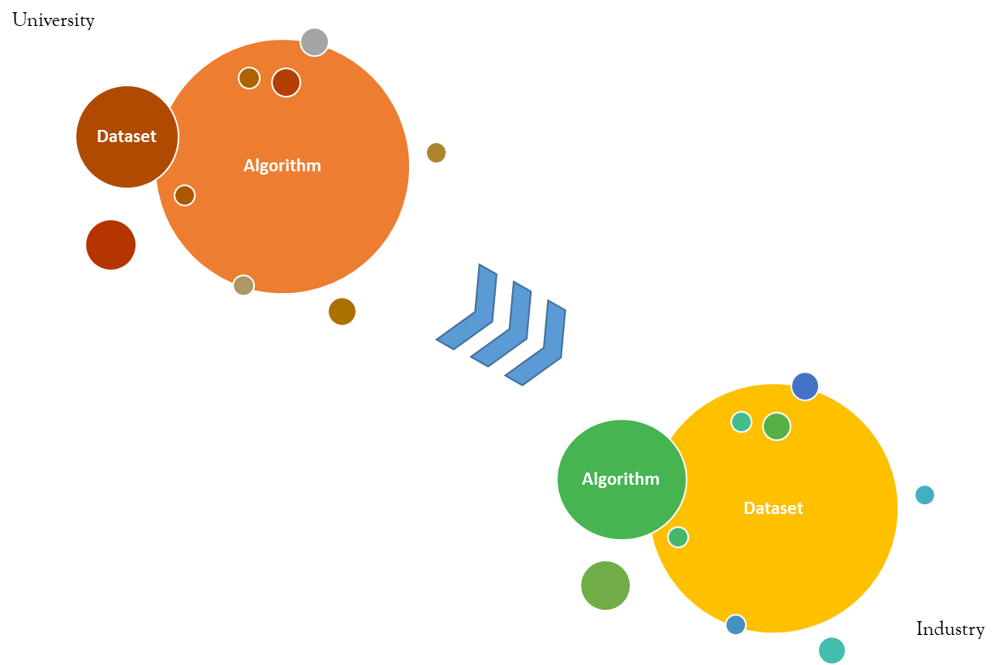
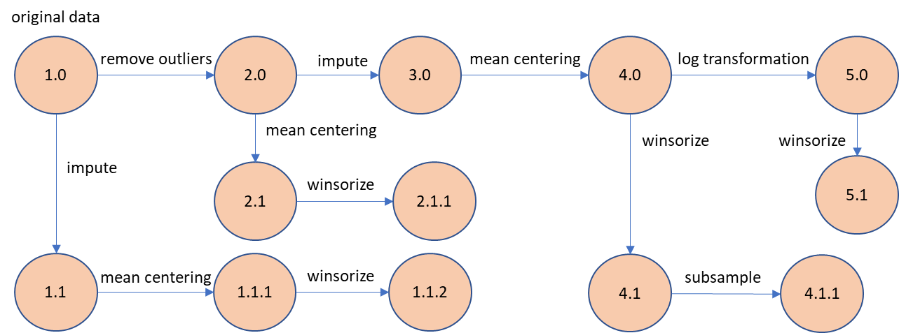
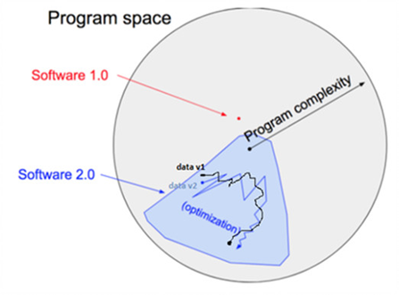
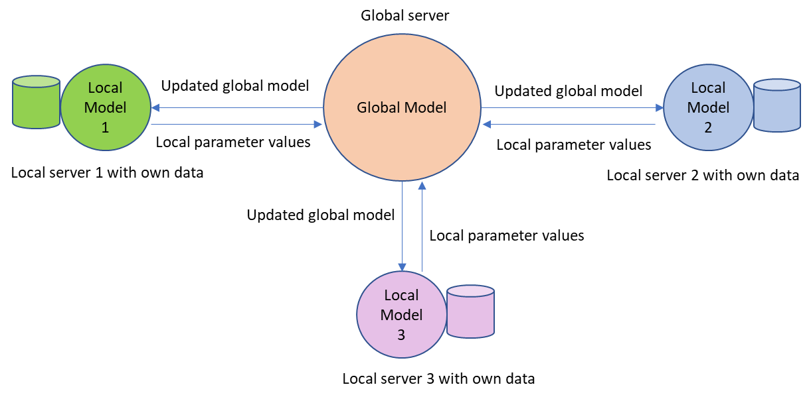
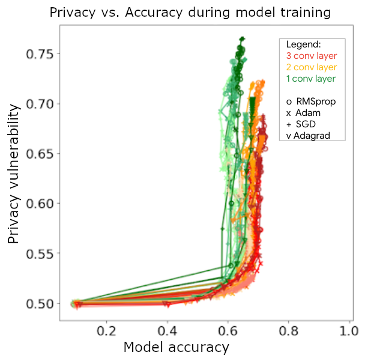

# 5 - Preparing the Data


In this fifth chapter, we understand the importance of data in ML model development and ways to protect data privacy. By the end of this chapter, you will be able to:

-   Appreciate the importance of data in ML models
-   Reason the need for data versioning
-   Understand how to ensure data privacy


We start this chapter with the importance of data and data versioning.


##  Time Spent on Data


In academia, a lot of emphases are placed on the mechanics of algorithms and the steps toward model building, for good reasons. Students need to understand the fundamentals and the math behind the algorithms so that they know when to use what strategy. In contrast, the industry places a lot more emphasis on data and very little on algorithms, again for good reasons (Figure 5.1). The industry needs to extract information and insights from data that benefit the business. The actionable outcome is what drives business more than which algorithms were used.


<!-- <p align="center">
  
  <br>
  <em>Figure 5.1: Time on data from academia to industry</em>
</p> -->


<center>


<div align="center">
Figure 5.1: Time on data from academia to industry
  </div>
</center>


###  Data Verification and Validation

Data verification and validation are different concepts, though they are often used interchangeably. Specifically, data verification ensures that the data is accurate, up-to-date while data validation ensures that the data is what it claims to be. Table 5.1 highlights the different between data verification and data validation with examples [1]. 


|Data Verification | Data Validation | 
|----------|-----------------|
| Check data against source to verify correctness, e.g. checking the age against a valid document | Check if a data value is within a range, e.g. age should not be negative |
| Verify that email and password are as expected in system | Validate that the email syntax contains '@' |
<p align="center">
Table 5.1: Algorithms and corresponding hyperparameters.
</p>


###  Exploratory Data Analysis (EDA)


As explained in the last chapter, a good start with data analysis is to check for statistical metrics such as mean, median, standard deviation, missing data, and correlation.  If the data has multiple categories, check for imbalance where categories have unequal proportions of data points. This data exploration step is EDA. Note that EDA is a statistical approach that is valid across all types of data and independent of the business use case. Unlike feature engineering that we discuss next.


###  Feature Engineering


In contrast to EDA, feature engineering is very much use-case-dependent. This is where you build custom features that are relevant to the ML model, which in turn is dependent on the use case. For example, if you are building a ML model to predict the winner of a tennis match, then features such as double-fault, and aces served, are relevant. But they are not if you are building a ML model for credit card fraud detection. Instead, fraud-relevant features such as the number of transactions in the last three days, and the location of the transactions, are important. We outline different types of automated feature engineering in Chapter 6. However, for either use case, EDA is valid.


In conclusion, understanding the data details is very important to extract the most from the data. You should expect to spend the majority of an ML project time exploring, analyzing, and transforming the data. Given the time spent on the data, there is a requirement (just like code) to be able to try out different data variations and roll back to an earlier version, capabilities that are provided by a versioning system. This underscores the need for data versioning.


##  Data Versioning


As mentioned above, the time spent on analyzing and trying different things with the data needs to be systematic with a lineage. That is provided by a data versioning system. Typically a data versioning system provides capabilities such as

1.   Origin determination so that you can always go back to the raw data as it was collected before any custom modifications.


1.   Version tracking so that you know which changes/transformations are in the data that you are using.


1.   Rollback so that you have access to previous versions that you can use when iterating on model building.


<!-- <p align="center">
  
  <br>
  <em>Figure 5.2: Data versioning example</em>
</p> -->

<center>


Figure 5.2: Data versioning example

</center>


The above concepts are illustrated in Figure 5.2. You start with the original data as it was acquired/collected. Post verification of the data, there are different options to validate the data such as removal of outliers, imputation to fill missing data [2], mean centering, and winsorizing, among others. There are different strategies  for data imputation starting from mean imputation to least squares to nearest neighbors. Mean centering means that you subtract the mean value of the data from each data point. This moves the data to be centered around the mean while leaving the distribution unchanged. On the other hand, winsorizing means you remove the extreme values of the data to limit the effect of possible outliers. While some operations are commutative (remove outliers, mean centering), others are dependent on the sequence. Most importantly, not all operations may be needed.


At the outset, it is not clear what will work best from the perspective of model training and model metrics. So you may have to try different options with different sequencing. Data versioning keeps this exercise manageable with data lineage that allows you to switch between different versions. Each version of the data is expected to deliver different models with different parameter values. So the data is the primary driver toward parameters, as we see in detail in the next section.


###  Image data versioning


Unlike structured data, image data changes between versions do not include changes to the underlying image (  Figure 5.3a)  . Instead, it incorporates changes in the bounding boxes or image segmentation as demonstrated in Figure 5.4b. One approach often utilized is to store such meta-information separate from the underlying image and   version that   meta-data. For example, store the image segmentation information as meta-data separate from the underlying image as shown in Figure 5.4c. And when the image segmentation is edited or changed, update the meta-data version.


<center>


(a)

</center>


<!-- <p align="center">
  
  <br>
  <em>(a)</em>
</p> -->

<!-- <p align="center">
  
  <br>
  <em>(b)</em>
</p> -->

<center>


(b)

</center>


```python
file_name": "000000332351.png", "image_id": 332351}, {"segments_info":

[{"id": 8732838, "category_id": 70, "iscrowd": 0,
 "bbox": [45, 0, 379, 628], "area": 170095}, 
 {"id": 3882584, "category_id": 176, "iscrowd": 0,
  "bbox": [0, 0, 425, 323], "area": 29935},

{"id": 2306905, "category_id": 190, "iscrowd": 0, 
"bbox": [0, 302, 425, 338], "area": 46272}, 
{"id": 4539746, "category_id": 199, "iscrowd": 0, 
"bbox": [362, 254, 63, 369], "area": 11737}],
```
<div align="center">
(c)
</div>
<br>
<div align="center">
Figure 5.3: Image versioning (a) original image (b) image segmentation (c) segmentation meta-data. 
</div>

Source:   [https://cocodataset.org](https://www.google.com/url?q=https://cocodataset.org&sa=D&source=editors&ust=1681619213251470&usg=AOvVaw1DDaWgK7iUwQFP4eedh-Ek)


##  Software Stack 2.0


As Andrej Karpathy put it “Gradient descent can write better code than you. I’m sorry” [3]. Quite a straightforward way to say that the data is responsible for the parameter values. We identify the algorithm to use and determine its specification (i.e. number of parameters to estimate). That generates a shell with initial parameter values. Data then populate those parameter values using optimization techniques such as gradient descent. This is referred to as software stack 2.0.


In contrast, software stack 1.0 is deterministic coding where you have functions with parameter values written in the code and the function pre- and post-conditions are clear. In contrast, software 2.0 parameter values are dependent on optimization techniques driven by the data, so that code behavior is probabilistic as demonstrated in Figure 5.4.


<!-- <p align="center">
  
  <br>
  <div align="center">
  <em>Figure 5.4: Software stack 2.0 where the software parameters are determined by data
  </div>
</em>
</p> -->

<center>


Figure 5.4: Software stack 2.0 where the software parameters are determined by data

</center>


##  Data Governance


Given the importance of data in software 2.0, data governance is a critical component in any enterprise’s data management strategy [4]. Data governance covers availability, validation, usability, privacy, and security of the data. Security and privacy of the data are covered in the next sections of this chapter.


The first part that includes data sourcing, validation, usability, and transformations is documented using Datasheet for datasets   [[5]](Chapter5.html#ftnt5) (it includes some security and privacy as well). The datasheet approach addresses the needs of both the data creators and the data consumers, enables communication between them, and promotes transparency, accountability, and reuse of data.


The datasheet covers the following set of questions (summary) with information on the dataset -

1.   Motivation   – why was this dataset created and by whom? Who funded the project?


1.   Composition   – what is in the dataset in terms of features? Are there any recommended train/test splits? Is the data dependent on any other (external) data?


1.   Collection Process   – how was the dataset collected and over what timeframe? If individuals are involved, were they notified about the data collection, and did they consent to the use of their data?


1.   Preprocessing/Cleaning/Labeling   – what transformations have been done to the dataset (related to data versioning discussed previously)? Is the ETL tool/software used for the transformation available?


1.   Uses   – what are the intended and not-intended use cases for the dataset? Has the data been used already for any project?


1.   Distribution   – how to distribute and use the dataset from IP/legalities perspective? When will the data be distributed?


1.   Maintenance   – who supports the dataset and how is it maintained? When will the data be updated?


As you can see, data availability, validation, and usability are covered in the datasheet. For details on any of the questions above or for example use cases of the datasheet, please refer to the paper. Now that the data is ready to be used, you need to verify that there are no privacy violations and that it is stored securely. In the next section, we discuss data security.


##  Data Security


Data security is the prevention of data breaches, unauthorized access to data, and information leaks. At the enterprise level, regulations such as the EU GDPR   [[6]](Chapter5.html#ftnt6)   (Global Data Protection Regulation) encourage enterprises to implement system-level security protocols such as encryption, incident management, and network integrity to protect data. Common techniques include access control using security keys, access monitoring and logging, and data encryption during transit.


At the individual level, in addition to enterprise security protocols, there are regulations such as the California Consumer Privacy Act   [[7]](Chapter5.html#ftnt7)  that protect personal data privacy during the usage, retention, and sharing of data. Outside of the regulatory framework, there are ways to enforce data privacy as we see in the next section.


##  Data Privacy


Data privacy pertains to data that contains an individual’s personally identifiable information (PII) and general sensitive data such as healthcare and financial data. It is also applicable to quasi-identifying data that can uniquely identify an individual when merging data from different sources such as credit card transactions and cell phone locations. In this section, we focus on techniques to impose data privacy.


###  Federated Learning


A model training technique for preserving data privacy is federated learning that does not need any data sharing during model training. The raw data (that may contain sensitive information) is kept in the original location. An algorithm that needs to use different data from different locations is sent to each location (local server) for local model building. The model is trained locally and the model parameters are sent to a centralized server to integrate into the global model. A popular technique for parameter value integration is averaging the different local values. As illustrated in Figure 5.5, the global model is in a centralized global server and is sent to the local servers post-parameter update.


In this methodology instead of sending all the data from different locations to the model, you send the model to different locations where the data resides.


<!-- <p align="center">
  
  <br>
  <em>Figure 5.5: Federated learning
</em>
</p> -->

<center>


Figure 5.5: Federated learning

</center>


The general characteristics of federated learning are -

1.   Training data is not iid (independent and identically distributed)   – given that the training data is local to multiple clients.


1.   Training data is unbalanced – non-uniform use of training data by different clients.


1.   Training is distributed - the number of local model training is generally more than the average number of data points per client.


1.   Training has limited communication – offline or on slow or inexpensive media to send the parameter values to a centralized server.


The other methodology for data privacy that is quite popular is different privacy.

###  Differential Privacy (DP)


In the previous section we see how privacy is preserved by not sharing the data but keeping it local and sharing only model parameter value. However, this is not possible for many ML projects where data is sourced from different locations and data sharing is imperative. Differential privacy (DP) is a mathematical definition of privacy that has shown the most promise in research to preserve privacy during data sharing. It balances learning nothing about an individual (from the data) and learning useful information about a population. It is achieved by adding (some) noise or randomness to data transformations such that conclusions made from the data are independent of any specific data point.


The mathematical definition of DP is as follows - assume 2 datasets     and      that differ by a single data point. A     DP is provided when the maximum difference in the outcome of the same transformations (linear or nonlinear) on      and     are bounded (less than or equal to)     .     is the strength of privacy guarantee with a lower value indicating higher privacy guarantee.     is the probability that    does not hold and is generally set to be inverse of dataset size, rounded to the nearest order of magnitude.


There is a question of where to add the noise (randomness) that divides DP into 2 strategies -

1.   Global DP   - randomness added to the data transformation for the entire dataset. This adds less noise to the dataset but requires a trusted data curator to handle the original dataset and transform all the data.


1.   Local DP   - randomness added to each data point. This requires no data curator but does add more noise to the dataset.


An example of Global DP is noise added to the output of a database query. The DB administrator is the data curator who queries the database, handles the original data, and then adds noise to the dataset. Another example of Global DP is the US 2020 census data   [[8]](Chapter5.html#ftnt8).


An example of local DP is a toy example of a survey where a student is asked if she/he is attending the University of Chicago. In response, each student follows this logic (that adds noise to each data value):   

1.   Flips a coin.
2.   If tails then respond truthfully.
3.   If heads, then flips again and responds “Yes” if heads and “No” if tails.


So if we know how many students said “Yes” to attending the University of Chicago, then we can know the true percentage   p   by


Pytorch implements DP in a python package called opacus   [[9]](Chapter5.html#ftnt9). Tensorflow DP uses DP-Stochastic Gradient Descent. Both clip gradients and then add random noise to them. 


There is a privacy vs accuracy trade-off in DP design. As shown in Figure 5.6 an increase in privacy (go down the y-axis to lower vulnerability) causes a decrease in accuracy. As with most trade-offs, there is a sweet spot after which the drop in accuracy does not justify the increase in privacy guarantees.


<!-- <p align="center">
  
  <br>
  <em>Figure 5.6: DP vs accuracy during model training
</em>
</p> -->

<center>


Figure 5.6: DP vs accuracy during model training

</center>


 Source:    [https://blog.tensorflow.org/2020/06/introducing-new-privacy-testing-library.html](https://www.google.com/url?q=https://blog.tensorflow.org/2020/06/introducing-new-privacy-testing-library.html&sa=D&source=editors&ust=1681619213410990&usg=AOvVaw3Jl7UvEw6omH8E8ECaeNCP)


###  Synthetic Data


Another way to address data privacy is to use synthetic data for model building. In this case, the privacy concerns are based on how the synthetic data is generated -

1.   Using real data - data privacy for the real data is guaranteed through techniques such as differential privacy and then that data is used to generate additional synthetic data using ML models. For example, generate synthetic credit card transaction data using a Generative Adversarial Network (GAN) and a small real dataset.


1.   Without any real data - there are no data privacy issues as the entire dataset is generated with synthetic data developed with simulated models and using knowledge from subject matter experts. For example, generate healthcare claims data where the features or the data fields and their data types are standardized and the data values are created using Python libraries such as Faker   [[10]](Chapter5.html#ftnt10). The values are validated by subject experts.


##  Summary


In this chapter, we understand the importance of data not just from data governance perspective, but also from model building perspective in software 2.0. In addition to data versioning, we also discussed the need to preserve privacy and security. Now that the data is ready for use in ML model building, we look at feature development and feature store in the next chapter.

------------------------------


[[1]](Chapter5.html#ftnt_ref1)   A. Aggarwal and A. Bose, Data Validation and Data Verification - From Dictionary to Machine Learning https://www.kdnuggets.com/2021/03/data-validation-data-verification-dictionary-machine-learning.html


[[2]](Chapter5.html#ftnt_ref2)     [https://pypi.org/project/autoimpute/](https://www.google.com/url?q=https://pypi.org/project/autoimpute/&sa=D&source=editors&ust=1681619213413857&usg=AOvVaw2L-CXsn4MVW0yYkWGScj-C)


[[3]](Chapter5.html#ftnt_ref3)   Andrej Karpathy, Software 2.0,    [https://karpathy.medium.com/software-2-0-a64152b37c35](https://www.google.com/url?q=https://karpathy.medium.com/software-2-0-a64152b37c35&sa=D&source=editors&ust=1681619213413417&usg=AOvVaw2oBq5xmzvb00YK5kNsa2El)


[[4]](Chapter5.html#ftnt_ref4)      [https://www.kdnuggets.com/2020/12/mlops-why-required-what-is.html](https://www.google.com/url?q=https://www.kdnuggets.com/2020/12/mlops-why-required-what-is.html&sa=D&source=editors&ust=1681619213412084&usg=AOvVaw3lqs4w-ich0BmKWFZDmV09)


[[5]](Chapter5.html#ftnt_ref5)   Timnit Gebru et al, Datasheets for Datasets,   [arXiv:1803.09010](https://www.google.com/url?q=https://arxiv.org/abs/1803.09010&sa=D&source=editors&ust=1681619213413020&usg=AOvVaw2yoFR07c1IjfVNCHS6mye-)    ,    [[1803.09010] Datasheets for Datasets (arxiv.org)](https://www.google.com/url?q=https://arxiv.org/abs/1803.09010&sa=D&source=editors&ust=1681619213413156&usg=AOvVaw31OPaylN5S_glQF-nlBDPT) [1803.09010](arxiv.org)   , Dec 2021.


[[6]](Chapter5.html#ftnt_ref6)      [General Data Protection Regulation (GDPR) – Official Legal Text (gdpr-info.eu)](https://www.google.com/url?q=https://gdpr-info.eu/&sa=D&source=editors&ust=1681619213412496&usg=AOvVaw1JUGgMNp_YbNcmfETMmnNh) (GDPR)(gdpr-info.eu)


[[7]](Chapter5.html#ftnt_ref7)      [Home - California Consumer Privacy Act](https://www.google.com/url?q=https://www.californiaconsumerprivacy.com/&sa=D&source=editors&ust=1681619213412769&usg=AOvVaw0lQmdovoudHUljc-bmWrut)


[[8]](Chapter5.html#ftnt_ref8)      [https://dataskeptic.com/blog/episodes/2020/differential-privacy-at-the-us-census](https://www.google.com/url?q=https://dataskeptic.com/blog/episodes/2020/differential-privacy-at-the-us-census&sa=D&source=editors&ust=1681619213413642&usg=AOvVaw0dh2EvBBE0EMObp105Ffsd)


[[9]](Chapter5.html#ftnt_ref9)      [https://github.com/pytorch/opacus](https://www.google.com/url?q=https://github.com/pytorch/opacus&sa=D&source=editors&ust=1681619213414066&usg=AOvVaw1bFaJxvc_TNQfsfEGIdwqh)


[[10]](Chapter5.html#ftnt_ref10)     [https://faker.readthedocs.io/en/master/](https://www.google.com/url?q=https://faker.readthedocs.io/en/master/&sa=D&source=editors&ust=1681619213414280&usg=AOvVaw2kd2RNkgvh1ooPmEXWwdMS)

\newpage
