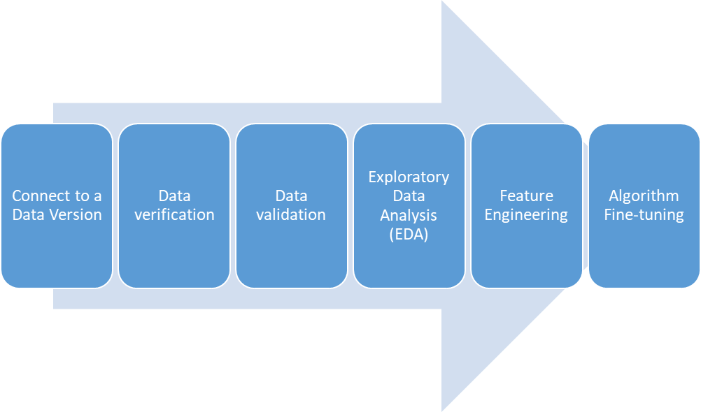
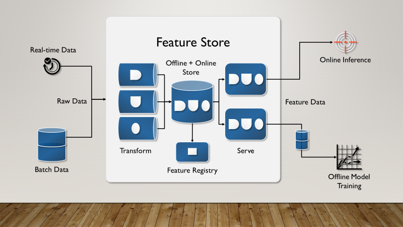

# 6 - Using a Feature Store

In this sixth chapter, we continue from the last chapter to look at ways data is used in ML model building and cover what a feature store is and the role it plays in ML model development. By the end of this chapter, you will be able to:

-   Understand the motivation of a feature store
-   Appreciate how a feature store promotes reusability to develop quick robust ML models
-   View important components of a feature store including automated feature engineering
-   Discover the benefits and challenges of a feature store

We start this chapter with understanding reusability in the model development part of the ML lifecycle.

##  What is Reusable in ML Model Development?

A good practice in software engineering is to write reusable code and leverage existing modules/functions/components. Extending that into ML model development, what part of the ML model development (sans the performance metrics and model delivery) is reusable? Looking at Figure 6.1,  let's go through each module to find out -

1.   Connect to a Data Version - data connectors are standard components that are reusable from an engineering perspective, but this is not specific to ML model development.

1.   Data Verification - very specific to the data schema and often not reusable.

1.   Data Validation - very specific to the data schema and often not reusable.

1.   EDA - very specific to the data characteristics, but the statistical concepts used for EDA (such as mean/variance) can be reused - this is related to data discovery that is part of but not specific to ML model development. For example, data discovery is needed also for data visualization.

1.   Feature Engineering - this is about developing features that are characteristics of the data (Chapter 5). However, these features may be useful in other business problems (and ML models) that require the same data. For example, a feature that aggregates hourly data to daily data can be used in multiple different types of forecasting models. Therefore, potential for reuse.

1.   Algorithmic Fine-tuning - this is specific to the algorithm and the data characteristics, hence not reusable.

<!-- 

  
   
  <em>Figure 6.1: ML Pipeline Components from Data ingestion to Model Training
</em>

 -->

Figure 6.1: ML Pipeline Components from Data ingestion to Model Training

Therefore feature engineering holds the promise of reusability among the different components. Given that is the case, one way to promote this concept is to construct and store the features one time, and reuse those features many times. That is what a feature store does.

##  What is a Feature Store?

A feature store is a repository for features that includes feature development and feature cataloging. This promotes feature discovery and reuses across different ML applications. A feature store connects to the data ingestion and is the interface between a ML algorithm and data. The basic components of a feature store are shown in Figure 6.2 and discussed below   [[1]](Chapter6.html#ftnt1).

<!-- 

  
   
  <em>Figure 6.2: Feature store data flow for ML model from data ingestion to serving both training and inference
</em>

 -->

  
Figure 6.2: Feature store data flow for ML model from data ingestion to serving both training and inference

###  Feature Store Components and Functionalities

The 3 major components of a feature store are

1.   An offline feature store   - this is for batch processing of features that do not have strict latency requirements. For example, the offline store can be implemented as a distributed file system (ADLS, S3, etc) or a data warehouse (Redshift, Snowflake, BigQuery, Azure Synapse, etc).

1.   An online feature store   - this is for real-time processing of features serving a   feature vector   as input for an ML model with strict latency requirements, usually of the order of milliseconds. For example, the online store is ideally implemented as a key-value store (eg. Redis, Mongo, Hbase, Cassandra, etc.) for fast lookups depending on the latency requirement.

1.   A Feature Registry   - this is to store feature   metadata with lineage to be used by both offline & online feature stores. It is a utility to discover all the features available in the store and information about how they were generated. It may include a search/ recommendation capability to enable easy discovery of features.

With the above main feature store components, the functionalities supported are:

1.   Transformation   - need to develop features from the incoming data. This includes automated feature engineering that we talk about in the next section.

1.   Storage   - need to store the features such that they can be used at any time.

1.   Versioning   - need to version features so that different modifications can be made to assess their impact on ML model training and you can roll back to earlier versions if required. Akin to data versioning that is discussed in Chapter 5.

1.   Catalog   - need to make the features discoverable by indexing the features with metadata so that other ML applications know what is available. An example of this discovery is using a   natural language-based query retrieval. This is often done by the Feature Registry. Furthermore, feature stores can enhance the visibility of existing features by recommending features based on a query of certain attributes and metadata. This empowers not-very-experienced data scientists with insights associated with experienced senior data scientists, thus enhancing the efficiency of the data science team.

1.   Serving   - need to support both training (batch mode) and inference (such as streaming) modes.

1.  Access -  control to decide who gets access to work on which features.

1.   Ownership - identify feature ownership i.e. responsibility for maintaining and updating features.

1.   Governance and Regulatory Audit - check for bias/ethics and comply with compliance regulations to ensure that the developed features are not in violation (for example, no features based on race or ethnicity).

1.   Lineage - maintain data source lineage for transparency.

1.   Monitoring   - need to monitor the incoming data used to create features and detect any data drifts. We discuss monitoring in Chapter 12.

As indicated in #1 Transformation, an important part of a feature store is automated feature engineering. There are different ways this can be implemented, as outlined in the next section.

###  Automated Feature Engineering

Aggregations and transformations are two popular feature engineering that can be automated for both continuous and categorical variables.

Let's review the data type with their transformation and aggregation techniques:

#### (a) Continuous data type
  
  <u> Transformation </u>

Univariate: absolute value, imputation, mean center, winsorize, smoothing/averaging, binning, change scale of data using for example log or inverse or power   [[2]](Chapter6.html#ftnt2)  transformations. 
  Bivariate: the difference between 2 variables, odds-ratio   [[3]](Chapter6.html#ftnt3)

Aggregation

Mean, median, standard deviation, variance.

#### (b) Categorical unordered aka nominal data type
  
  Transformation

Dummy encoding: assign numbers to the levels and ensure that if there are   K   levels you encode using only   K-1   new variables. This is to ensure that for algorithms such as linear regression the coefficient matrix is not over-determined and is invertible. 
  
    One hot encoding - encode each level as a vector where if there are   K   levels the vector is of size   K. 
  
    Feature vectors: use vectors to encode each level  (vectors are usually <   K   size if there are   K   levels) where the distance (such as Euclidean) between the vectors are semantically determined. Thus semantically similar levels have vectors close to each other by distance measure. For example, encoding colors with feature vectors will have blue and azure vectors close to each other in distance.
  
  Aggregation
  
  Count/frequency of a specific level, the number of times a level is hit in a given period.
 
 
#### (c) Categorical ordered aka ordinal data type

Transformation

Numbering: assign numbers in ascending or descending order. For example, if an alert has low, medium, and high levels, the corresponding encoding maybe 0, 1, or 2 to indicate the order of criticality.
  
Aggregation

Same as unordered categorical.

Next, we outline the benefits and challenges of a feature store and list 3 popular open-source feature stores.

###  Benefits of a Feature Store

Using a feature store with the aforementioned components and functionalities has multiple benefits as follows -

1.   The well-defined interface between data and algorithm   - feature store sits between the data repository and algorithm and provides a well-defined interface between the two. This makes it easy to add/remove data sources and swap algorithms.

1.   Centralized repository of features   - feature building is not easy and takes time. Feature store provides a central location where all the features are generated and stored. This helps in writing robust code using pre-built and tested features.

1.   Promote reuse of features and collaboration   - Features stores make it easy to search for and reuse pre-built and tested features. Furthermore, it helps in crowdsourcing features across the enterprise - you can leverage existing features to build new features and store them in the feature store.

1.   Training for junior data scientists   - who have access to insightful features developed by experienced senior data scientists.

1.   Reduced time-to-market   - with the reusability of built and tested features, you can focus on fine-tuning the algorithm and building ML pipelines (discussed in Chapter 8) for more iterations, thereby reducing the time-to-market of your ML model.

###  Challenges of a Feature Store

While the aforementioned benefits are attractive, they do come with challenges -

1.   An additional component to build and maintain   - Feature store is another component in your ML pipeline that you need to build and maintain.

1.   Risk of training-serving skew   - Feature store is used for both training and inference, each with different latency requirements. This often results in different architectures for the two pipelines. Therefore there is always a risk of training-serving skew where the data transformations/aggregations are different between training and inference (discussed in Chapter 8).

1.   Does not become a feature swamp   - adequate governance is required such that a feature store does not become a feature swamp and a dumping ground for features that are not completed and/or never used.

1.   Continuous monitoring   - need continuous monitoring of the developed feature to detect any unexpected drift or gaps (Chapter 12).

Open-Source Feature Stores

In this section we introduce 3 open-source feature stores -

1.   Feature tools (   [https://www.featuretools.com/](https://www.google.com/url?q=https://www.featuretools.com/&sa=D&source=editors&ust=1681619228594132&usg=AOvVaw1J60KRGQNFKvscGbCYG1CU)    ) - an open-source framework for automated feature engineering.

1.   Feast (   [https://www.featuretools.com/](https://www.google.com/url?q=https://www.featuretools.com/&sa=D&source=editors&ust=1681619228594611&usg=AOvVaw2aJGV-OAzvwiWf84lfxFgs)    ) - open-source feature store with support for data located in the cloud and on-premise.

1.   Hopworks Feature Store (   [https://www.hopsworks.ai/](https://www.google.com/url?q=https://www.hopsworks.ai/&sa=D&source=editors&ust=1681619228595000&usg=AOvVaw3w6qF9bkiBOePSWYuNLlam)    )  - open-source feature store that can ingest data from the cloud and on-premise and is a component of Hopworks ML platform (that supports ML model training and serving).

There is a list of commercially available feature stores at    [https://www.featurestore.org/](https://www.google.com/url?q=https://www.featurestore.org/&sa=D&source=editors&ust=1681619228595415&usg=AOvVaw0rMlGOVHyF-B3ElC6cgvWt).

##  Summary

In this chapter we looked at the motivations and structure of a feature store and how they are beneficial to ML model development. We also outlined automated feature engineering and challenges that arise with a feature store and listed open-source and commercial feature stores that are available in the industry. In the next chapter, we use these features to build ML models.

------------------------------

[[1]](Chapter6.html#ftnt_ref1)   https://towardsdatascience.com/mlops-building-a-feature-store-here-are-the-top-things-to-keep-in-mind-d0f68d9794c6

[[2]](Chapter6.html#ftnt_ref2)      [https://en.wikipedia.org/wiki/Power_transform](https://www.google.com/url?q=https://en.wikipedia.org/wiki/Power_transform&sa=D&source=editors&ust=1681619228596209&usg=AOvVaw3t6d5KLytvlMslNGgHJrdd)

[[3]](Chapter6.html#ftnt_ref3)      [https://en.wikipedia.org/wiki/Odds_ratio](https://www.google.com/url?q=https://en.wikipedia.org/wiki/Odds_ratio&sa=D&source=editors&ust=1681619228596561&usg=AOvVaw2r6Cdnje8FI_CeIAw__39B)

\newpage
