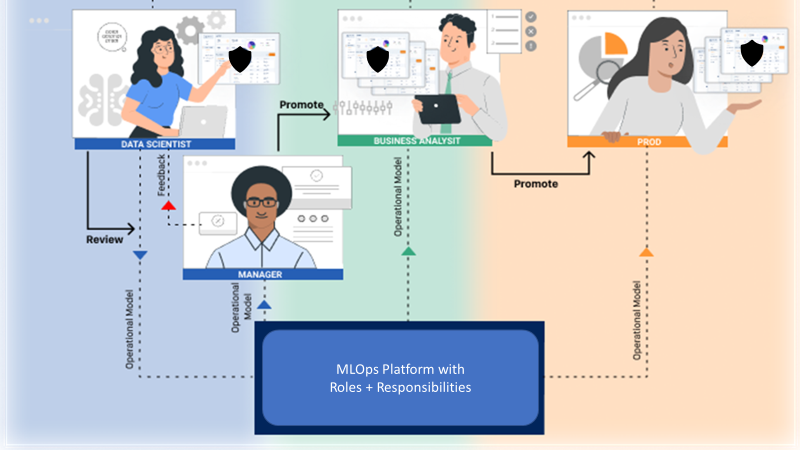

# 7 - Building Machine Learning Models

In this seventh chapter we look at what is involved in building machine learning models after the data is ready for ingestion (for example from a feature store discussed in Chapter 6). By the end of this chapter, you will be able to:

-   Understand what is meant by algorithm versioning
-   Define what is AutoML and its purpose
-   Describe an ML model using a model card

We start this chapter with versioning an ML algorithm.

##  ML Algorithm Versioning

You want to version ML algorithms for repeatability and governance, similar reasons to data versioning (Chapter 5). But you may be thinking, what do I need to version when I am using say an algorithm from scikit-learn? To start with, you may have different candidate algorithms that you want to try, each corresponding to a different algorithm version.

<!-- 

  
   
  <em>Figure 7.1: Versions with different algorithms
</em>

 -->

Figure 7.1: Versions with different algorithms

For example, consider a brick-and-mortar retail sales prediction model that incorporates weather. The input features (say from a feature store from Chapter 6) may be historical sales, temperature, precipitation, and day-of-week. These features may be used with any of the following models: linear regression, random forest, support vector machines, and neural networks, as illustrated in Figure 7.1. Each experimental run with the same data version (from Chapter 5) uses a new algorithm type and version.

Another example of versioning is with different hyperparameters for the same algorithm. Note that a hyperparameter is a parameter whose value is defined before training/learning   [[1]](Chapter7.html#ftnt1)   . For example, you can create different structures of an algorithm listed in Table 7.1 with different hyperparameters. You can use different versions of the random forest algorithm with different tree depths, or use different versions of a neural network with different learning rates for the retail sales prediction example (Figure 7.2).

So you can have combinatorial versioning of algorithms (Figure 7.1) with hyperparameters (Figure 7.2). In Chapter 8 we see how this works with data versioning in ML pipelines.

|Algorithm | Hyperparameters | 
|----------|-----------------|
| Linear Regression | Regularization parameter,...|
| Random forest | Number of estimators |
| Support Vector Machine | C and gamma |
| Neural network|Learning rate,...|

Table 7.1: Algorithms and corresponding hyperparameters.

<!-- 

  
   
  <em>Figure 7.2: Versions with the same algorithm and different hyperparameters
</em>

 -->

Figure 7.2: Versions with the same algorithm and different hyperparameters

As demonstrated, algorithm versioning helps you keep track of all the moving parts in ML model building. Note that these are just sample algorithms that you can use for the retail sales prediction example. There are multiple other algorithm options including ensembling the aforementioned algorithms. Determining what is the best algorithm to use necessitates building models with each and evaluating the model metrics. Sometimes the challenge may be that you cannot train a model continuously from start to finish for whatever reason be it time, hardware availability, data, or cost. At the same time, you do not want to lose the training you have done till then. This is where model checkpointing comes in handy.

###  Model Checkpointing

As outlined above, a machine learning model training may be paused for many reasons, some decided by you such as suspend now and pick it up later to free up computation resources, others not decided by you such as out-of-memory or execution crash. Irrespective of the reason, you would want to restart the training from the last completed point as opposed to restarting from the beginning. This is what model checkpointing allows as demonstrated in Figure 7.3. Checkpoints A, B and C save the state of a model during training and validation. Checkpoints B and C pickup from the saved model state in checkpoint A and B, respectively, with each region indicated differently in the loss curves.

Model checkpointing is similar to model save but with a subtle difference. In the former, you have the model source code so you are only saving the parameter values. In the latter, you are serializing the complete model - parameter values and model architecture. ML libraries such as TensorFlow   [[2]](Chapter7.html#ftnt2)     and PyTorch   [[3]](Chapter7.html#ftnt3)     have APIs for model checkpointing.

Armed with algorithm versioning, hyperparameter versioning and model checkpointing, now you are ready to make a serious impact on a business project. However, manually determining which combination gives the best result (as evaluated by a business metric) is cumbersome. Automated machine learning is an automated methodology that does this automatically. In other words, it builds models with multiple combinations of different algorithms and different hyperparameters and ranks them based on a user-defined model evaluation metric.

<!-- 

  
   
  <em>Figure 7.3: Model checkpointing during training
</em>

 -->

Figure 7.3: Model checkpointing during training

##  Automated Machine Learning (AutoML)

AutoML is automated ML model development spanning data ingestion, parameter extraction, and selection with feature engineering, hyperparameter optimization, and algorithm selection. AutoML automates the processes in Figure 7.1 and Figure 7.2 as illustrated in Figure 7.4. The benefit of such automation is that a lot of the glue code needed for the aforementioned functionalities is already available to you. The outcome of AutoML is ranked ML models (to be precise ML pipelines that we look at in Chapter 8).

###  AutoML Usage and Benefits

AutoML are used in the industry in a variety of ways -

-   Business and other analysts use AutoML to develop models without going into the algorithm or hyperparameter selection details - these users are sometimes referred to as citizen data scientists. The benefit of AutoML is democratizing ML model usage. Not all employees in an enterprise need an intensive math and algorithm code development background. AutoML empowers citizen data scientists who may not have the intensive ML data science background to impact enterprise productivity using ML models with some upskilling.

-   Experienced data scientists use AutoML to narrow down the algorithm and hyperparameter possibilities, including neural network architectures. And then develop or fine-tune the models themselves. The benefit is that trained data scientists with math and algorithm backgrounds use AutoML as an efficiency tool. In the next section we discuss using AutoML to search neural network architectures.

<!-- 

  
   
  <em>Figure 7.4: Automated Machine Learning (AutoML) steps
</em>

 -->

Figure 7.4: Automated Machine Learning (AutoML) steps

###  AutoML for Neural Architecture Search (NAS)

Neural Architecture Search is where you use AutoML to search for the best (as defined by a loss function) neural network architecture from a set of possibilities. For example, Google implements NAS using reinforcement learning or evolutionary algorithms (such as genetic algorithms) to search the vast space of possible neural networks to design neural network architectures.

A restriction of AutoML including NAS is that its search space comprises predefined algorithms and hyperparameters that may be subject to the designer’s bias. To remove this restriction, Google defined a concept called AutoML-Zero   [[4]](Chapter7.html#ftnt4) [4]    that uses evolutionary algorithms to start from empty programs and use basic math operations as building blocks to construct ML code. Next, we list popular open-source AutoML libraries.

###  AutoML Open-source Libraries

Below are examples of open-source automl libraries -

-   AutoWEKA (   [https://www.automl.org/automl/autoweka/](https://www.google.com/url?q=https://www.automl.org/automl/autoweka/&sa=D&source=editors&ust=1681619240160336&usg=AOvVaw3LlsBHUgwdLaurHaZyqljc)    ) - oldest library released in 2013.
-   Auto-sklearn (   [https://automl.github.io/auto-sklearn/master/](https://www.google.com/url?q=https://automl.github.io/auto-sklearn/master/&sa=D&source=editors&ust=1681619240160786&usg=AOvVaw3ZADgd65z4Q3CgNfP2Twxs)    ) – for ML models
-   Auto Keras (   [https://autokeras.com/](https://www.google.com/url?q=https://autokeras.com/&sa=D&source=editors&ust=1681619240161109&usg=AOvVaw1Scah1SoHv9aLNNgwZ-aKt)    ) – for DL models
-   TPOT (   [https://epistasislab.github.io/tpot/](https://www.google.com/url?q=https://epistasislab.github.io/tpot/&sa=D&source=editors&ust=1681619240161438&usg=AOvVaw3h7ggaaS3bZ1TCufUaSQ9S)    )
-   H2O AutoML (   [https://www.h2o.ai/products/h2o-automl/](https://www.google.com/url?q=https://www.h2o.ai/products/h2o-automl/&sa=D&source=editors&ust=1681619240161782&usg=AOvVaw1fs5ZgHq2zJbeJiXBn_Oeo)    )
-   Ludwig (   [https://eng.uber.com/introducing-ludwig/](https://www.google.com/url?q=https://eng.uber.com/introducing-ludwig/&sa=D&source=editors&ust=1681619240162109&usg=AOvVaw2KVMykpOOQSdRfVIFc5HiE)    )
-   FLAML (   [https://microsoft.github.io/FLAML/](https://www.google.com/url?q=https://microsoft.github.io/FLAML/&sa=D&source=editors&ust=1681619240162445&usg=AOvVaw29CjZeeWYJKUnS9GCR1zGu)    ) – Fast and Lightweight AutoML

###  ML Model Development - Full/Low/No Code

Using AutoML reveals an interesting spectrum in ML model development. At one end of the spectrum is automated ML development as defined in this chapter. At the other end of the spectrum is manual ML development where a data scientist works with the data and algorithms and trains them (maybe with model checkpointing) using open-source libraries such as scikit-learn, TensorFlow, PyTorch, among others. Additionally, there is an interesting methodology in the middle that we discuss next.

As shown in Figure 7.5, there is a semi-automated ML between the AutoML and manual ML model development where you have off-the-shelf pre-trained models available for use. Such pre-trained models target domain-specific use cases. Their usage is expected in enterprises with data science teams who want accelerators to solve a business problem. These enterprises do not have the luxury of starting from scratch due to the competitive landscape but have data scientists who can improve and fine-tune the pre-trained models. Let us explain using a couple of examples. Assume two pre-trained models - an employee churn propensity model to assign a probability to an employee to leave a company and a patient infection propensity model to assign a probability to a hospital patient to develop a site infection. Both models are developed using domain-specific data collected from multiple sources that give them reasonable predictive power. The employee churn model uses data from different enterprises with varying numbers of employees. The patient infection model uses data from different hospitals of different sizes (as determined by the number of beds). Both these models have reasonable accuracy out of the box when applied to a specific enterprise or a specific hospital. However, to increase their accuracy for that specific company or hospital, the respective data science teams can fine-tune the models using transfer learning   [[5]](Chapter7.html#ftnt5) [5]    with the company or hospital-specific dataset.

<!-- 

  
   
  <em>Figure 7.5: ML model development from manual to AutoML
</em>

 -->

Figure 7.5: ML model development from manual to AutoML

Closely associated with the concepts of AutoML, semi-auto ML and manual ML is how much code you will have to write when using them. As indicated in Figure 7.5, this introduces the associated concepts of low-code or no-code that differentiate from full-code -

Full-code   –  when you write code for an ML model (for example using libraries such as scikit-learn, TensorFlow, or PyTorch). Associated with manual ML.

No-code   – when you use graphical tools such as drag-and-drop components on a workspace and connect them with arrows to build a system without writing any code. Associated with semi-auto ML (no fine-tuning, just use the pre-built ML model as-is) and AutoML (use the automatically built ML model as-is).

Low-code   –  when you use similar graphical tools but may have to update settings in a configuration file or update parameters in a code file or write some basic scripts. Also associated with both semi-auto ML (update scripts to fine-tune and train the pre-built ML model with your dataset) and AutoML (update scripts to change hyperparameters, if allowed by the AutoML framework).

##  Model Card

Just like a nutrients facts label tells you every detail about the product - how it was made, its constituents, etc., similarly a model card   [[6]](Chapter7.html#ftnt6) [6]    (introduced by Google) tells you everything about the model. Specifically, a model card outlines

1.   Model details   - basic information about when the model was built, version, license details etc.

1.   Intended use   - what are the different use-cases that the model was built for and the out-of-scope use-cases.

1.   Factors   - what are the relevant factors used to build the model.

1.   Metrics   - what are the performance measures to evaluate model impact

1.   Evaluation data   - what evaluation dataset (and preprocessing, if any) was used to analyze the model.

1.   Training data   - what training dataset (and preprocessing, if any) was used to build the model.

1.   Quantitative analysis   - what are the results of model analysis.

1.   Ethical considerations   - what ethical aspects (bias and fairness discussed in Chapter 13) was taken care of to build the model.

1.   Caveats and recommendations   - warnings and recommendations on using the model.

As you can see a model card details everything pertinent and important there is to know about a model. Now that you have a ML model documented with a model card, you need to ensure that there is model governance to keep track of which model is deployed to or updated in production.

##  Model Governance

Given the possible Cambrian explosion of data versions, hyperparameters, and algorithm versions that constitute a specific model, it is imperative that enterprises require strong ML model governance to keep track of which model is currently in production and who authorized the last production release. This is managed using approval workflows.

Approval Workflows are processes designed to ensure the authorized flow of information and/or artifacts in organizations. Such workflows are very familiar in everyday enterprise activities such as applications for leave, expense reimbursements, equipment allocation, and the like. There are industry-standard best practices for these workflows, which each organization modifies to suit its needs and culture. They have also become commonplace in the world of software development, for example,

-   A developer issues a “Pull Request” (PR) to a Tech Lead / Manager. The code is reviewed and corrected before being merged into the release branch of the code repository.

-   Managers review unit test/integration test reports before releasing code for the QA team to test. Additional tests may be required before the code is deemed ready for QA.

-   A Release Manager reviews QA reports before releasing software to a production system.

<!-- 

  
   
  <em>Figure 7.6: Model approval workflow based on different roles and responsibilities
</em>

 -->

Figure 7.6: Model approval workflow based on different roles and responsibilities

Approval Workflows are based on the concepts of Roles and Requests. A workflow typically defines a Request (to be performed by a specific Role), and multiple levels of approvals to be

provided by other Roles. In the first example provided above, the Developer Role made a Pull Request to be approved by a Manager Role.

In addition, an ideal workflow should be customizable to suit the needs of the organization and should maintain a log of requests and approvals (by whom and when), thus providing a complete audit trail.

Let us follow the workflow in Fig. 7.6. Assume a data scientist completes an ML model. Next, a manager reviews the model and provides feedback. Once the model is approved by the manager, it is promoted for validation and testing in quality assurance (QA). In QA, a data analyst (or any QA specialist) tests the model. If the model has issues, then the data analyst provides feedback to the data scientist, the model is rebuilt, and the cycle is repeated. Once the model passes the QA test, the data analyst approves and promotes the model to production. In production, an IT engineer deploys the model. All the workflow roles, responsibilities, and subsequent actions are managed, labeled, identified, and controlled using approval workflows. Such workflows are often managed by MLOps platforms.

In conclusion, the demonstrated approval workflow maintains a complete log of approvals (by whom and when) and promotions (dev to QA and QA to production) for a production ML model. Such model governance improves the ML production lifecycle with streamlined processes and accountability in a collaborative environment.

##  Summary

In this chapter we understand algorithm versioning and discuss AutoML. We also look at model documentation using a model card and no/low/full code ML model development. Lastly, we discuss model governance given the different data versions, hyperparameters, and algorithm versions. In the next chapter, we discuss ML pipelines that are the backbone of ML experimentation and model building.

------------------------------

[[1]](Chapter7.html#ftnt_ref1)       [https://en.wikipedia.org/wiki/Hyperparameter_(machine_learning)](https://www.google.com/url?q=https://en.wikipedia.org/wiki/Hyperparameter_(machine_learning)&sa=D&source=editors&ust=1681619240171100&usg=AOvVaw3Upk-ruYERIg-lLBTnhvOd) (machine_learning)

[[2]](Chapter7.html#ftnt_ref2)      [https://www.tensorflow.org/api_docs/python/tf/train/CheckpointManager](https://www.google.com/url?q=https://www.tensorflow.org/api_docs/python/tf/train/CheckpointManager&sa=D&source=editors&ust=1681619240171616&usg=AOvVaw10OvgTzEZeG8ghqxi1RS94)

[[3]](Chapter7.html#ftnt_ref3)      [https://pytorch.org/tutorials/recipes/recipes/saving_and_loading_a_general_checkpoint.html](https://www.google.com/url?q=https://pytorch.org/tutorials/recipes/recipes/saving_and_loading_a_general_checkpoint.html&sa=D&source=editors&ust=1681619240172109&usg=AOvVaw1f1LAm9PhHdFtqjuqmeos4)

[[4]](Chapter7.html#ftnt_ref4)       [https://ai.googleblog.com/2020/07/automl-zero-evolving-code-that-learns.html](https://www.google.com/url?q=https://ai.googleblog.com/2020/07/automl-zero-evolving-code-that-learns.html&sa=D&source=editors&ust=1681619240173540&usg=AOvVaw3dWOeYzrW7-qBgkoJyWXZh)

[[5]](Chapter7.html#ftnt_ref5)      [https://en.wikipedia.org/wiki/Transfer_learning](https://www.google.com/url?q=https://en.wikipedia.org/wiki/Transfer_learning&sa=D&source=editors&ust=1681619240172981&usg=AOvVaw0rO45lfUngaoj4xC8p3Zog)

[[6]](Chapter7.html#ftnt_ref6)     M. Mitchell et.al.,   Model Cards for Model Reporting  , Assoc. for Computing Machinery, 2019, https://arxiv.org/pdf/1810.03993.pdf
