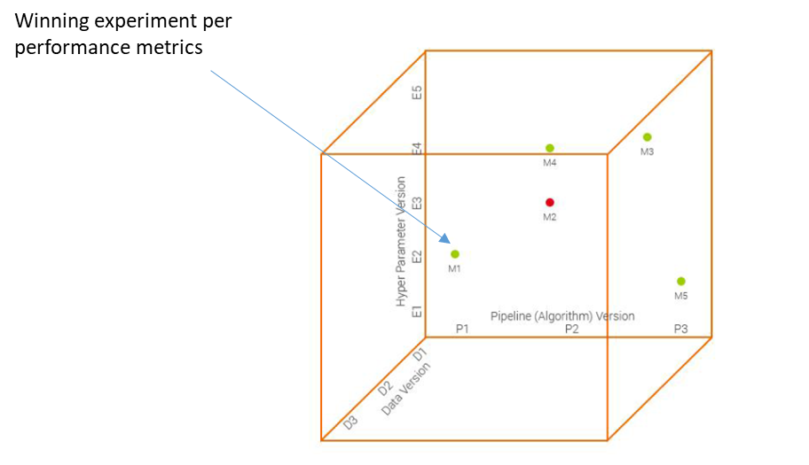
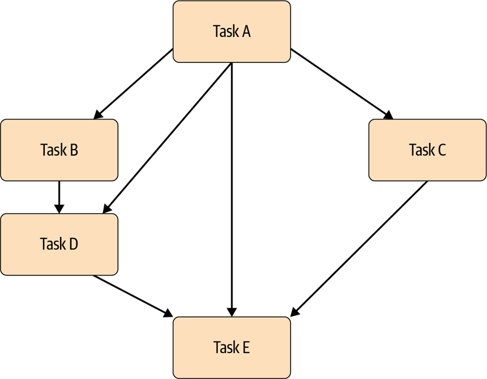
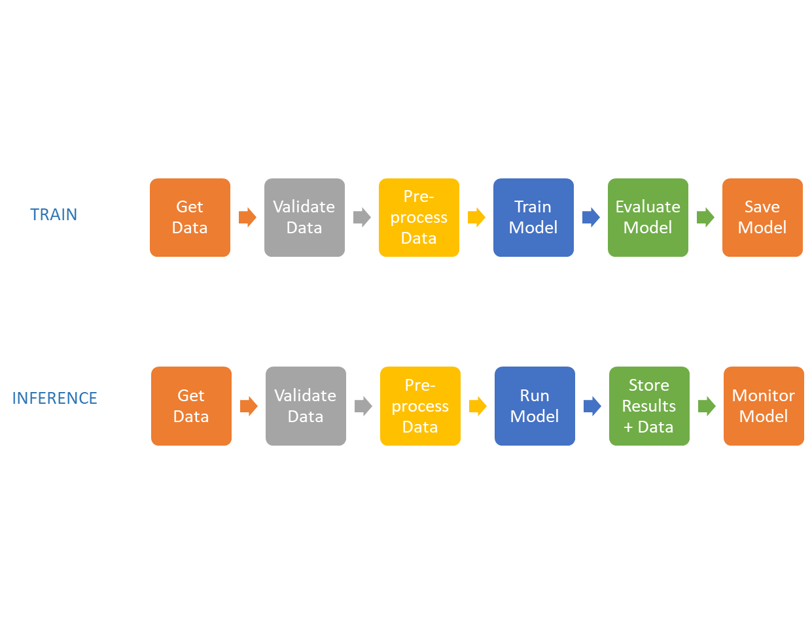
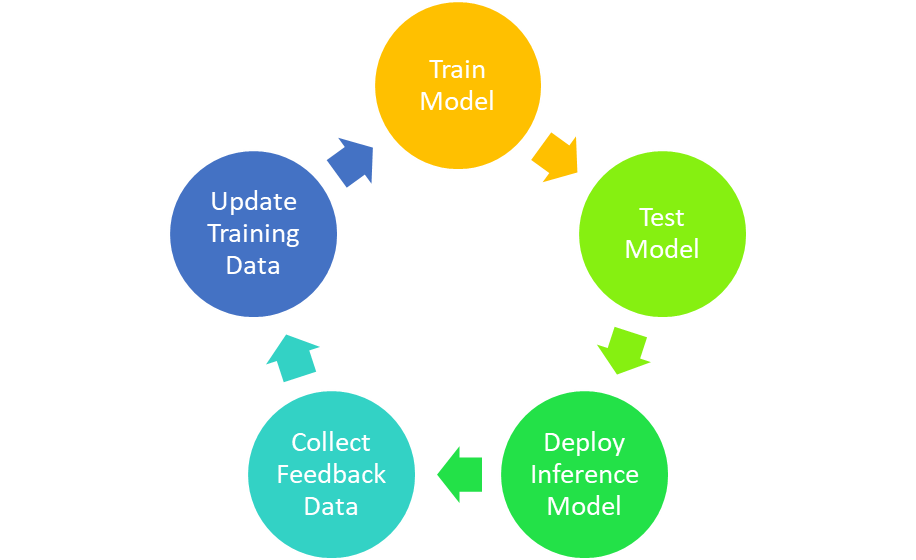

# 8 - Understanding Machine Learning Pipelines


This eighth chapter pulls together data from Chapter 5 (including feature store from Chapter 6) and ML algorithms and model building from Chapter 7 and introduces experimentation using machine learning (ML) pipelines. By the end of this chapter, you will be able to:

-   Understand why ML pipelines are important
-   Understand what to ensure when productionizing pipelines
-   How to create data feedback loops
-   Be cognizant of available open-source ML pipeline tools


We start this chapter with the notion of experimentation that is at the heart of iterative ML model development.


##  Phases of Experimentation


The iterative nature of ML model building was outlined in the last chapter where you managed data versions for different experiments. Experimentation has 3 different phases that form an experimental wheel as defined by Stefan Thomke   [[1]](Chapter8.html#ftnt1):

1.   Generate verifiable hypothesis   - this is where you have a hypothesis that using data version 1.1.1 is better than version 4.0 (Figure 5.2) because including outliers makes the model robust.


1.   Run disciplined experiments   - this is where you have a platform to run experiments where you build ann ML model using different data versions (Figure 5.2) and different algorithm and hyperparameter versions (Figure 7.1 and Figure 7.2) and compare the metrics.


1.   Learn Meaningful Insights   - use the feedback from the metrics comparison to learn insights and derive insights such as imputation is not important but outlier removal is and uses these insights to generate the next verifiable hypotheses (for example to use version 2.1.1 in Figure 5.2).


The ability to run the above experimentation wheel is enabled by ML pipelines. And the knobs to change for an ML experiment span data versioning, hyperparameters versioning, and algorithms/pipeline versioning   [[2]](Chapter8.html#ftnt2) [2]    (Figure 8.1). For example, you may want to experiment with the same data version in the same ML pipeline but with different hyperparameters. Another experiment would be using the same data version with the same algorithm hyperparameter but different pipeline configurations such as different data mappings or mash-ups with external data. A third configuration may use the same data version with different algorithms. As outlined in Chapter 4 on the desiderata of an MLOps platform, team collaboration with different members running different experiments (some of which will fail fantastically like M2 and not all successful ones will perform like M1) is important to find that winning model combination.


<!-- <p align="center">
  
  <br>
  <em>Figure 8.1 - ML experiments
</em>
</p> -->

<center>


Figure 8.1 - ML experiments

</center>


##  ML Pipeline


A ML pipeline is a workflow to run experiments outlined in the previous section starting with data ingestion and ending with model delivery.   It includes all the steps necessary to train a model from DataOps and ModelOps in Figure 4.2 such as data validation, data preprocessing, data mappings (including any external data mash-ups), model training, model evaluation, and model delivery (ready for production deployment). Note that this includes defining an ML pipeline for AutoML discussed in Chapter 7. A workflow example is given in Figure 8.2 -

1.   Use a hypothesis to connect to a specific data version.


1.   [Optional] Perform additional mapping/mash-ups on the data.


1.   [Optional] Generate features - each new feature corresponds to a new pipeline version.


1.   Choose an algorithm and specific hyperparameters. Note that changing hyperparameters corresponds to a new hyperparameter version.


1.   Train an ML model (can be manual or Semi-Auto ML or AutoML from Chapter 7).


1.   Calculate model metrics (training error, if possible out-of-sample validation error).


1.   Deliver the trained model ready to be deployed if needed (to be determined based on the model metrics) - this completes the experiment.


<!-- <p align="center">
  
  <br>
  <em>Figure 8.2: ML pipeline example
</em>
</p> -->

<center>


Figure 8.2: ML pipeline example

</center>

Pipelines need orchestration so that the components are executed in the correct order. In the Hidden Technical Debt in Machine Learning paper, the authors found that one of the reasons for the failure of ML projects is the brittle and often not-portable scripts that glue the different components of an ML workflow. This is mitigated by ML Pipelines that abstract the glue code and manage the orchestration in a standardized way.

Pipeline tools manage the flow of tasks through a directed graph representation of the task dependencies (Figure 8.3). Directed graphs ensure that task dependencies are honored. They are acyclic (no cycles) so that the orchestration is not going back to a previously completed task, and are directed such that the execution flows in one direction.


<!-- <p align="center">
  
  <br>
  <em>Figure 8.3: Directed Acyclic Graph (DAG) used in ML pipelines
</em>
</p> -->

<center>


Figure 8.3: Directed Acyclic Graph (DAG) used in ML pipelines

</center>


###  ML Pipeline   Advantages


The technical advantages of ML pipelines are -

1.   Independent   steps   so multiple team members can collaborate on the pipeline simultaneously.


1.   Start   from any specific point -   Re-run   does not have to always start at the beginning, you can choose a midpoint skipping steps not needed.


1.   Reusability   promoted by pipeline templates for specific scenarios that always follow the same sequence - for example, you can create a copy of a pipeline and reuse for another experiment (i.e. use another data version and/or another set of hyperparameters and/or another data mapping/external data mash-up).


1.   Tracking   and   versioning     of data, model and metrics.


1.   Modular development   with isolated changes to independent components that enable faster development time.


1.   Visual representation   of components / functionalities deployed to production.


The primary business advantage provided by ML pipelines is cost reduction due to -    1.   Multiple quick iterations   via different experiments that give more development time for novel models – something that data scientists love to do = better job satisfaction + retention.


1.   Standard processes   to update existing models.


1.   Systematic   methodology to reproduce results.


1.   Increased data governance   with data and model audit – create a paper trail.


###  Inference Pipelines


So far in this chapter we have discussed training ML pipelines where you run different experiments to create the best (from your metrics-perspective) ML model and deliver it ready for deployment. That model is then deployed to production and is ready for inferencing. Here you have to be diligent so that your inference pipeline includes all the data mapping(s) and mash-up(s) and feature engineering that were done on the raw incoming data in the training pipeline. As illustrated in Figure 8.4, all the steps prior to model run have to be identical so that there are no differences between the data used to train the algorithm to generate the deployed model, and the data used by the same model for inferencing.


If there is a difference in the data sent to the model then your pipelines have a Training-Serving skew. Be careful to avoid this skew. Otherwise you violate one of the basic assumptions in machine learning that the training and inference data are from the same data distribution.


Note that training and inference pipelines are complementary. The training pipeline's primary purpose is to evaluate models and deliver the one with the best metrics. The inference pipeline’s primary purpose is to generate results from the model and monitor the model for any drift (more on this in Chapter 12). More on this result generation and feedback for the ML model in the next section.


<!-- <p align="center">
  
  <br>
  <em>Figure 8.4: Complementary Train and Inference ML Pipelines
</em>
</p> -->

<center>


Figure 8.4: Complementary Train and Inference ML Pipelines

</center>


###  Data Feedback and Flywheel


As you can see in the Inference pipeline above, there is a “store results + data” component. This component constitutes data feedback and stores new data input to the model during inference. The stored data serves as new training data that is used in the training pipeline.


There are 2 types of data feedback in ML models -

1.   Implicit feedback   - a user clicks on an online advertisement implying the ad was useful.


1.   Explicit feedback   - a user rates a movie in an online streaming service.


The motivation behind data feedback is to institute a cycle of model retraining and data collection also known as data flywheel (Figure 8.5). The flywheel concept is from Jim Collins   [[3]](Chapter8.html#ftnt3) [3]    and it depicts a cycle that is enabled by all the different components and leads to improvement.


From a ML perspective, the data flywheel concept is tied to Continuous Training (CT). CT forms the third part of a CI/CD/CT pipeline where a ML model is retrained with new training data. The need to retrain is enabled by different triggers such as data drift (Chapter 12) or a heuristic time window such as the first of each month. The data flywheel ensures that when CT is triggered there is new training data available to deliver an updated model. For example, a recommender system is a good example of collecting training data using a feedback loop - when a user clicks on a recommendation that is used as positive (implied) feedback.

In the next section, we outline three popular open-source pipelines for use with your ML code.


<!-- <p align="center">
  
  <br>
  <em>Figure 8.5: Data Flywheel
</em>
</p> -->

<center>


Figure 8.5: Data Flywheel

</center>


###  Open Source Pipeline Implementations


There are multiple open-source pipeline implementations and we list 3 of them in this chapter. Note that most of these implementations use YAML files to define the pipeline components and dependencies (including external library versions). An example of such a YAML file pipeline definition is in Figure 8.6.


```yaml
name: spacy-example
channels:
 - conda-forge
depencies:
 - python=3.7
 - pip
 - pip:
   - mlflow >= 1.0
   - spacy==2.2.3
```
<p align="center">
Figure 8.6: YAML file from spacy example of MLflow.
</p>

The popular pipeline frameworks are -

1.   Apache Airflow (   [https://airflow.apache.org](https://www.google.com/url?q=https://airflow.apache.org/&sa=D&source=editors&ust=1681619251622052&usg=AOvVaw39NOsSCkt-Z01yjDPApPgX)    /) - originated at Airbnb this is a workflow engine that manages scheduling and running jobs and data pipelines.


1.   Kubeflow Pipelines (   [https://www.kubeflow.org/](https://www.google.com/url?q=https://www.kubeflow.org/&sa=D&source=editors&ust=1681619251622572&usg=AOvVaw35Pnm3-5cRZChF5k2KT4rR)    ) - started as an open-source Google to manage TensorFlow jobs on Kubernetes.


1.   MLflow (   [https://mlflow.org/](https://www.google.com/url?q=https://mlflow.org/&sa=D&source=editors&ust=1681619251622891&usg=AOvVaw2iy_Rm7bNR0BuXhuY99Jj2)    ) - provides a framework to track experiment metrics and  parameters and visualize and compare them in a browser.


##  Summary


In this chapter we looked at the motivations behind ML pipelines and the advantages of using them both from technical and business perspectives. We also outlined continuous training that extends the DevOps CI/CD methodology to CT using a data flywheel. Lastly, we present 3 popular open source implementations for ML pipelines. In the next chapter, we look at model interpretability and explainability.

------------------------------


[[1]](Chapter8.html#ftnt_ref1)     Thomke Stefan H., Experimentation Works, Harvard Business Review, 2020


[[2]](Chapter8.html#ftnt_ref2)      [How MLOps Helps CIOs Reduce Operations Risk (xpresso.ai)](https://www.google.com/url?q=https://xpresso.ai/resources/blogs/how-mlops-helps-cios-reduceoperations-risk/&sa=D&source=editors&ust=1681619251623850&usg=AOvVaw3ok7vUwIesXkZNVAxHxJ0A) (xpresso.ai)


[[3]](Chapter8.html#ftnt_ref3)    J. Collins,    [Good to Great: Why Some Companies Make the Leap and Others Don’t, HarperBusiness, 2001.](https://www.google.com/url?q=https://smile.amazon.com/Good-Great-Some-Companies-Others/dp/0066620996/ref%3Dsr_1_1?keywords%3Djim%2Bcollins%2Bgood%2Bto%2Bgreat%26qid%3D1662917929%26sprefix%3DJim%2Bcol%252Caps%252C103%26sr%3D8-1&sa=D&source=editors&ust=1681619251624332&usg=AOvVaw2Nw2smFXf9pQ0pnNupy-8E)
