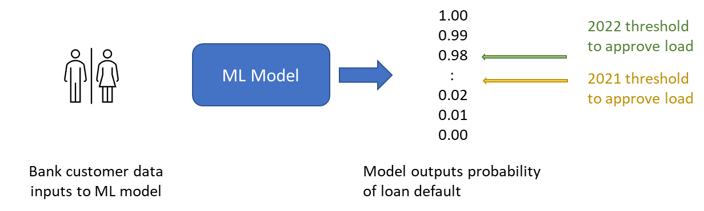
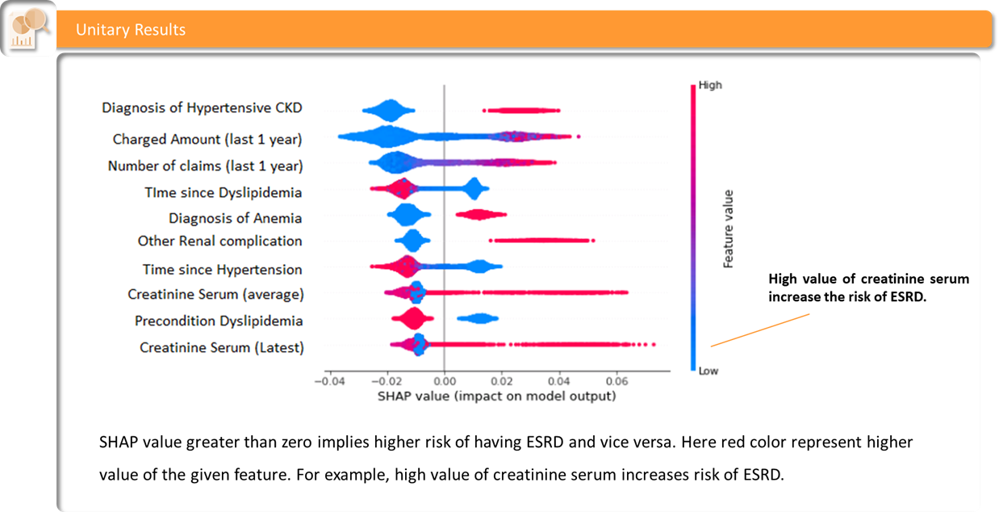
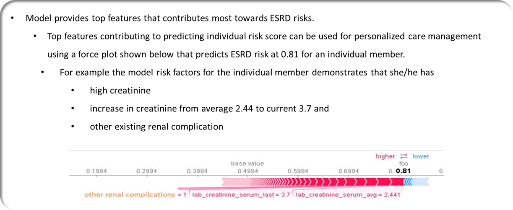
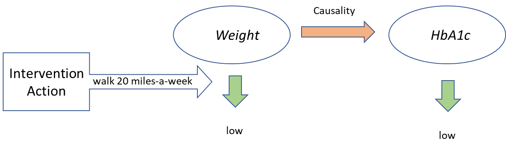

# 9 - Interpreting  & Explaining Machine Learning Models

This ninth chapter discusses how to dissect a ML model from the perspectives of explainability and interpretability. Until now, you have learned about building models using data versions (Chapter 5), feature stores (Chapter 6), ML algorithms (Chapter 7), and experimentations with ML pipelines (Chapter 8). Now that you have a built model, in this chapter you will be able to:

-   Assess how to interpret the output of a ML model
-   Understand how to explain the output of a ML model
-   Use techniques such as causal inference and counterfactuals for ML model explainability

We start this chapter with ML model interpretability.

##  ML Model Interpretability

Consider that you have built a ML model that outputs the probability of a patient developing diabetes after 6 months and before 12 months. The inputs to the model are a variety of healthcare data such as electronic health records, lab results, number of visits to the emergency department, among others. The objective is to rank patients from high to low probabilities and determine which high-probability (high-risk) patients should be contacted for medical intervention/treatment.

The output of the ML model is 0 to 1, with 0 indicating no risk and 1 a certainty of diabetes. From a business standpoint, you have to determine the threshold above which you are going to medically intervene and reach out to patients. This threshold is a function of your organization’s capacity to manage the number of interventions in a given period, the intensity of the interventions, and the history of health outcomes of patients with such probability modeling. In other words, multiple business factors influence the threshold and how you interpret the output of the ML model. For example, a large hospital group with sizable resources will have a lower threshold for intervention than a small hospital with limited resources (using a higher threshold). Note that the ML model workings remain unchanged as you alter your interpretation of the model output based on external factors.

Consider another example where you build a model to determine the probability of a bank customer asking for a loan to default. Based on this probability you will determine whether to approve the loan or not (Figure 9.1). The output of the ML model is 0 to 1 with 0 indicating no risk and 1 a certainty of loan default. Again, you have to determine how you interpret the output of the ML model for loan approval. Possibly in 2021, you would have a greater appetite to give loans, and depending on your bank budget your threshold may be low. In 2022, given the economic conditions and interest rates, your threshold presumably will be higher. As in the previous example, the inner structure of the ML model remains unchanged as you change your threshold based on economic conditions.

<!-- 

  
   
  <em>Figure 9.1: Bank loan default probability interpretation using a threshold determined by external factors
</em>

 -->

Figure 9.1: Bank loan default probability interpretation using a threshold determined by external factors

##  ML Model Explainability

Now that you have determined how to interpret your ML model output, let us take a look at why the ML model is giving a particular output. In other words, we want to   explain   why in the first example the ML model is outputting a particular diabetes probability for say John Doe and likewise in the second example why the ML model is outputting a particular loan default probability for say Mary Jane. This is ML model explainability and is key to understanding the inner workings of a ML model. It is also important for prescriptive analytics - to use the model to determine what action(s) to take to change a possible outcome. For example, maybe John Doe has a high probability of diabetes because of obesity so a possible intervention might be walking 20 miles a week. Mary Jane may have a low probability of default because she has taken loans previously that she has successfully paid off, so the bank now has higher confidence in her model output. A popular ML explainability library is SHAP that we discuss next.

###  Shapley Explainability

A popular ML explainability library is Shapley Additive exPlanations (SHAP) developed by Scott Lundberg and Su-In Lee in 2017   [[1]](Chapter9.html#ftnt1). SHAP   [[2]](Chapter9.html#ftnt2) is based on Shapley's values that are based on cooperative game theory. It is named after Lloyd Shapley who introduced this concept in 1951 and was later awarded the Nobel Prize for it. SHAP also explains individual data instance predictions adopting techniques from a method called Local Interpretable Model-agnostic Explanations   [[3]](Chapter9.html#ftnt3) (LIME).

The SHAP framework considers prediction for a data instance as a game.  The difference between the actual instance prediction and the average prediction of all instances is the gain or loss of an instance from playing the game. SHAP treats each feature value of a data instance as a "player", who works with each other feature values for loss or gain (= the difference between the instance predicted value and the average value). As different players (feature values) contribute to the game differently, the Shapley value is the average marginal contribution by each player (feature value) across all possible coalitions (data instances).

Note that SHAP explains the output of any ML model (using   shap.Explainer( )   or   shap.KernelExplainer( )   APIs) including deep learning (shap.DeepExplainer( )), NLP, and Computer Vision models (shap.GradientExplainer( )).

The Shapley value is the only attribution method that satisfies the properties   Efficiency,   Symmetry,   Dummy,   and   Additivity, which together may be considered a definition of a fair payout -

1.   Efficiency   - for a data instance, the sum of its feature contributions should be the same as the difference in its prediction from the average.

1.   Symmetry   - two feature contributions are the same if they have equal contributions to all possible coalitions.

1.   Dummy   - a feature has a value of 0 if it does not have any impact on the predicted value.

1.   Additivity   - the combined value of a feature contributes to the average. For example, the Shapley value for a feature of a random forest algorithm is the average of the Shapley value of the feature across all trees.

Figure 9.2 is an example of a global view of the feature importance using SHAP that calculates the marginal contribution of each feature across the data instances (or coalitions as is called in cooperative game theory). In the example, we have a model to predict the risk of End Stage Renal Disease (ESRD) for an individual given the features listed on the y-axis. As seen in the diagram, the x-axis represents the influence of a feature on the model outcome (whatever that may be) with the vertical line indicating no influence. Points to the left (right) of the line denote a decrease (increase) in the output with feature (aka player in game theory) value change. Feature values are codified low (blue) to high (red). Some feature contributions are explainable. For example, low (blue) values of the diagnosis of hypertensive CKD decrease the output (since they are to the left of the line), in other words, reduce the risk of ESRD. Likewise, high (red) values of the same feature increase the output, i.e. higher risk of ESRD (since they are to the right of the line). Some feature values are not clearly explainable. For example, time since hypertension indicates that while a high feature value (red) lowers the risk of ESRD, a low value (blue) can increase or decrease the risk. In conclusion, such a global viewpoint clearly demonstrates the impact of individual features on the predicted output, thereby enabling users to develop an actionable plan.

<!-- 

  
   
  <em>Figure 9.2: SHAP feature importance
</em>

 -->

Figure 9.2: SHAP feature importance

In contrast to the aforementioned global view, Shapley values also generate a local instance-specific view as illustrated in Figure 9.3. In Shapley terminology this is known as a force plot and demonstrates why a particular data instance has a specific risk value (0.81), and what the contribution of each feature is to change that risk value from the average. For example, the feature value lab_creatinine_serum_avg is increasing the risk value (from the average) for this specific instance.

In conclusion, Shapley values are important for ML model explainability that is algorithm agnostic due to the cooperative game theory approach.

<!-- 

  
   
  <em>Figure 9.3: SHAP force plot
</em>

 -->

Figure 9.3: SHAP force plot

###  Causality, Counterfactuals, and Interventions

While ML model explainability demonstrates the impact of a feature on the output, the implicit assumption is that a specific feature influences or causes the change in the output (and not the other way around). For some use cases, this may be simple to determine such as hypertensive CKD and risk of ESRD. But there are use cases where this is not a given, such as a nation’s inflation and unemployment rate (does high inflation cause high unemployment or the other way around?). This is where causality and counterfactual are important.

Causality determines the arrow of influence and time - which variable (the lead that happens first in time) causes a change in which other variable (the lag that happens after the lead in time). A counterfactual is akin to a what-if analysis to determine what would happen to a ML model prediction for a data instance if the value of a feature was different than what it is. Counterfactuals are executed using causal inference starting with a hypothesis on the arrow of time (specific feature(s) -> output) and determining the output after purposely changing the value(s) of the specific feature(s). In terms of statistical notation, an ML model outputs for a specific data instance      i.e.     . For counterfactual analysis, we want to to know the output when we change a feature for the data instance, i.e.      where      denotes changing the instance feature to     . This causal inference determines if the output changes in response to the feature change. If yes, then causality is determined, the output is explained by the input(s) and we know how to develop an actionable plan. This actionable plan is an intervention to change the data instance feature based on the counterfactual analysis. If no, then rerun counterfactual analysis with other hypotheses.

Let us walk through an example. Imagine that John Doe has a high risk of diabetes as determined using a measurable clinical variable called HbA1c. HbA1c prediction is done using a ML model that uses weight as one of the features. John is overweight. Note that when you start the ML model development, the direction of influence may not be clear - is John HbA1c high because he is overweight, or is he overweight because of high HbA1c? This is answered with counterfactual analysis that hypothesizes weight -> HbA1c and checks that if John was not overweight would he still be at a high risk of diabetes? Such counterfactual analysis using causal inference can be done using python packages such as DoWhy[[4]](Chapter9.html#ftnt4)   . If the risk is lowered with weight reduction, then causality is determined. Once causality is determined it helps with explainability - a factor that contributes to John’s high risk of diabetes is weight. So to reduce the risk, reduce weight. Based on this explainability and causal analysis, we can prescribe specific actions to reduce weight such as walk 20 miles a week (Figure 9.4).

<!-- 

  
   
  <em>Figure 9.4: Causality and intervention
</em>

 -->

Figure 9.4: Causality and intervention

##  Summary

In this chapter we learned about techniques to interpret and explain ML models, including causal inference and counterfactuals. In the next chapter, we look at using containers to deploy ML models.

------------------------------

[[1]](Chapter9.html#ftnt_ref1)   Scott Lundberg and Su-In Lee,   A Unified Approach to Interpreting Model Predictions  , NIPS 2017,    [https://proceedings.neurips.cc/paper/2017/file/8a20a8621978632d76c43dfd28b67767-Paper.pdf](https://www.google.com/url?q=https://proceedings.neurips.cc/paper/2017/file/8a20a8621978632d76c43dfd28b67767-Paper.pdf&sa=D&source=editors&ust=1681619262869979&usg=AOvVaw3TVp-aWD4Eokn7Vo7wO9CJ)    .

[[2]](Chapter9.html#ftnt_ref2)      [https://github.com/slundberg/shap](https://www.google.com/url?q=https://github.com/slundberg/shap&sa=D&source=editors&ust=1681619262870509&usg=AOvVaw3NoHyaI34u0EJrjzhbhuiW)

[[3]](Chapter9.html#ftnt_ref3)      [https://github.com/marcotcr/lime](https://www.google.com/url?q=https://github.com/marcotcr/lime&sa=D&source=editors&ust=1681619262870925&usg=AOvVaw0yNgfdDL-6sU-85pOX9jP0)

[[4]](Chapter9.html#ftnt_ref4)   https://github.com/py-why/dowhy

\newpage
