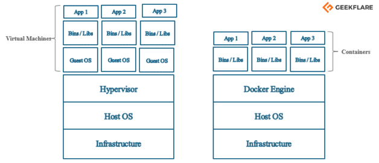
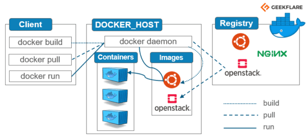
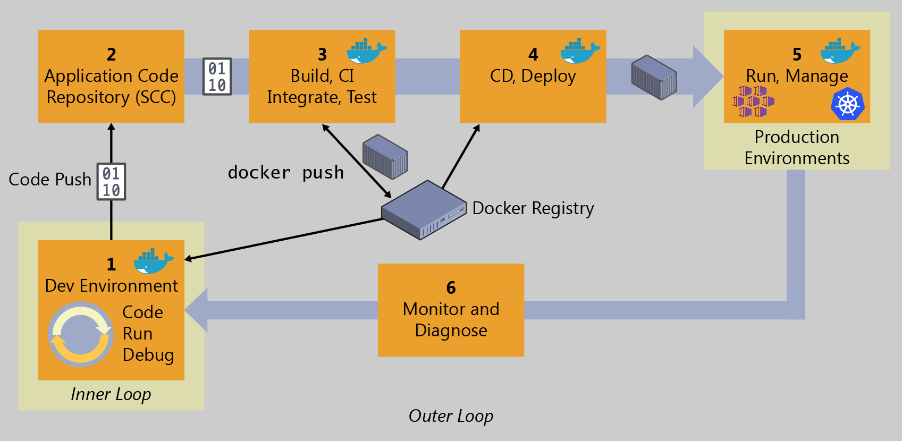
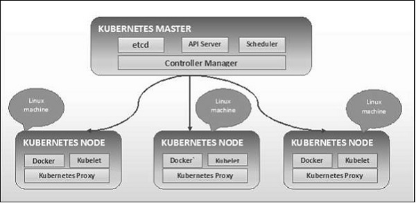
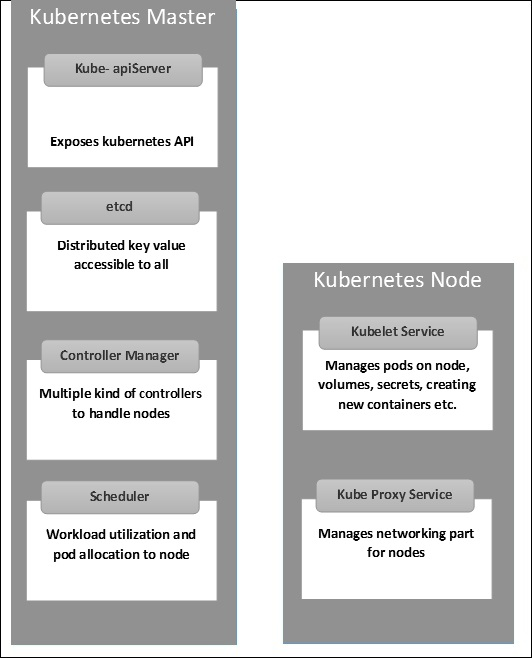

# 10 - Building Containers and Managing Orchestration

This chapter will introduce the use of containerized applications, then we will talk about process orchestration. These tools will facilitate the DevOps process.

By the end of this chapter, you will be capable of:   -   creating an instance of Kubernetes
-   Understanding the process to update ML models in production

##  Microservices and Docker containers

In this section, we will learn about the advantages of using microservices and how to combine them with docker containers. We will first learn the pros of using microservices.

###  Benefiting from microservices

For many years, microservices are a part of software design. With this method, services stay linked yet operate separately from one another as a server-side solution to development. Microservices are being used by more developers to increase performance, scalability, and maintainability. With conventional architectural styles, it is impossible for different teams to operate on services without influencing overall operations.

Microservices are an architectural design pattern used in software development that structures applications as a group of loosely coupled services, making it simpler for developers to create and grow systems. The traditional monolithic architectural approach, which views software development as a single entity, is different from the microservices architectural approach.

The microservices approach divides software development into smaller, autonomous "chunks," each of which carries out a distinct service or function. Integration, API management, and cloud deployment technologies are all used by microservices.

Microservices are now necessary due to a lack of other options. Developers demand a fresh approach to development as applications get bigger and more complex, one that enables them to easily extend programs as user wants and requirements change.

The benefits of using microservices are:   -   Scalability

Microservices scale better than monoliths. Developers may expand certain services instead of a whole program and perform unique activities and requests more efficiently. Because developers focus on particular services, there's less effort. Microservices accelerate development since developers focus on individual services that need deployment or debugging. Developers can bring software to market faster via faster development cycles.

-   Data Security

Microservices interact through secure APIs, which may offer greater data security than monolithic methods. Developers manage data security since teams operate in silos (but microservices are constantly linked). As data security becomes a bigger problem in software development, microservices might help.

-   Data Governance

Microservices enable more responsibility when dealing with data governance standards like GDPR and HIPAA. Some teams may struggle with the monolithic method's comprehensive approach to data governance. Compliance processes benefit from microservices' more precise approach.

-   Multilingual technologies

Microservices enable developers to utilize diverse programming languages and technologies without compromising software architecture. Java may be used to code app functionalities. Another developer uses Python. This adaptability creates "technology-agnostic" teams.

Developers package and deploy microservices using Docker containers in private and hybrid clouds. Microservices and cloud environments facilitate scalability and speed-to-market.

One of the main benefits is developers access microservices from one cloud location and

cloud-based back-end modifications to microservices don't affect other microservices.

We will now talk about the docker containers.

###  Leveraging docker containers

In a microservices architecture, Docker containers isolate applications from the host environment. It helps package apps into containers. Each container will have standardized executable components, including source code and OS libraries to operate a microservice in any environment. Docker containers help allocate and share resources. They automate application deployment as portable, self-sufficient containers in the cloud and on-premise Linux and Windows platforms. Their main advantage is they are cheaper and more efficient than virtual machines. They standardize development and manufacturing and allow Continuous Integration.

<!-- 

  
   
  <em>Figure 10.1: Difference between Virtual Machines and Docker containers
</em>

 -->

 

Figure 10.1: Difference between Virtual Machines and Docker containers

<!-- 

  
   
  <em>Figure 10.2: Docker diagram
</em>

 -->

 

Figure 10.2: Docker diagram

Figure 10.2 explains how docker works. It is divided into the following components:   -   Images: serve as the foundation for containers.
-   Containers — Used to execute applications created using Docker images10. We use docker run to construct a container. The docker ps command may be used to see a list of active containers.
-   Docker Daemon: host's background service in charge of creating, executing, and disseminating Docker containers. Clients communicate with this daemon.
-   The Docker Client is a command-line program that connects the user to the daemon. In a broader sense, there may be more types of clients as well, like Kitematic, which gives users a graphical user interface.
-   a repository for Docker images10 called Docker Hub. The registry may be seen as a collection of all accessible Docker images10. One may run their Docker registries and utilize them to retrieve images10 if necessary.

<!-- 

  
   
  <em>Figure 10.3: High-level workflow for the Docker containerized application life cycle
</em>

 -->

 

Figure 10.3: High-level workflow for the Docker containerized application life cycle

Developers start the inner-loop process by developing code. Developers specify everything before sending code to the repository in the inner-loop stage (for example, a source control system such as Git). The repository commits Continuous Integration (CI) and the procedure.

The inner loop includes "code," "run," "test," and "debug," plus actions before executing the software locally. The developer uses Docker to run and test the program. Next, we'll outline the inner-loop process.

DevOps is more than a technology or toolset; it's a philosophy that demands cultural transformation. People, methods, and technologies speed up and forecast application life cycles. Companies that embrace a containerized workflow reorganize to fit their people and processes.

DevOps replaces error-prone manual procedures with automation, improving traceability and repeatable workflows. With on-premises, cloud, and closely integrated tools, organizations can manage environments more effectively and save money.

Docker technologies are available at practically every step of your DevOps process for Docker applications, from your development box during the inner loop (code, run, debug) through the build-test-CI phase and the staging and production environments.

Quality improvement helps uncover faults early in the development cycle, reducing repair costs. By putting the environment and dependencies in the image and delivering the same image across many environments, you encourage removing environment-specific settings, making deployments more dependable.

Rich data from effective instrumentation (monitoring and diagnostics) helps guide future priorities and expenditures.

DevOps shouldn't be a destination. It should be introduced slowly via adequately scoped initiatives to show success, learn, and improve.

##  Kubernetes

Kubernetes was created in the Google lab to manage containerized applications in a variety of settings, including physical, virtual, and cloud infrastructure. It is an open-source technology that aids in the creation and administration of application containerization. It can automate application deployment, application scaling, and application container operations across clusters. It can build infrastructure that is focused on containers. Let’s learn why Kubernetes and DevOps are not only two mutually exclusive worlds but also a perfect pair.

###  Pairing Kubernetes and DevOps

As we saw in Chapter 1, DevOps drives a company's software development and deployment. It connects previously siloed development and operational teams. It mixes development and operations processes and workflows and offers them a common infrastructure and toolset. This enables one team to see the other's code so they may discover bugs early. As DevOps gained popularity, teams cobbled together pipelines from various distinct platforms, requiring customization. Adding a tool required rebuilding the pipeline, which was inefficient. They found the solution of using containerization. Containers bundle an application or service's code and dependencies to operate in any software environment. By using containers to execute microservices, enterprises can design flexible, portable pipelines. This enabled them to add or alter tools without affecting the overall process, providing seamless CI/CD pipelines.

As DevOps switched to containerized workloads, orchestration and scalability issues arose. Kubernetes came then. Kubernetes automates the deployment, scaling, and administration of containers, allowing companies to handle thousands of containers. Kubernetes delivers resilience, reliability, and scalability to DevOps initiatives.

Kubernetes' key DevOps characteristics are:    -   Everything in Kubernetes may be built "as code," meaning access restrictions, databases, ports, etc. for tools and apps and environment parameters are declarative and saved in a source repository. This code may be versioned so teams can send configuration and infrastructure changes to Kubernetes.
-   As enterprises adopt cloud-native initiatives, their teams need tools that can be smoothly integrated across platforms and frameworks. Kubernetes can flexibly orchestrate containers on-premises, at the edge, in the public or private cloud, or between cloud service providers (CSPs).
-   Kubernetes' automatic deployment and update rollback capabilities let you deliver upgrades with no downtime. Tools and apps in a container-based CI/CD pipeline are split into microservices. Kubernetes updates individual containers without affecting other processes. Kubernetes makes it easy to test in production to catch flaws and vulnerabilities before deploying updates.
-   Kubernetes distributes resources effectively and just as required, lowering overhead costs and optimizing server utilization. Kubernetes boosts development productivity by providing fast feedback and warnings about code, expediting issue fixes, and lowering time to market.
-   Kubernetes may operate anywhere in a company's infrastructure. This enables teams to implement it without switching infrastructures.

Let’s now learn more in-depth about the features of Kubernetes.

###  Deep diving into Kubernetes

Kubernetes has the following main features:   -   develops, integrates, and deploys new software.
-   Infrastructure housed in containers
-   Management focused on applications
-   infrastructure with automatic scaling
-   maintaining the same environment for production, testing, and development
-   Infrastructure that is loosely connected such that any part may function independently
-   greater resource usage density
-   Infrastructure that will be developed predictably

The ability of Kubernetes to execute applications across clusters of real and virtual machine infrastructure is one of its primary features. Additionally, it can execute apps on the cloud. It facilitates the transition from host-centric to container-centric infrastructure.

<!-- 

  
   
  <em>Figure 10.4: Kubernetes Master Machine components
</em>

 -->

Figure 10.4: Kubernetes Master Machine components

####  etcd

It contains cluster-wide configuration information. It's a distributed, high-availability key-value store. As it may contain sensitive information, only the Kubernetes API server may access it. It's a public key-value store.

####  APIServer

Kubernetes is an API server for cluster operations. Different tools and libraries may connect with the API server thanks to its interface. Kubeconfig includes server-side communication features. Kubernetes API is exposed.

####  Supervisor

This component controls most cluster collectors and performs a job. It's a daemon that collects and sends information to the API server in a nonterminating loop. It gets the cluster's shared state and changes the server to the required state. Replication, endpoint, namespace, and service account controllers are critical. The controller manager manages nodes, endpoints, etc.

####  Scheduler

Kubernetes master requires this component. Master's workload-distribution service. It monitors cluster node load consumption and places a burden on available resources. This allocates pods to available nodes. The scheduler allocates pods and manages the workload.

####  Kubernetes Nodes

The following Node server components are required for Kubernetes master communication.

####  Docker

Each node needs Docker to execute application containers in an isolated, lightweight operating environment.

####  Kubelet

This tiny node service relays information to and from the control plane. It reads configuration data from etcd store. This receives directives from the master component. kubelet maintains the work state and node server. Network rules, port forwarding, etc. are managed.

####  Proxy Kubernetes

This proxy service operates on each node and enables remote hosts access services. It forwards requests to proper containers and does load balancing. It makes networking predictable, accessible and separated. It maintains node pods, volumes, secrets, and container health checks.

####  Master-node structure in Kubernetes

Kubernetes Master and Node are shown in Figure 10.5.

<!-- 

  
   
  <em>Figure 10.5: Kubernetes Master Machine components
</em>

 -->

Figure 10.5: Kubernetes Master Machine components

## Summary

In this chapter, we underlined the advantages of using micro-services. We described how pairing containers and microservices to fasten time to market for software. Then we finally scaled up by learning how to use Kubernetes. In the next chapter, we will learn how to release software.
