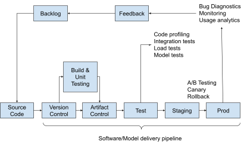
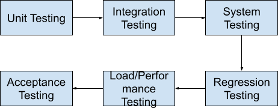
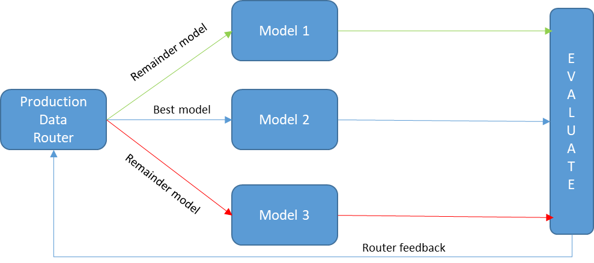
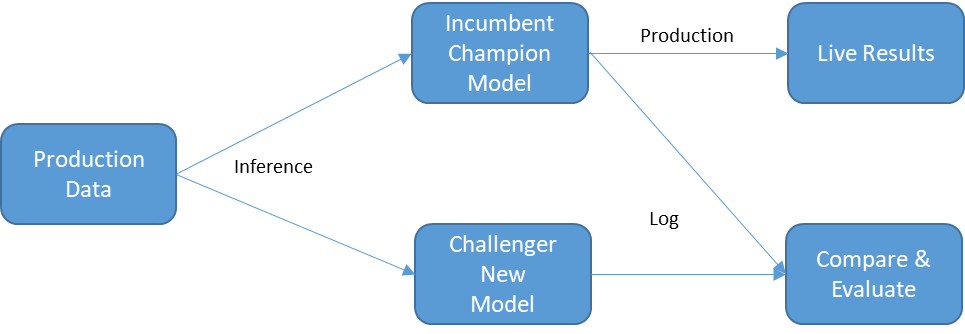

#  11 - Testing ML Models


In this chapter, we will talk about testing. Testing ensures software quality and it is a critical part of the DevOps/MLOps process. You will learn about the many forms of functional testing and their functions in software deployment. By using several technologies that are linked with version control software, we will investigate test automation and unit testing in further detail.  By the end of this chapter you will be capable of doing the following:   -   creating unit testing
-   creating performance testing
-   creating integration testing
-   creating UI testing


We will start by introducing what testing is.
#  Introduction to testing


Software/Model testing checks, monitors, and ensures quality standards across the whole development operations cycle. In DevOps/MLOps, we are actively engaged in managing the testing procedures of new software/new model as it is being built. Testing is essential to make sure that the software complies with the business requirements established for the application and that it merges successfully with the current code without altering it or interfering with its dependencies. When checking if a model still performs as well or better than the prior version, we set metrics that will allow us to sign off on new modifications. This set of metrics is linked to the business:   -   confusion matrix: we separate the dataset into Training and Test datasets. The training dataset will be used to train the model while the test dataset is put aside. When the model is trained to predict, we attempt to do so using the test dataset. And after the data are divided into a matrix, we can observe how much of our model's predictions are accurate and how much of them are false: true-positive, true-negative, false-positive and false-negative
-   accuracy: the closeness of measuring findings to the actual value. It reveals the precision with which our classification model can forecast the classes specified in the issue statement.
-   recall/sensitivity/True Positive Rate: often utilized in situations when determining the truth is crucial
-   precision: often utilized in situations when it is crucial to avoid having a large number of False positives
-   specificity: genuine negative rate which gauges the percentage of real negatives that are accurately classified as such
-   F1-score: gauge the accuracy of a test of binary classification. To calculate the score, it takes into account the test's recall and precision.
-   and any other metric which makes sense for the business. It could be the money made by a model, the cost saved by a model, or the risk forecasted by a model,...


We demonstrated that testing was an important step of the code/model deployment. We will now talk more in-depth about the various testing we will encounter.


##  Functional testing


To assure quality and value, we run tests at various phases of the software development process. Functional testing is carried out throughout the software development process to ensure that the program complies with the requirements. Each function is put to the test by having its arguments filled up with values, then the result is compared to what was forecasted. Applications are built and deployed with functional testing in place. As a result of DevOps' cyclical nature, software functions are continuously monitored and evaluated, which leads to a source code revision for subsequent development cycles. In the whole iterative process, functional testing is crucial.


The DevOps process is shown in the chart below. The construction and deployment phases of the delivery pipeline described in Figure 11.1 have been covered in this book. We can observe that testing is an important part of this workflow.


<!-- <p align="center">
  
  <br>
  <em>Figure 11.1: DevOps workflow
</em>
</p> -->

<center>


Figure 11.1: DevOps workflow

</center>


In Figure 11.2, we show the order of the various tests we will present in this chapter.

<!-- <p align="center">
  
  <br>
  <em>Figure 11.2: Sequence of the various tests
</em>
</p> -->

<center>


Figure 11.2: Sequence of the various tests

</center>


We can now further analyze each sort of functional testing with a comprehensive understanding of the testing technique. We will start by talking about unit testing.


##  Unit testing


A program's whole code base is tested using unit testing to ensure that every function and each component is operating as intended. The foundation of unit testing is the examination of the smallest testable components, units, or blocks that make up the program. As a result, after assigning values to the function's arguments, unit testing validates the function return (which is a single output). It is an iterative best practice that makes the code base more independent and modular the more often it is used during development. This indicates that unit testing makes it simple to test and, if required, repair each new function in the developers' branch. As branches are included in new builds and developers' work continues while including their faults, issues will become more difficult to isolate and repair if unit tests are not performed throughout development.


To put it another way, unit testing creates modularity and divides the software into smaller programs, each with a particular purpose. Coverage is the number of functional units or blocks that are tested.


We may create a function script add (x,y), and insert arguments as an example of unit testing to compare the output to an anticipated value. This would essentially be a unit test run.

```code
Define add (x, y):

provide x + y
```

Thus, using the function add (6, 3) should result in the number 9 being returned. The unit test would print the error if the value was different.


To prevent any output variation that might invalidate the testing analysis, unit testing needs control over the input data utilized for testing. Therefore, a testing environment that is separate from the development process must be set up. It is important not to link any external components. For instance, if a code is linked to the parameters fetched from a database, we don’t want to use the databases in the unit tests. We will create a mock database (which mimics the behavior of the database) and we will use this mock object in the unit test.


We learned how to create a unit test, we will now learn how to get a higher view of the functioning of our software/model by talking about integration testing.


##  Integration Testing


By integrating the modules that were examined in unit testing into larger groupings, integration testing increases the complexity of testing software. One user request requires the cooperation of many software functional units. This procedure must be followed in a certain order to get the intended result. Integration testing makes sure these components work together as required. In other words, the integration technique checks to see whether the new modules are compatible with the code base's current modules.


Since integration testing does not simulate a database as we did with the mock database in the unit testing. The integration approach has direct access to the database. As a consequence, integration tests may not pass if they cannot access resources. These resources were not needed for unit testing but will be needed for integration testing.


For unit testing, we used the function add as an example, for integration testing, to keep on building this example, we will use a matrix multiply using the function   add   and the function   multiplies   as an example of integration testing.


The integration testing regroups many more components and gives a full view of the system works on a few use cases, we will not talk about the acceptance testing.


##  Acceptance testing and system testing


Now that system testing and acceptability testing are both conducted from the viewpoint of the user, we shall discuss them together because of their similarities and interdependence. One verifies the consistency and usability of the program, while the other verifies user engagement and its usefulness.


To assess how effectively all the components work together to meet the objectives of the various requirements, system testing is done on a full and integrated codebase that includes all of the functional needs of the application. System testing, as opposed to integration tests, focuses on the results of the processes themselves rather than how the modules interact. System testing assures that results are accurate and dependable following business needs.


The goal of acceptance testing, often known as user acceptability testing, is to ensure that the program is usable by users in real-world situations. The user experience is the main emphasis of this testing, which makes sure that several functional features of the application are evaluated to ensure smooth and consistent user interaction.


We know how to test what was fixed or added in terms of features, and we will now learn how to use regression testing to check if any prior features have not been broken.


##  Regression Testing


Regression testing aids in determining if our program consistently delivers when it is used frequently. When all of the tests reveal that a program is operating properly and by its design, it has succeeded.


To do this, we develop a golden performance reference that serves as a benchmark for how our program should function. We'll be looking for our software to perform just as well as its ideal reference every time we execute it.


##  Load Performance Testing


Since it assesses an application's stability, speed, scalability, and responsiveness under a certain workload, this form of testing are not functional (e.g., data or request volume). Functional needs are thus disregarded in favor of the software's capability.


The main goal of performance testing is to evaluate how well a system performs under severe use scenarios including massive amounts of data, several concurrent requests, etc. As a result, application and computing system performance limitations are investigated during load and performance testing. Load tests are laborious and time-consuming; they are often planned for midnight execution when the crew is off duty.


##  Canary testing and A/B testing


Canary testing and A/B testing are in some ways similar. We will first talk about Canary testing.


###  Canary testing


A new software version or a new feature is tested with actual users in a live setting as part of software testing known. It is accomplished by pushing a limited number of end users some code updates live.


The new code or "canary" only affects a tiny number of people, therefore its overall effect is minimal. If the new code turns out to be problematic or causes issues for users, the modifications may be rolled back.


A small number of end users act as a test group for new code during program canary testing. These users, like the canary in the coal mine, are not aware that they are aiding in the early detection of application issues. Monitoring software notifies the development team if a code update is problematic so they may correct it before it is made available to more people, reducing the chance that the experience for all users will be negatively impacted.


A canary release is an excellent approach to introducing small code modifications connected to the introduction of new features or a new software version. Because the code is made available to real users in production, the development team can assess if the changes have the intended or anticipated effects rapidly.


Developers may move a small portion of users to new features in a new version via canary deployment. The impacts of any problems with the new software are limited by merely exposing a portion of the total user population to it, and developers may more easily roll back a problematic release without having it harm the user base as a whole.


###  How does the canary test work?


Canary testing adheres to a methodical, step-by-step methodology like other kinds of software testing. The following are the steps:


First, the testing users are chosen by the development team. This group is a minor portion of the user base, but it is large enough to provide data that will support useful statistical analysis. Users are not aware that they are a part of a test population.


Step 2 involves setting up a testing environment that runs concurrently with the live environment already in place. Additionally, they set up the system load balancer to direct user requests from chosen canary testers to the new setting.


Step 3: By sending test user requests to the new environment, developers start the canary test. Additionally, they keep an eye on testers for whatever length is necessary to make sure the new version is performing as planned.


Step 4: The new software feature or version may be made available to all users if it satisfies the deployment requirements. The testers are then sent to the software's original version if it turns out that the new version has several flaws, performs badly, or causes some other problem for consumers.


Step 5: The team publishes the program to a larger audience after fixing any found flaws.


Validating new software or a new feature in an existing application is simple by using canary testing. Before being made available to a broader user population, the performance of the code may be carefully watched. The danger of widespread bad performance or negative user experiences is drastically reduced since the canary is only deployed to a limited number of users. Additionally, alterations or additions may be swiftly removed if it turns out that they cause the program to run poorly, have problems, or cause unfavorable user feedback.


We will now talk about the A/B testing.


###  A/B testing


A/B testing, often known as split testing, is a method for determining whether the version of something may assist a person or organization achieve a goal more successfully. To make sure that modifications to a website or page component are driven by facts and not just one person's opinion, A/B testing is often used in web development.


A/B tests are anonymous research in which the subjects are not made aware that a test is being run. Version A serves as the control in a typical A/B test on a Web page, whereas Version B serves as the variation. During the test period, half of the website visitors get version A of the page, which has no modifications, and the other half receive version B, which has a change intended to increase a certain statistic like clickthrough rate, conversion, engagement, or time spent on the page. It is determined if the control or the variation performed better for the targeted aim by analyzing end-user behavior that is collected during the test   period   [[a]](Chapter11.html#cmnt1) [a]   .


The difference between A/B testing and canary testing is that the first one, the two versions are known to be functional. A/B testing focuses is to check the preference of the user while canary testing is to test if a new feature will work better. If this new feature doesn’t work, it will be easy to roll back to the previous version.


##  Multi-Armed Bandit Testing (MAB)


The challenge with A/B testing from the previous section is that there is no way to dynamically prioritize a specific model (say A or B) based on its performance while in production. This is what can be done with multi-armed bandit testing (MAB). MAB is a simplified version of reinforcement learning that balances exploration and exploitation. Assume you have chosen a model for production deployment. Exploration is when you are exploring other models and comparing their performance vis-a-vis your production model. Exploitation is when you are focused only on the production model to squeeze out the best performance.


In MAB testing, the routing of production data is governed by a router that analyzes the performance of the models under test. So for a scenario akin to A/B testing, the router would evaluate the performances of A and B models. Based on the evaluation result, the majority of the inference data is routed to the best-performing model. Minority subsets are randomly routed to the remaining model(s), as illustrated in Figure 11.3. This dynamic strategy is a balance between exploitation (the majority of the data to the best-performing model) and exploration (the minority of the data to the other models). The phrase multi-armed comes from the scenario where you are always evaluating and exploring multiple models.


In the next section, we discuss the case when you do not have multiple models to test in production but a single update to an existing production model.


<!-- <p align="center">
  
  <br>
  <em>Figure 11.3: Multi-Armed Bandit testing
</em>
</p> -->

<center>


Figure 11.3: Multi-Armed Bandit testing

</center>


##  Shadow Mode Testing - Champion-Challenger Paradigm


Sometimes you may not have the luxury to have multiple production-ready models for A/B or MAB testing. You may have only a single update to the current production model. But you still want to be sure that your model will perform as expected in production before a complete switchover. Even better, you want to make sure that this new update has better model performance. In the industry, a champion-challenger paradigm is used for this approach. The incumbent production model is the champion and the new updated model is the challenger. Until the challenger proves itself (i.e. has a better performance), the champion is not dislodged.


A method to determine if the challenger is worthy of the crown is shadow mode testing. In this mode, the challenger is deployed in the “shadow” of the champion and a minority of production data is routed to the challenger (see Figure 11.4). If the data can be copied (say in models such as risk analysis of bank loan applications) then both models receive and evaluate the same data. If the data cannot be copied (say user web interface) then users with similar behaviors such as clicking on the same link are divided between the champion and the challenger. In either scenario, the results are logged and offline analysis is done to determine the winner. If the challenger performs better than the champion then a new champion is crowned and a complete switchover is done to the new model.


<!-- <p align="center">
  
  <br>
  <em>Figure 11.4: Champion-Challenger paradigm and shadow mode testing to determine the winner
</em>
</p> -->

<center>


Figure 11.4: Difference between Virtual Machines and Docker containers

</center>

##  User Interface testing


In the past, testing a user interface always required manual intervention. It was very difficult to automate this part. The selenium library allowed some automation by scripting the actions which are done on a given User Interface. UI testing is a large part of the application using a User Interface. For ML ops it will matter less since the target for testing is to ensure that the model will work in production.


##  Summary


In this chapter, we enforced the importance of testing in the DevOps/MLOps workflow. We learned how to create a unit test, and integration test and talked about all the other specific tests that ensure software and model quality. In the next chapter, we will talk about the monitoring step of the workflow.

\newpage
