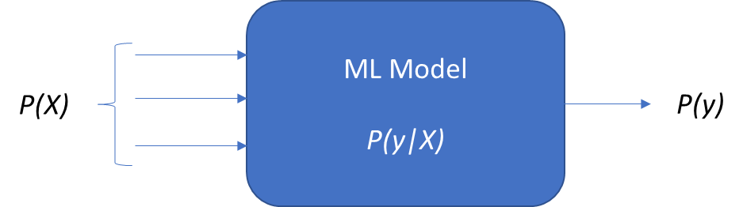
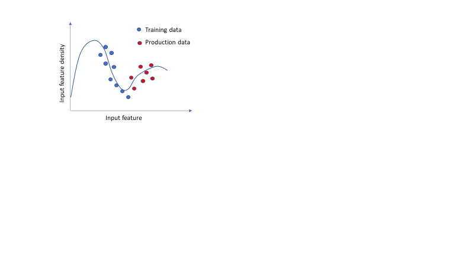
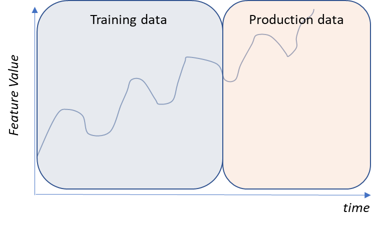
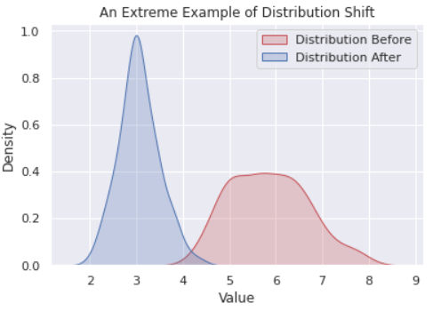
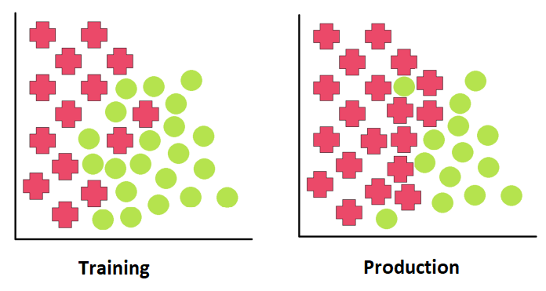
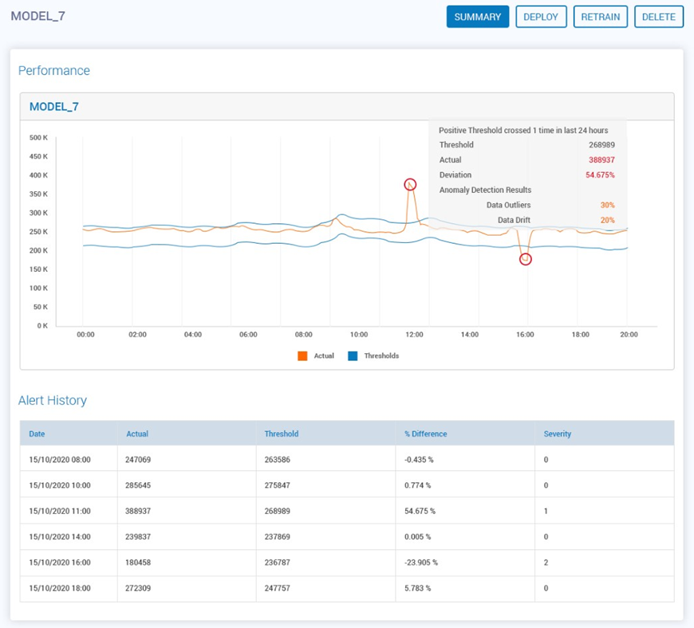

# 12 - Monitoring Machine Learning Models

In this twelfth chapter we highlight post-production responsibilities after a model has been tested and deployed. Specifically, in this chapter you will be able to:

-   Appreciate the need for ML model monitoring
-   Understand what are the different ways that a ML model can underperform in production
-   Decide on different methodologies to detect and do a root cause analysis of model performance

We start this chapter highlighting the need for monitoring ML models.

##  Why is ML Model Monitoring Needed?

You need to monitor a ML model in production because the performance of the model may deviate from the performance observed during training. Let us understand how this may happen.

As illustrated in Figure 12.1, you can think of a ML model as having data inputs   X   and output   y  . In terms of probabilities, there is the input probability   P(X)  , the input-conditional output probability   P(y|X),   and the output marginal probability   P(y)  .

<!-- 

  
   
  <em>Figure 12.1: Input-output relation in an ML model
</em>

 -->

Figure 12.1: Input-output relation in an ML model

The model performance deterioration in production may be due to a change in any of the 3 probabilities from training that are outlined in Figure 12.1. Starting with   P(X)  , a data shift in distribution between training and production is known as a covariate shift. Note that the other probabilities do not change. This shift is a violation of a key   assumption in ML model development that states that production data is from the same distribution as the training data. In other words, the assumption states that the patterns identified by the developed ML model during training are valid in the future in the not-yet-seen production data. In covariate shift, this is no longer valid and we look at it in the next section.

If   P(y)   is different in production from training (and the other probabilities remain unchanged), then that shift is known as the prior probability shift and we look at it later in this chapter. Finally, if   P(y|X)   (with the other probabilities unchanged) is different in production from training, that is known as concept shift and is discussed later in the chapter.

As stated, any of the above may cause unexpected model performance. To detect such a change in model performance, we monitor model metrics in production and compare them to expected values measured during training. We discuss this approach later in this chapter.

Another reason for the model performance deterioration may be the system health (the machine on which the ML model is running) and we also look at how to monitor that as well.

##  Why Production Data may be different from Training Data

In this section, we look at the reasons why the production data may be different from the training data. Before that, note that while training data is in batches (and mini-batches), production data may be streaming. To compare them, you need to collect a significant amount of streaming production data over time so that a statistical comparison can be made to verify if the distribution is significantly different from the training data distribution.

The production and training data may be different because of the following reasons -

1.   Sampling bias - it could be that the training data that was sampled from a population is biased and is not a true representation of the underlying population distribution, as demonstrated in Figure 12.2. Therefore, during production, the ML model is exposed to a population distribution that is different from the training data distribution. For example, using cartoon pictures of dogs to train a model to identify the type of dog while production data includes real-life pictures of dogs.

<!-- 

  
   
  <em>Figure 12.2: Biased training sample distribution different from the test sample
</em>

 -->

Figure 12.2: Biased training sample distribution different from the test sample

2.   Non-stationary environment - an ML production model that is receiving outside data may be exposed to a non-stationary environment where the data characteristics (such as mean and variance) are changing with time (as illustrated in Figure 12.3) and the data processing does not correct for it. For example, trending data such as movie ticket sales over the years is data from a non-stationary environment. Note that there are data processing techniques available to change a non-stationary data to a stationary data but are beyond the scope of this chapter.

<!-- 

  
   
  <em>Figure 12.3: Non-stationary feature
</em>

 -->

Figure 12.3: Non-stationary feature

Given that now we understand why production data may be different, in the next sections we cover characteristics of those differences, how to detect them and importantly, how to correct for them such that the ML model regains performance in production.

##  ML Model Feature Different in Production Data from Training Data - Covariate Shift

As we explained earlier, covariate shift happens when   p(X)   in Figure 12.1 changes between training and production. An example is illustrated in Figure 12.4   [[1]](Chapter12.html#ftnt1).

<!-- 

  
   
  <em>Figure 12.4: Covariate shift with different distribution in training (before) and production (after)
</em>

 -->

Figure 12.4: Covariate shift with different distribution in training (before) and production (after)

An example of covariate shift is when an image ML model is developed to detect cars using black-and-white pictures and the production data contains colored images12 of the same cars as in the training data. Another example of covariate shift is when a spoken English speech recognition algorithm to detect what is being said is trained using an Australian accent and used an American accent. A third example is when a disease detection algorithm using patient data is trained with data of 20 and 30-year-olds and used on Medicare (ages 65 or older) population data.

###  Detect Covariate Shift

There are different statistical tests and machine learning models that can be used to detect covariate shifts in the ML features. In this chapter, we outline different statistical tests for the distribution comparison of different types of features as follows -

1.   Categorical feature - you can use the chi-squared   [[2]](Chapter12.html#ftnt2) test that uses the contingency table.

1.   Numerical feature - you can use the Kolmogorov-Smirnov   [[3]](Chapter12.html#ftnt3) test to compare distributions.

###  Correct Covariate Shift

Once you detect the feature(s) with covariate shift, you have 2 options to compensate for the shift -

1.   Drop the feature(s) - this is more of a hard-line but simple approach where you rebuild the model without the feature. The downside to this approach is that if this is an important feature, then removing it from the model may reduce the accuracy.

1.   Retrain the model - you retrain the model with the shifted production data as the updated training data. If there are not many shifted data points, then you may have to assign higher weights to them during training. Note that the downside to this approach is that if the feature returns to the earlier distribution, you will detect another covariate shift and need to redo the training,

##  ML Model Output Different in Production Data from Training Data - Prior Probability Shift

When the distribution of the output/target variable   P(y)   (Figure 12.1) changes between training and production, this is called prior probability shift (aka target shift). In this case, the prior assumption of say a particular percentage of the output variable belongs to a specific category is violated as shown in Figure 12.5   [[4]](Chapter12.html#ftnt4)   .

<!-- 

  
   
  <em>Figure 12.5: Prior Probability Shift - change in output variable distribution
</em>

 -->

Figure 12.5: Prior Probability Shift - change in output variable distribution

An example of a prior probability shift is when fraudulent credit transactions go down from 5% in training data to 2% in production data. Another example is an ML model trained to detect email spam with 25% of the training data but 50% of the production data containing spam.

###  Detect Prior Probability Shift

Prior probability shift can be detected using a methodology called Population Stability Index (PSI). PSI is a comparative measure of how much a variable has changed between two samples. It divides the training data output into bins and uses the bins to compare with production data output   [[5]](Chapter12.html#ftnt5). Therefore, if the production data output has a different distribution, then the PSI detects it.

###  Correct Prior Probability Shift

Once you detect the feature(s) with covariate shift, you will need to retrain the model with the shifted production data as the updated training data. Note that the downside to this approach is that if the feature returns to the earlier distribution, you will detect another covariate shift and need to redo the training.

##  ML Model Conditional   Output Different in Production Data from Training Data - Concept Shift

When the ML model input and output data distributions do not change, but the conditional output probability   P(y|X)   (Figure 12.1) changes, that is a concept drift. For example, loan approvals during Q4 2022 with high-interest rates and fear of pending recession may be different than Q4 2019 before the pandemic. Note that the input (data of loan applicants) and output (approval/denials of loans) data distribution do not change.

###  Detect Concept Shift

Concept shift is tricky to detect given the input and output data distributions remain unchanged. One way to detect it is to maintain a “golden dataset” where you have the expected result values (regression test). Run the golden dataset through the current ML model and compare the new results with the expected results. If there is a significant change detected, that is an indicator of a concept shift.

###  Correct Prior Probability Shift

As with the other drifts, a simple solution to a concept drift is to retrain the ML model with the new production data.

##  Monitor Transient   ML Model Performance Changes

Data drift and prior probability shifts can happen suddenly or gradually over time. As long as there are significant data points in production that can be compared with historical data, the drifts are detectable using the techniques discussed above. However, there may be transients due to sudden distribution changes in   P(X)   or   P(y),   and the data returns to where it was before the drift after some time. During the transient phase, there may be unexpected changes to the model performance. In such circumstances, the statistical techniques discussed above may not be able to detect them. Instead, they are detectable by monitoring model performance for each data instance as described below.

###  Detect Model Performance Change

During ML model development with training data, the evaluation metrics of the model are tracked to determine acceptable limits. Examples of such metrics are given in Table 12.1. The tracking of the metrics enables us to determine the mean and standard deviation. Thereafter in production, monitoring metrics can be set such that if the model performance is beyond _n_ (=2 or 3) standard deviation from the mean, then a flag is raised. In the example in Figure 12.6, the accuracy metric performance bound is set to be +/- 2 standard deviations from the mean.

|Regression Models| Classification Model
|-----------------|---------------------
Root Mean Squared Error|F1 score
R-squared|Precision-Recall
Mean Absolute Percentage Error|Receiver Operating Characteristic

Table 12.1: Regression and Classification Model Evaluation Metrics.

<!-- 

  
   
  <em>Figure 12.6: Model Performance monitoring using bounds determined at training
</em>

 -->

Figure 12.6: Model Performance monitoring using bounds determined at training

###  Correct Model Performance Change

If the ML model performance monitoring detects deterioration and nothing on the data drift detectors, then possibly the drifts were transient and are no longer present. Not much you can do in such situations except for monitor how frequently this happens and take a business decision on what to do when the data drifts.

##  System Health Operational Monitoring

The production machine on which the ML model is running may have multiple issues with processor and memory. For example, if there is a processor intensive process running on the same machine and starving the ML model, then the ML model may not respond to input data in time. Likewise, the same ML model phenomenon may occur if there is a memory hungry process running on the same production machine. Additionally, if there is an issue with the rate of input data in the machine due to outside interference or a denial-of-service attack on the production machine, this may result in increased latency where the ML model is not responding in time.

##  Detect System Health Change

The machine on which the ML model is running needs to be monitored for usage and latency as follows -

1.   Amount of data over time - this is to ensure that the data ingestion (especially for streaming data) is not overwhelming the memory of the machine.

1.   Memory usage - to ensure that the ML model is not being starved of memory by checking that the memory usage is within operational limits.

1.   Output latency - to track the latency of the ML model response by monitoring the time to output and checking that it is within expected limits set during training.

###  Correct System Health Change

Once a machine issue is detected, it is best to shut down the ML model and attempt to remove the cause of the machine issue. For example, shutdown any runaway processes that may be hogging the processor and/or memory.

## Summary

In this chapter we discuss why ML model monitoring is required, and the concepts behind detection and correction. We also outline different reasons that a ML model may be performing different-than-expectation in production. In the next chapter, we look at ML model fairness.

------------------------------

[[1]](Chapter12.html#ftnt_ref1)       [https://towardsdatascience.com/to-monitor-or-not-to-monitor-a-model-is-there-a-question-c0e312e19d03](https://www.google.com/url?q=https://towardsdatascience.com/to-monitor-or-not-to-monitor-a-model-is-there-a-question-c0e312e19d03&sa=D&source=editors&ust=1681619301464937&usg=AOvVaw0UjqeJnKiMuQiQUd-pndzZ)

[[2]](Chapter12.html#ftnt_ref2)      [https://en.wikipedia.org/wiki/Chi-squared_test](https://www.google.com/url?q=https://en.wikipedia.org/wiki/Chi-squared_test&sa=D&source=editors&ust=1681619301466019&usg=AOvVaw2tLhMuwzwUIBmT1X_q2HDN)

[[3]](Chapter12.html#ftnt_ref3)       [https://en.wikipedia.org/wiki/Kolmogorov%E2%80%93Smirnov_test](https://www.google.com/url?q=https://en.wikipedia.org/wiki/Kolmogorov%25E2%2580%2593Smirnov_test&sa=D&source=editors&ust=1681619301466414&usg=AOvVaw2CCTIPhFhoullpZ0JjP5w0)

[[4]](Chapter12.html#ftnt_ref4)      [https://towardsdatascience.com/mlops-model-monitoring-prior-probability-shift-f64abfa03d9a](https://www.google.com/url?q=https://towardsdatascience.com/mlops-model-monitoring-prior-probability-shift-f64abfa03d9a&sa=D&source=editors&ust=1681619301465539&usg=AOvVaw2XTtTzmF6ahrQJeDBxTzaY)

[[5]](Chapter12.html#ftnt_ref5)       [https://towardsdatascience.com/mlops-model-monitoring-prior-probability-shift-f64abfa03d9a](https://www.google.com/url?q=https://towardsdatascience.com/mlops-model-monitoring-prior-probability-shift-f64abfa03d9a&sa=D&source=editors&ust=1681619301466930&usg=AOvVaw3Qd-pwSmPZoEmQoaulH4Us)
