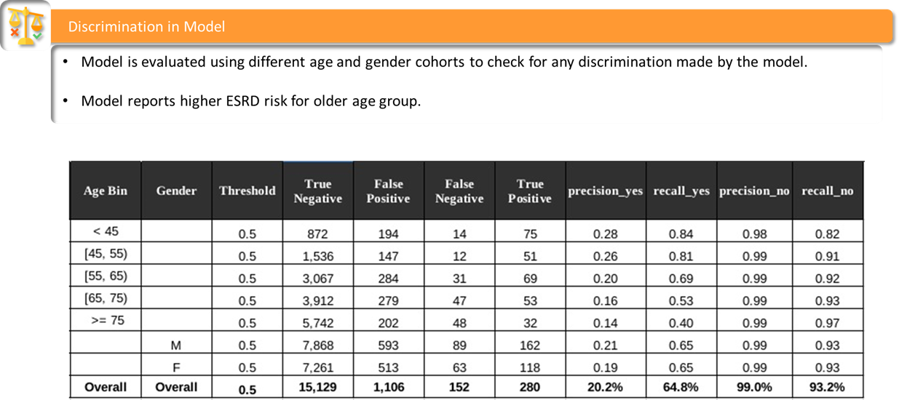
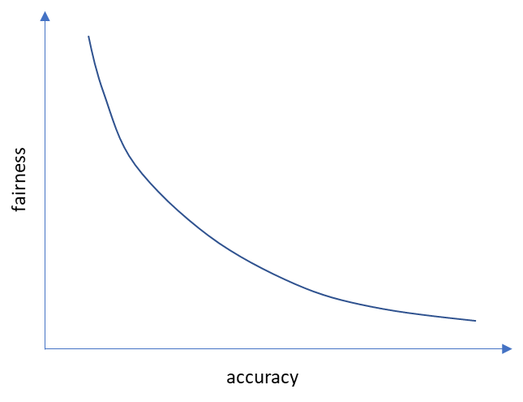

# 13 - Evaluating Fairness

In this thirteenth chapter, we discuss ML model fairness. This is an important topic for ML ethics, specifically bias. Now that you know how to build, deploy, test, and monitor ML models, you may need to ensure that your ML model is fair. Specifically, in this chapter you will be able to:

-   Understand what is bias and what is fairness in ML models
-   Learn how to detect bias in ML models
-   Take action to mitigate bias so that your ML model is fair
-   Analyze the trade-off between fairness and accuracy

In the first section, we discuss bias and fairness.

##  What are Bias and Fairness?

Bias is discriminating against a particular idea, group, or phenomenon. For example, you may be biased against a specific team in your favorite sport - you want to win against them and do not want them to do better than your favorite team. Another example is that you may be biased towards your favorite aunt or uncle versus the other relatives.

Fairness is to ensure there is no bias, that is no unequal harm or any preferential treatment to a particular idea, group, or phenomenon. Looking at the previous examples, for you to be fair you need to remove the bias against that specific team you want your team to win against and feel the same towards all relatives. As you can imagine, in our daily interactions and society in general there are a lot of biases.

The aforementioned regular biases that exist get captured in data. The same data is used to train ML models and their predictions are based on data patterns that have an underlying bias(es). Though the ML models pick up these underlying bias patterns, note that such pattern recognition is key. Without such patterns, ML models may not be effective. For example, a dataset with no patterns and no bias is white noise, and therefore it has no predictive power. So it is difficult to remove all bias (as per definition) and deploy completely fair ML models. The objective is to ensure that your ML models have no harmful bias that discriminates against a particular idea, group, or phenomenon in society.

##  ML Model Bias

There are different sources of bias in ML models. We start with the most popular data bias -

1.   Data bias - when the data is biased towards or against a particular idea, or group of phenomena, the trained ML model inherits that bias.  For example, assume you are building an ML model to target financial asset management advisors to buy your company's mutual funds. The ML model determines which advisors will buy the fund based on their profile, and geographical location, among others. If most of the advisors in California tend to buy your funds relative to other states, then your data is biased from a geographical perspective. Consequently, during inference, the ML model is likely to indicate that California-based advisors are going to buy your mutual fund. In reality, that may not happen and your ML model may overestimate your mutual fund selling success for California leading to high false positive (i.e. ML model estimates yes to buying funds but the actual is a no).

1.   Algorithmic bias - when you are building an ML model, you can choose to overfit or underfit on training data. If the algorithm overfits a dataset, then the inference for that dataset will likely have a high variance with a lot of false positives and false negatives (i.e. ML model estimates do not match actuals). For example, an ML model cross-selling to retail customers may focus on a specific customer segment and overfit on that segment. Therefore the prediction of whether to cross-sell to a customer from the overfit segment may have a high precision (i.e. the ML model estimate matches the actual). But the ML model may also have a lot of false positives and false negatives for customers from a different segment.

1.   Business bias - we have seen how different business and global circumstances can change the interpretation of an ML model output in Chapter 8. For example, during high inflation loan applications can be subjected to higher approval thresholds than during low inflation.

In the next section, we outline how to detect an ML model bias.

##  ML Model Bias Detection

To detect if an ML model has any bias, first use the related business case to determine what group, idea, or phenomena the model may be biased against. Then test the ML model with inference data such that you can verify if there is any bias. For example, assume you are building an ML model to ascertain the risk of chronic disease for an individual. You determine that there can be two sources of bias: gender and age. Therefore you need to set up a test such that you can analyze the ML model output by gender and by age.

As you see in Table 13.1, the inference data is binned by age group and also by gender. If there is a bias, it should be noticeable in the ML model output metrics such as precision and/or recall. From the table, you can conclude that there is no gender bias as the metrics for male (M) and female (F) have no significant difference. Unlike the metrics for the age bins. You can see that there is an indication of age bias as the model seems to predict disease risk for a higher number of individuals in older age groups. The consequence of this bias is that the age groups 65 years and older have high false positives and corresponding low precision for chronic disease detection (note:   precision = true_positive / (true_positive + false_positive)  ).

<!-- 

  
   
  <em>Table 13.1: Chronic disease prediction ML model output binned by age and gender for bias detection
</em>

 -->

Table 13.1: Chronic disease prediction ML model output binned by age and gender for bias detection

##  ML Model Bias Correction

Given that you have detected ML model bias, as discussed earlier there can be three sources of this bias. Business bias is easy to detect if you compare the model output and check if the interpretation of that output has changed over time.

To detect if there is data bias you should perform exploratory data analysis to check if the data is imbalanced for a specific category as outlined in Chapter 5. This can be corrected by the first method below. In contrast, detecting algorithmic bias can get tricky - if there is a bias against a specific category and the data is not imbalanced, then algorithmic bias may be a cause. This can be corrected by the second and third methods below -

1.   Data sampling - correct for any training data imbalance (fewer data points) in a specific category by either over- or under-sampling. Likewise, you can simulate the same effect by changing the weights for each data point, giving higher weight to the data instances belonging to categories with fewer data.

1.   ML Model Optimization - change the cost function constraints used during training to influence the model parameters calculations. For example, include false positive cost constraints such that the false positive is comparable across all the categories.

1.   Postprocessing - use the ROC curve for different categories to select different thresholds such that the metrics (false positive, false negative, F1 score) are comparable across all the categories.

##  How does ML Model Fairness affect Accuracy?

Bias correction often mitigates (but not eliminates) ML model bias. This comes at a cost (remember the adage: there is no free lunch). And the cost is ML model accuracy. Think of it this way - if you had all the details for a specific group of retail customers, then you would know them like family. Any ML model built using that data would have a near-perfect prediction of their likes/dislikes. But the model is very unfair since you are biased towards those customers. To make it fair, you need to give up some information (forget something about the customers in that group) that would reduce the ML model accuracy. That is the trade-off.

Once you have your ML model ready, identify the area(s) where you can make the ML model fair. Quantify fairness before you make any changes. Calculate accuracy using your defined metric. Start making the ML model fairer in steps. Calculate the accuracy for each step. You will notice that as you make your ML model fairer, you are likely giving up on accuracy. In other words, fairness and accuracy form a Pareto pair as illustrated in Figure 13.2.

<!-- 

  
   
  <em>Figure 13.1: Pareto curve of fairness vs accuracy
</em>

 -->

Figure 13.2: Pareto curve of fairness vs accuracy

## Summary

In this chapter, we understood ML model fairness and bias, the reason for ML model bias, and how to detect and correct the bias. We also discussed the trade-off when correcting for bias and making an ML model fairer. In the next chapter, we look at how to make an ML model robust to failures using anti-fragility.
